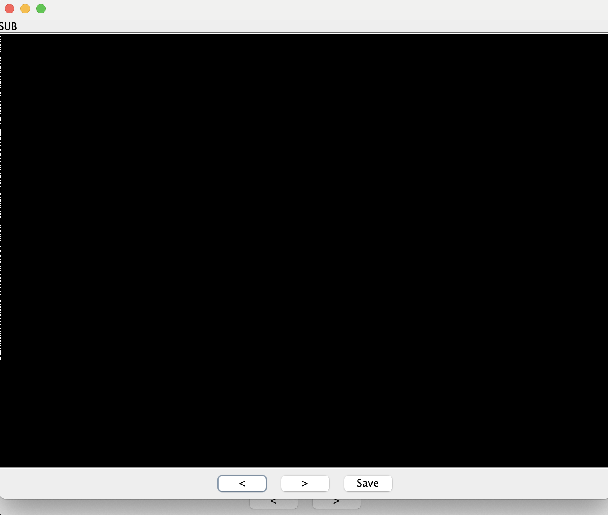

# Diagnostic

## Challenge Details 

- **CTF:** Hack The Box
- **Category:** Misc
- **Points:** 20

## Provided Materials

- Two images: `intercepted.png` and `original.png`

## Solution

While analyzing the images, we can't spot the difference at a glance, but let's use [stegsolve](https://wiki.bi0s.in/steganography/stegsolve/) to analyte it more closely:


We can use `Image Combiner` to analyze both images:



We can see some white dots at the left of the image in `SUB` mode. Probably they mean something, let's write `python` script, that will interpret white pixel as `1` and black one as `0`:

```python
from PIL import Image

def interpret_first_column(image_path):
    # Load the image
    img = Image.open(image_path)
    # Convert the image to grayscale to simplify the analysis
    img = img.convert('L')
    
    # Initialize the result string
    result = ''
    
    # Process the first column of the image
    for y in range(img.height):
        # Get the pixel value (in grayscale, 0 is black and 255 is white)
        pixel = img.getpixel((0, y))
        
        # Interpret pixel value (assuming the middle ground is 128)
        if pixel > 128:
            result += '1'  # White
        else:
            result += '0'  # Black

    return result

# Example usage
image_path = 'solved.bmp'
binary_sequence = interpret_first_column(image_path)
print(binary_sequence)
```

Output:

```
0101001101000110010100100100001101100101011110100100011001101101010110000011001001000110011001100110010001111010010000010111011101011010010001100011100101101010011000010100100001010110011010100110000100110001001110010110101001001101010010000101011001110011010110100100011000111001011010100110000101001000010101100110101001100001001100010011100100110011010011010100010001000010011010110110011001010001001111010011110100000000000000000000000000000000000000000000000000000000000000000000000000000000000000000000000000000000000000000000000000000000000000
```

Let's use [Cyber Chef](https://gchq.github.io/CyberChef/) to convert binary into string:


Base64?


Definitely!

## Final Flag

`HTB{1f_a_w00d_chuck_c0uld_chuck_w00d}`

*Created by [bu19akov](https://github.com/bu19akov)*