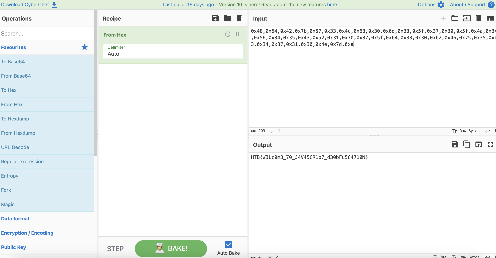

# Canvas

## Challenge Details 

- **CTF:** Hack The Box
- **Category:** Misc
- **Points:** 10

## Provided Materials

- `dashboard.html`, `index.html`, `style.css` and `login.js` files

## Solution

While analyzing `login.js`, we can notice this at the end: 

```sh
res=String['\x66\x72\x6f\x6d\x43\x68\x61\x72\x43\x6f\x64\x65'](0x48,0x54,0x42,0x7b,0x57,0x33,0x4c,0x63,0x30,0x6d,0x33,0x5f,0x37,0x30,0x5f,0x4a,0x34,0x56,0x34,0x35,0x43,0x52,0x31,0x70,0x37,0x5f,0x64,0x33,0x30,0x62,0x46,0x75,0x35,0x43,0x34,0x37,0x31,0x30,0x4e,0x7d,0xa);
```

So we can use [CyberChef](https://gchq.github.io/CyberChef/) to decode it:



## Final Flag

`HTB{W3Lc0m3_70_J4V45CR1p7_d30bFu5C4710N}`

*Created by [bu19akov](https://github.com/bu19akov)*