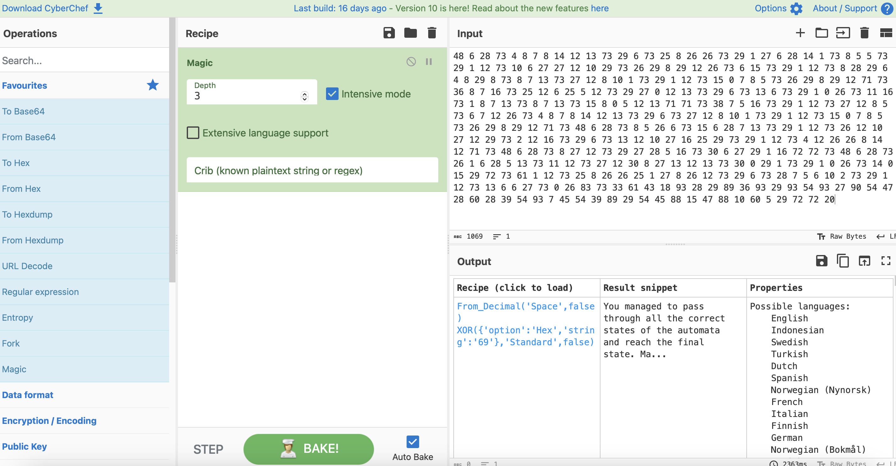
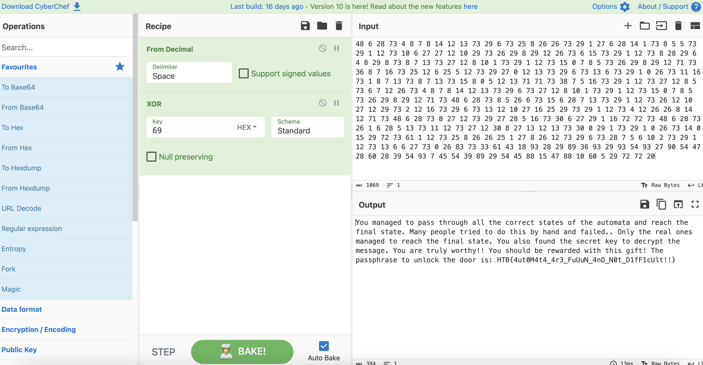

# Deterministic

## Challenge Details 

- **CTF:** Hack The Box
- **Category:** Misc
- **Points:** 20

## Provided Materials

- `deterministic.txt`

## Solution

In the `Challenge Description` we can find `State 0: 69420, State N: 999`. What can it mean, let's analyze `deterministic.txt`:

```
...
9 18 69
3 61 5
69 93 22
1 36 10
9 18 69
3 61 5
69 93 22
...
```

Out text file contains of three columns with numbers, and as we now that `State 0` is `69420` let's find the line:

```
69420 48 69421
```

Only one appearance in the whole file, so it will probably be in the order, so the number in third column will be in the first column of the next character. Let's write `python` script to recreate the right sequence from `69420` to `999`:

```python
def find_sequence(start_number, end_number, input_file, output_file):
    # Read the input file and store lines
    with open(input_file, 'r') as file:
        lines = file.readlines()

    # Dictionary to map first column numbers to their full lines, skipping non-digit lines
    num_to_line = {}
    for line in lines:
        if line.split():  # Check if the line is not empty
            try:
                # Attempt to convert the first token to int
                first_col_num = int(line.split()[0])
                num_to_line[first_col_num] = line
            except ValueError:
                # Skip the line if the first token cannot be converted to an integer
                continue

    current_number = start_number
    with open(output_file, 'w') as file:
        while current_number in num_to_line:
            # Write the matching line to the output file
            file.write(num_to_line[current_number])
            
            # Get the next number to search for from the third column
            next_number = int(num_to_line[current_number].split()[2])
            
            # Check if the next number is the end condition
            if next_number == end_number:
                break
            
            current_number = next_number

# Example usage
start_number = 69420
end_number = 999
input_file = 'deterministic.txt'
output_file = 'output.txt'
find_sequence(start_number, end_number, input_file, output_file)
```

We got the file with probably the right sequence, as we know, that first and third columns are only for the right sequence determinition, probably we are interested in the second column, let's extract it in the separate file:

```python
def extract_second_column(input_file, output_file):
    # Initialize an empty list to store second column values
    second_column_values = []
    
    # Read the input file
    with open(input_file, 'r') as file:
        for line in file:
            parts = line.split()
            if len(parts) >= 2:  # Ensure the line has at least two columns
                second_column_values.append(parts[1])
    
    # Convert the list of second column values to a single string with spaces
    single_line = ' '.join(second_column_values)
    
    # Write the single line string to the output file
    with open(output_file, 'w') as file:
        file.write(single_line)

# Example usage
input_file = 'output.txt'
new_output_file = 'second_column_values.txt'
extract_second_column(input_file, new_output_file)
```

`deterministic.txt` also states, that the values are xored, so let's use [Cyber Chef](https://gchq.github.io/CyberChef/) to find the key value:



Let's click on `From Decimal...` to read the whole text:



## Final Flag

`HTB{4ut0M4t4_4r3_FuUuN_4nD_N0t_D1fF1cUlt!!}`

*Created by [bu19akov](https://github.com/bu19akov)*