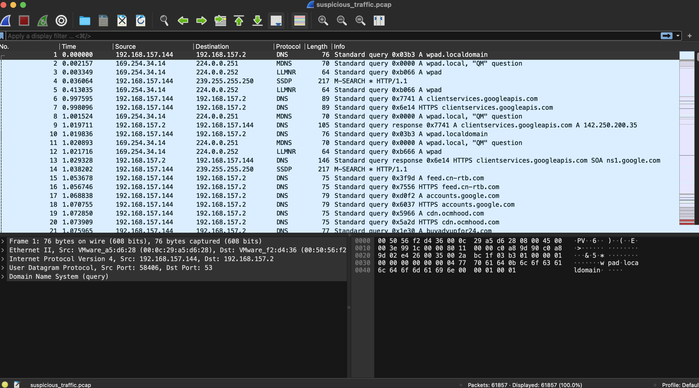
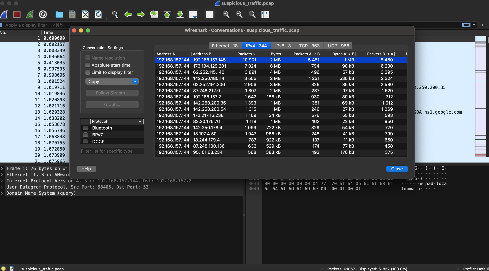

# Litter

## Solution

#### 1. At a glance, what protocol seems to be suspect in this attack?



We can see a lot of `DNS` traffic here.

> DNS

#### 2. There seems to be a lot of traffic between our host and another, what is the IP address of the suspect host?

We can open `Statistics` -> `Conversations` to see all the communication between each of two hosts and sort by packets amount:



> 192.168.157.145

#### 3. What is the first command the attacker sends to the client?

Firstly, we need to decrypt the whole `DNS` conversation to understand it, for that we can filter only packets, that are going from suspect host `192.168.157.145` *(`ip.src==192.168.157.145`)* and export them *(`File` -> `Export Specified Packets`)*. Next we can write simple `python` script that will help us to decrypt this communication for all the remainig tasks:

```py
import os

def read_dns_queries_from_pcap(pcap_path):
    """Execute tshark command to extract DNS query names from a pcap file."""
    command = f"tshark -r {pcap_path} -T fields -e dns.qry.name"
    raw_output = os.popen(command).read()
    return raw_output.strip().split('\n')

def decode_hex_string(hex_string):
    """Decode hex-encoded strings, filtering out non-printable characters."""
    hex_string = hex_string[18:].replace('.microsofto365.com', '').replace('.', '')
    try:
        bytes_object = bytes.fromhex(hex_string)
        ascii_string = bytes_object.decode("ASCII", errors='replace')
        return ''.join(char for char in ascii_string if char.isprintable() or char == '\n')
    except ValueError as e:
        print(f"Skipping invalid hex data due to error: {e}")
        return None

def main(pcap_file):
    lines = read_dns_queries_from_pcap(pcap_file)
    output_file_path = "./file.txt"

    with open(output_file_path, 'w') as file:
        for line in lines:
            if len(line) <= 56:
                continue
            decoded_string = decode_hex_string(line)
            if decoded_string:
                file.write(decoded_string + '\n')

if __name__ == "__main__":
    pcap_file_path = "./to_decode.pcap"
    main(pcap_file_path)
```

So when we open output file, we can see the first command:

```
C:\Users\test\Downloads>
whoami
desktop-umncbe7\test
```

> whoami

#### 4. What is the version of the DNS tunneling tool the attacker is using?

```
28/05/2016  21:38           142,336 dnscat2-v0.07-client
-win32.exe
```

> 0.07

#### 5. The attackers attempts to rename the tool they accidentally left on the clients host. What do they name it to?

```
ren ren 'dnscat2-v0.07-client-win32.exe' 'win_install.exe
```

> win_installer.exe

#### 6. The attacker attempts to enumerate the users cloud storage. How many files do they locate in their cloud storage directory?

```
C:\Users\test\OneDrive>
dir
 Volume in drive C has no label.
 Volume Serial Number is 503A-D127

 Directory of C:\Us
ers\test\OneDrive

04/06/2021  08:52    <DIR>          .
04/06/2021  08:52    <DIR>         
 ..
               0 File(s)              0 bytes
               2 Dir(s)  24,470,171,648 byt
es free
```

> 0

#### 7. What is the full location of the PII file that was stolen?

```
C:\Users\test\Documents\client data optimisation>
type "C:\Users\test\Documents\client data optimisation\user details.csv"
```

> C:\users\test\documents\client data optimisation\user details.csv

#### 8. Exactly how many customer PII records were stolen?

Last entry number is `720`

```
720,Ambulance person,"Smith, Collins and Brown",524-80-5753,"22
4 Randolph Mountain Suite 809
West Robertmouth, NV 64799","(Decimal('36.515191'), Decimal('-31.
158244'))",AB+,"['https://perez-livingston.com/', 'https://hudson.net/']",danielle62,Dalton Mun
oz,M,"42206 Finley Harbor Apt. 996
Dennisburgh, RI 55546",christophercampbell@hotmail.com,1910-
09-16
```

So, starting from `0` -> `721` total.

> 721

*Created by [bu19akov](https://github.com/bu19akov)*