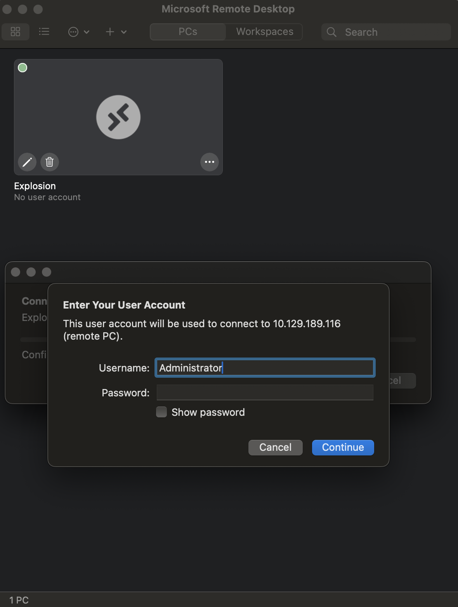

# Explosion (Windows)

## Machine Details 

- **CTF:** Hack The Box
- **Category:** Tier 0

## Solution

#### 1. What does the 3-letter acronym RDP stand for?

> Remote Desktop Protocol

#### 2. What is a 3-letter acronym that refers to interaction with the host through a command line interface?

> CLI

#### 3. What about graphical user interface interactions?

> GUI

#### 4. What is the name of an old remote access tool that came without encryption by default and listens on TCP port 23?

> telnet

#### 5. What is the name of the service running on port 3389 TCP?

```sh
nmap -A -T4 10.129.189.116
Starting Nmap 7.94 ( https://nmap.org ) at 2024-03-02 09:57 CET
Nmap scan report for 10.129.189.116
Host is up (0.034s latency).
Not shown: 996 closed tcp ports (conn-refused)
PORT     STATE SERVICE       VERSION
135/tcp  open  msrpc         Microsoft Windows RPC
139/tcp  open  netbios-ssn   Microsoft Windows netbios-ssn
445/tcp  open  microsoft-ds?
3389/tcp open  ms-wbt-server Microsoft Terminal Services
| rdp-ntlm-info: 
|   Target_Name: EXPLOSION
|   NetBIOS_Domain_Name: EXPLOSION
|   NetBIOS_Computer_Name: EXPLOSION
|   DNS_Domain_Name: Explosion
|   DNS_Computer_Name: Explosion
|   Product_Version: 10.0.17763
|_  System_Time: 2024-03-02T08:57:15+00:00
| ssl-cert: Subject: commonName=Explosion
| Not valid before: 2024-03-01T08:54:35
|_Not valid after:  2024-08-31T08:54:35
|_ssl-date: 2024-03-02T08:57:23+00:00; -1s from scanner time.
Service Info: OS: Windows; CPE: cpe:/o:microsoft:windows

Host script results:
| smb2-security-mode: 
|   3:1:1: 
|_    Message signing enabled but not required
| smb2-time: 
|   date: 2024-03-02T08:57:20
|_  start_date: N/A

Service detection performed. Please report any incorrect results at https://nmap.org/submit/ .
Nmap done: 1 IP address (1 host up) scanned in 23.47 seconds
``` 

> ms-wbt-server

#### 6. What is the switch used to specify the target host's IP address when using xfreerdp?

> /v:

#### 7. What username successfully returns a desktop projection to us with a blank password?

> Administrator

#### Submit root flag

As I am on `MacOS`, `xfreerdp` doesn't worked for me, so instead I used [Microsoft Remote Desktop](https://www.google.com/url?sa=t&rct=j&q=&esrc=s&source=web&cd=&ved=2ahUKEwi7kv3cm9WEAxU4gf0HHfh4A5EQFnoECA0QAQ&url=https%3A%2F%2Fapps.apple.com%2Fus%2Fapp%2Fmicrosoft-remote-desktop%2Fid1295203466%3Fmt%3D12&usg=AOvVaw2KNifFtsObmO6igO_JYDp4&opi=89978449). from `AppStore`:





## Final Flag

> 951fa96d7830c451b536be5a6be008a0

*Created by [bu19akov](https://github.com/bu19akov)*