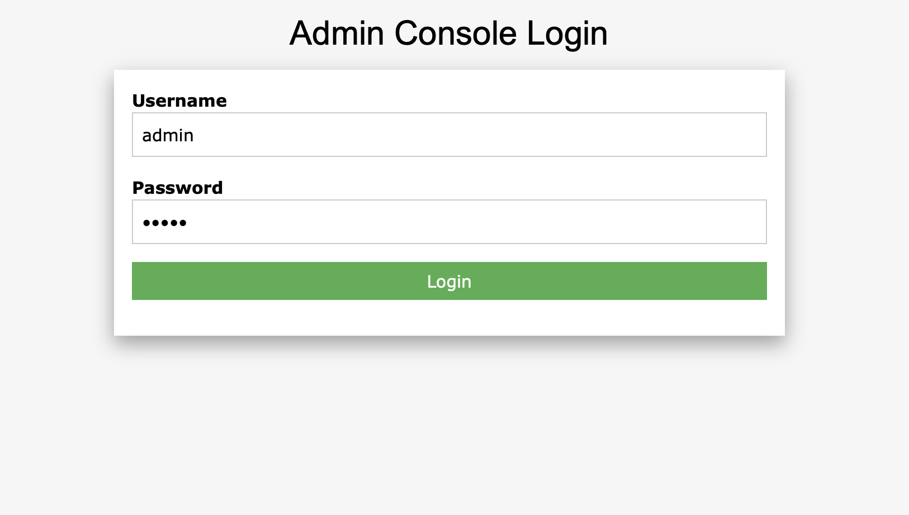
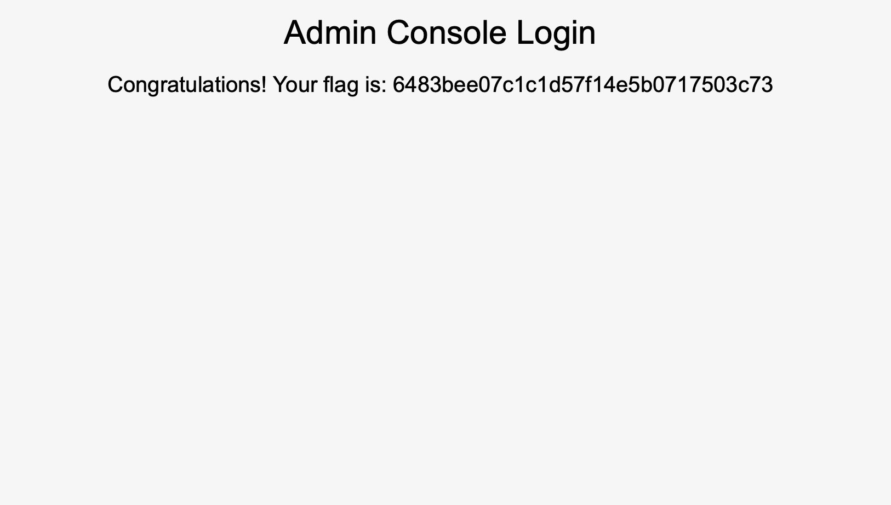

# Preignition

## Machine Details 

- **CTF:** Hack The Box
- **Category:** Tier 0

## Solution

#### 1. Directory Brute-forcing is a technique used to check a lot of paths on a web server to find hidden pages. Which is another name for this? (i) Local File Inclusion, (ii) dir busting, (iii) hash cracking.

> dir busting

#### 2. What switch do we use for nmap's scan to specify that we want to perform version detection

> -sV

#### 3. What does Nmap report is the service identified as running on port 80/tcp?

```sh
$ nmap -A -T4 10.129.143.113
Starting Nmap 7.94 ( https://nmap.org ) at 2024-03-02 10:18 CET
Nmap scan report for 10.129.143.113
Host is up (0.034s latency).
Not shown: 999 closed tcp ports (conn-refused)
PORT   STATE SERVICE VERSION
80/tcp open  http    nginx 1.14.2
|_http-server-header: nginx/1.14.2
|_http-title: Welcome to nginx!

Service detection performed. Please report any incorrect results at https://nmap.org/submit/ .
Nmap done: 1 IP address (1 host up) scanned in 14.28 seconds
```

> http

#### 4. What server name and version of service is running on port 80/tcp?

> nginx 1.14.2

#### 5. What switch do we use to specify to Gobuster we want to perform dir busting specifically?

> dir

#### 6. When using gobuster to dir bust, what switch do we add to make sure it finds PHP pages?

> -x php

#### 7. What page is found during our dir busting activities?

```sh
$ gobuster dir -u http://10.129.143.113 -w dictionaries/common.txt -x php
===============================================================
Gobuster v3.6
by OJ Reeves (@TheColonial) & Christian Mehlmauer (@firefart)
===============================================================
[+] Url:                     http://10.129.143.113
[+] Method:                  GET
[+] Threads:                 10
[+] Wordlist:                dictionaries/common.txt
[+] Negative Status codes:   404
[+] User Agent:              gobuster/3.6
[+] Extensions:              php
[+] Timeout:                 10s
===============================================================
Starting gobuster in directory enumeration mode
===============================================================
/admin.php            (Status: 200) [Size: 999]
...
```

> admin.php

#### 8. What is the HTTP status code reported by Gobuster for the discovered page?

> 200

#### Submit root flag

We try to login with `admin:admin`:



And get the flag:




## Final Flag

> 6483bee07c1c1d57f14e5b0717503c73

*Created by [bu19akov](https://github.com/bu19akov)*