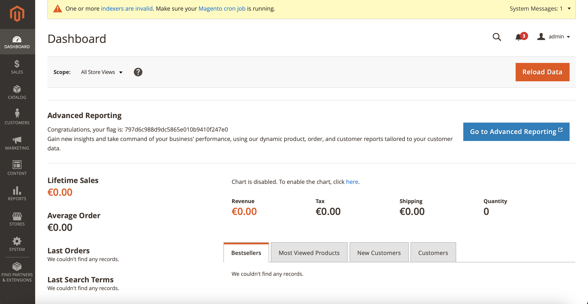

# Ignition

## Machine Details 

- **CTF:** Hack The Box
- **Category:** Tier 1

## Solution

#### 1. Which service version is found to be running on port 80?

```sh
$ nmap -A -T4 10.129.170.65
Starting Nmap 7.94 ( https://nmap.org ) at 2024-03-02 19:43 CET
Nmap scan report for 10.129.170.65
Host is up (0.096s latency).
Not shown: 999 closed tcp ports (conn-refused)
PORT   STATE SERVICE VERSION
80/tcp open  http    nginx 1.14.2
|_http-server-header: nginx/1.14.2
|_http-title: Did not follow redirect to http://ignition.htb/

Service detection performed. Please report any incorrect results at https://nmap.org/submit/ .
Nmap done: 1 IP address (1 host up) scanned in 29.50 seconds
```

> nginx 1.14.2

#### 2. What is the 3-digit HTTP status code returned when you visit http://{machine IP}/?

```sh
$ curl -v http://10.129.170.65 
*   Trying 10.129.170.65:80...
* Connected to 10.129.170.65 (10.129.170.65) port 80
> GET / HTTP/1.1
> Host: 10.129.170.65
> User-Agent: curl/8.5.0
> Accept: */*
> 
< HTTP/1.1 302 Found
...
```

> 302

#### 3. What is the virtual host name the webpage expects to be accessed by?

> ignition.htb

#### 4. What is the full path to the file on a Linux computer that holds a local list of domain name to IP address pairs?

> /etc/hosts

#### 5. Use a tool to brute force directories on the webserver. What is the full URL to the Magento login page?

*(`echo "10.129.170.65 ignition.htb" | sudo tee -a /etc/hosts`)*

```sh
$ gobuster dir -u http://ignition.htb -w dictionaries/common.txt 
===============================================================
Gobuster v3.6
by OJ Reeves (@TheColonial) & Christian Mehlmauer (@firefart)
===============================================================
[+] Url:                     http://ignition.htb
[+] Method:                  GET
[+] Threads:                 10
[+] Wordlist:                dictionaries/common.txt
[+] Negative Status codes:   404
[+] User Agent:              gobuster/3.6
[+] Timeout:                 10s
===============================================================
Starting gobuster in directory enumeration mode
===============================================================
/0                    (Status: 200) [Size: 25803]
/Home                 (Status: 301) [Size: 0] [--> http://ignition.htb/home]
/admin                (Status: 200) [Size: 7092]
...
```

> http://ignition.htb/admin

#### 6. Look up the password requirements for Magento and also try searching for the most commong passwords of 2023. Which password provides access to the admin account?

> qwerty123

#### Submit root flag

Login to [http://ignition.htb/admin](http://ignition.htb/admin) with `admin:qwerty123`:



## Final Flag

> 797d6c988d9dc5865e010b9410f247e0

*Created by [bu19akov](https://github.com/bu19akov)*