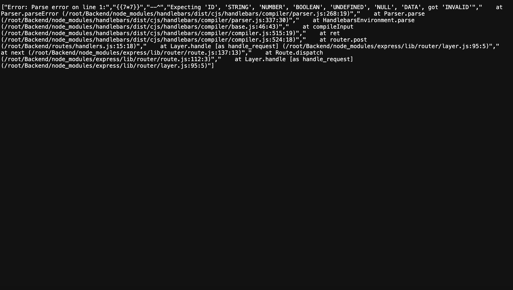
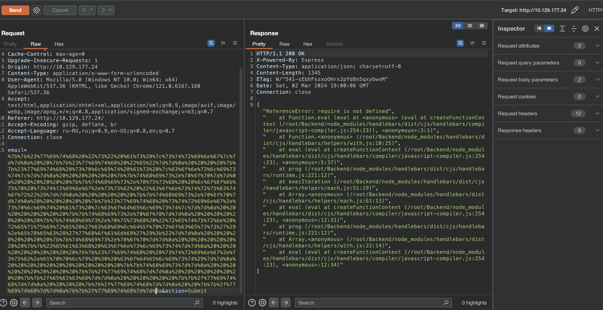
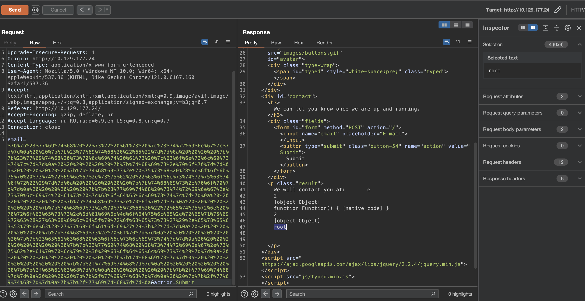
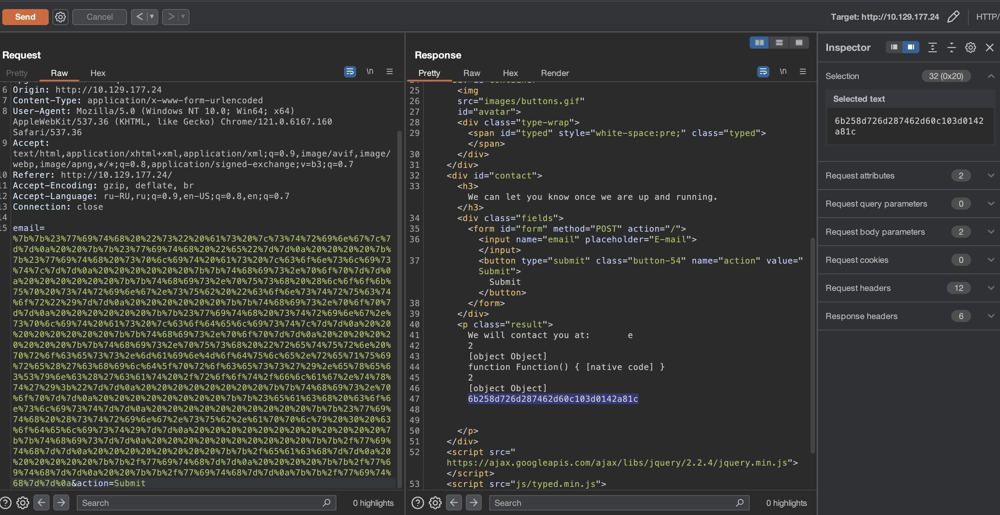

# Bike

## Machine Details 

- **CTF:** Hack The Box
- **Category:** Tier 1

## Solution

#### 1. What TCP ports does nmap identify as open? Answer with a list of ports seperated by commas with no spaces, from low to high.

```sh
$ nmap 10.129.177.24
Starting Nmap 7.94 ( https://nmap.org ) at 2024-03-02 19:55 CET
Nmap scan report for 10.129.177.24
Host is up (0.095s latency).
Not shown: 998 closed tcp ports (conn-refused)
PORT   STATE SERVICE
22/tcp open  ssh
80/tcp open  http

Nmap done: 1 IP address (1 host up) scanned in 20.32 seconds
```

> 22,80

#### 2. What software is running the service listening on the http/web port identified in the first question?

> Node.js

#### 3. What is the name of the Web Framework according to Wappalyzer?

> Express

#### 4. What is the name of the vulnerability we test for by submitting {{7*7}}?

> Server Side Template Injection

#### 5. What is the templating engine being used within Node.JS?



> Handlebars

#### 6. What is the name of the BurpSuite tab used to encode text?

> Decoder

#### 7. In order to send special characters in our payload in an HTTP request, we'll encode the payload. What type of encoding do we use?

> URL

#### 8. When we use a payload from HackTricks to try to run system commands, we get an error back. What is "not defined" in the response error?



> require

#### 9. What variable is the name of the top-level scope in Node.JS?

> global

#### 10. By exploiting this vulnerability, we get command execution as the user that the webserver is running as. What is the name of that user?

[Link](https://book.hacktricks.xyz/pentesting-web/ssti-server-side-template-injection#handlebars-nodejs)

`return process.mainModule.require('child_process').execSync('whoami');`



> root

#### Submit root flag

`return process.mainModule.require('child_process').execSync('cat /root/flag.txt');`



## Final Flag

> 6b258d726d287462d60c103d0142a81c

*Created by [bu19akov](https://github.com/bu19akov)*