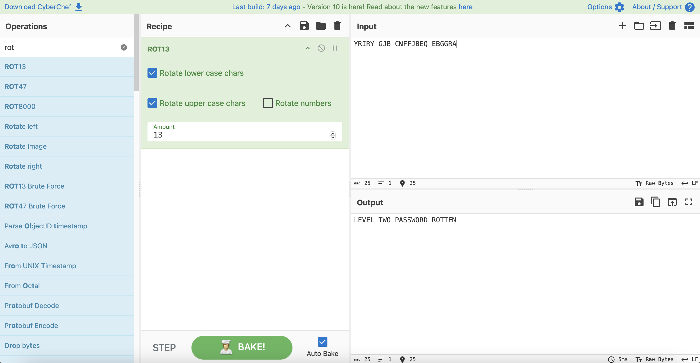

# Level 1

## Challenge Details 

- **CTF:** OverTheWire
- **Category:** Krypton

## Provided Materials

- username: `krypton1`
- password: `KRYPTONISGREAT`

## Solution

We have file `krypton2` file and we know that is was encrypted using `ROT13`:

```sh
krypton1@bandit:/krypton/krypton1$ cat krypton2 
YRIRY GJB CNFFJBEQ EBGGRA
```

So we can use [CyberChef](https://gchq.github.io/CyberChef/#recipe=ROT13(true,true,false,13)&input=WVJJUlkgR0pCIENORkZKQkVRIEVCR0dSQQ) to decode it:



## Password

`krypton2`:`ROTTEN`

*Created by [bu19akov](https://github.com/bu19akov)*