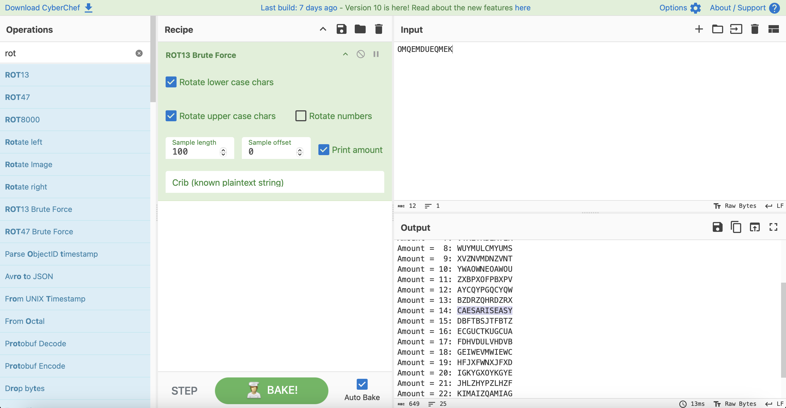

# Level 2

## Challenge Details 

- **CTF:** OverTheWire
- **Category:** Krypton

## Provided Materials

- username: `krypton2`
- password: `ROTTEN`

## Solution

We know that `OMQEMDUEQMEK` is encrypted using caesar cipher, so we can bruteforce it with [CyberChef](https://gchq.github.io/CyberChef/#recipe=ROT13_Brute_Force(true,true,false,100,0,true,'')&input=T01RRU1EVUVRTUVL):

## Password

`krypton3`:`CAESARISEASY`

*Created by [bu19akov](https://github.com/bu19akov)*