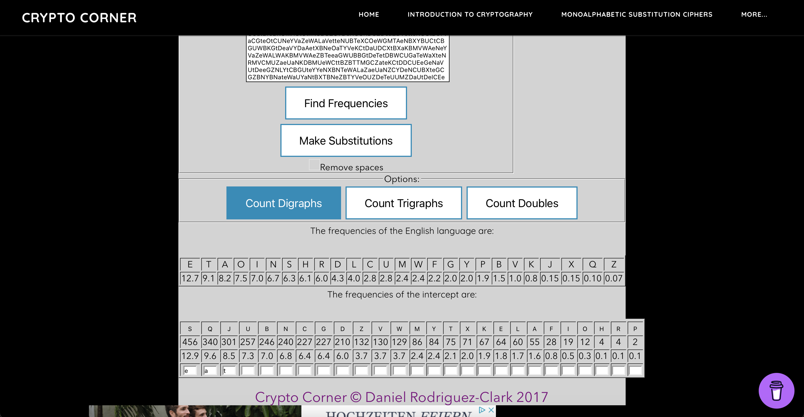
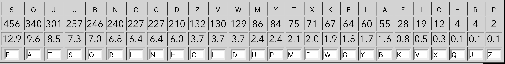
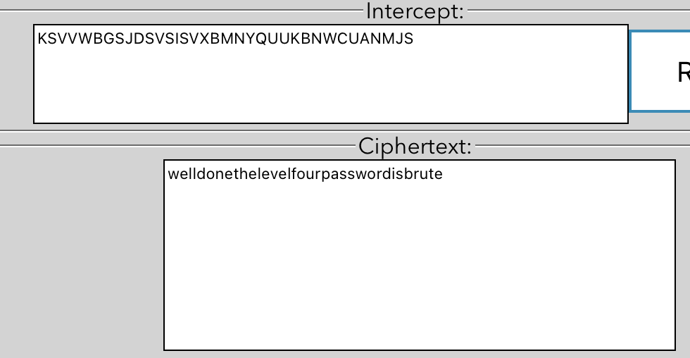

# Level 3

## Challenge Details 

- **CTF:** OverTheWire
- **Category:** Krypton

## Provided Materials

- username: `krypton3`
- password: `CAESARISEASY`

## Solution

We have three files `found1`, `found2` and `found3` that we need to analyze with frequency analysis to restore the cipher. We can use [this](https://crypto.interactive-maths.com/frequency-analysis-breaking-the-code.html) tool:

By making this substitution *(S -> E, Q -> A, J -> I)*, we can see some words like `ZaeUaN` we can assume, that this is `caesar` so we can map it forward. Now we can see like `caesarcCYDer` that is probably `caesar cipher`. So by iterating again and again we can get the final key:

So our message is:

## Password

`krypton4`:`BRUTE`

*Created by [bu19akov](https://github.com/bu19akov)*