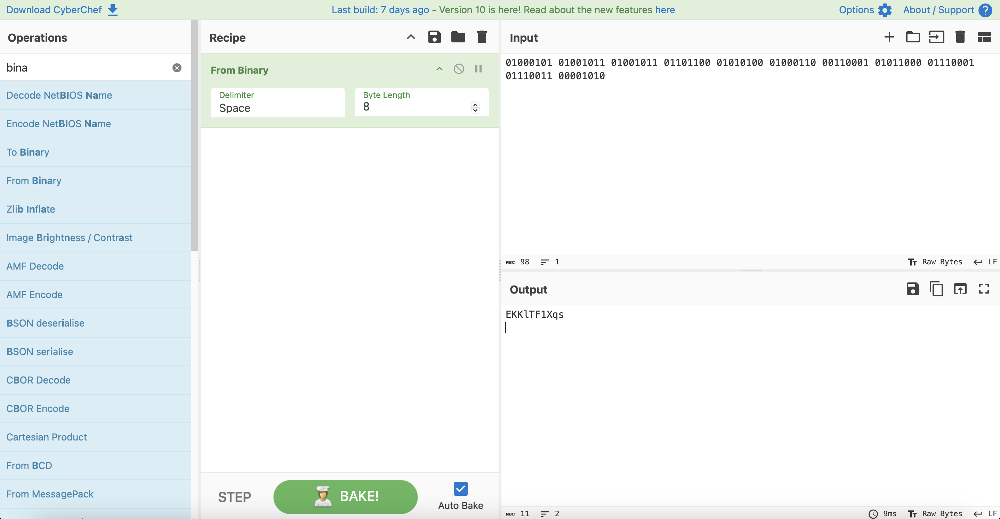

# Level 4

## Challenge Details 

- **CTF:** OverTheWire
- **Category:** Leviathan

## Provided Materials

- username: `leviathan4`
- password: `AgvropI4OA`

## Solution

Let's see what do we have:

```sh
leviathan4@gibson:~$ ls -al
total 24
drwxr-xr-x  3 root root       4096 Oct  5  2023 .
drwxr-xr-x 83 root root       4096 Oct  5  2023 ..
-rw-r--r--  1 root root        220 Jan  6  2022 .bash_logout
-rw-r--r--  1 root root       3771 Jan  6  2022 .bashrc
-rw-r--r--  1 root root        807 Jan  6  2022 .profile
dr-xr-x---  2 root leviathan4 4096 Oct  5  2023 .trash
```

Let's see what's inside `.trash` directory:

```sh
leviathan4@gibson:~/.trash$ ls -al
total 24
dr-xr-x--- 2 root       leviathan4  4096 Oct  5  2023 .
drwxr-xr-x 3 root       root        4096 Oct  5  2023 ..
-r-sr-x--- 1 leviathan5 leviathan4 14928 Oct  5  2023 bin
```

Let's execute `bin`:

```sh
leviathan4@gibson:~/.trash$ ./bin
01000101 01001011 01001011 01101100 01010100 01000110 00110001 01011000 01110001 01110011 00001010 
```

We can use [CyberChef](https://gchq.github.io/CyberChef/#recipe=From_Binary('Space',8)&input=MDEwMDAxMDEgMDEwMDEwMTEgMDEwMDEwMTEgMDExMDExMDAgMDEwMTAxMDAgMDEwMDAxMTAgMDAxMTAwMDEgMDEwMTEwMDAgMDExMTAwMDEgMDExMTAwMTEgMDAwMDEwMTA) to read the string from binary:



## Password

`leviathan5`:`EKKlTF1Xqs`

*Created by [bu19akov](https://github.com/bu19akov)*