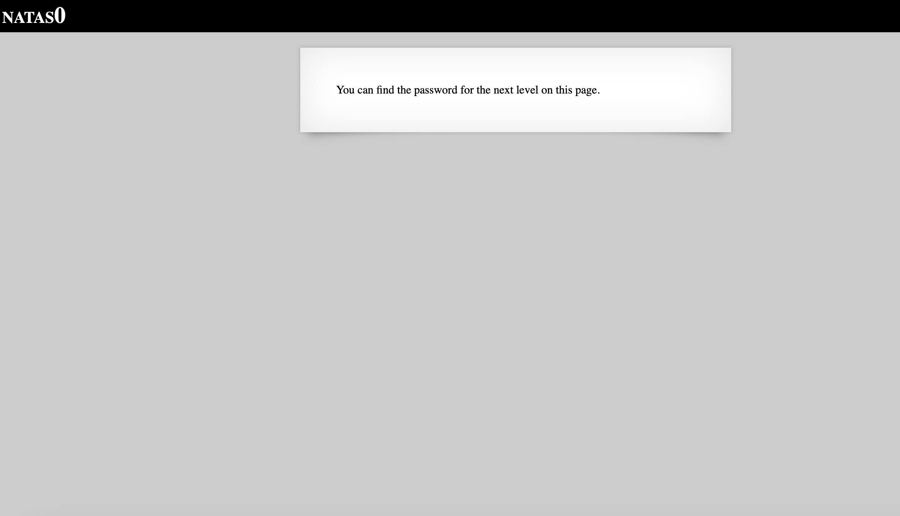
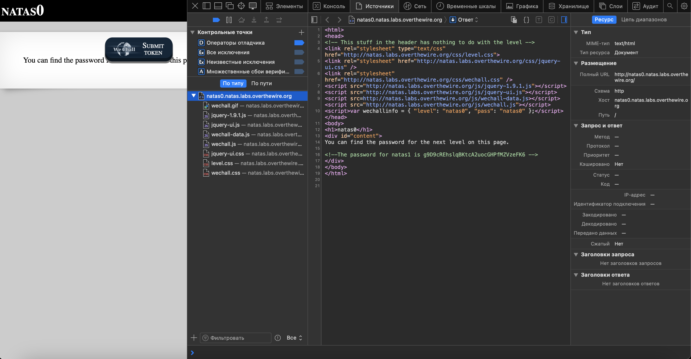

# Level 0

## Challenge Details 

- **CTF:** OverTheWire
- **Category:** Natas

## Provided Materials

- [http://natas0.natas.labs.overthewire.org](http://natas0.natas.labs.overthewire.org)
- username: `natas0`
- password: `natas0`

## Solution

We can open the source of the page with `Developer Tools` *(Option + ⌘ + I (on macOS), or Shift + CTRL + I (on Windows/Linux))*:

And the password is directly in the source.

## Password

`natas1`:`g9D9cREhslqBKtcA2uocGHPfMZVzeFK6`

*Created by [bu19akov](https://github.com/bu19akov)*