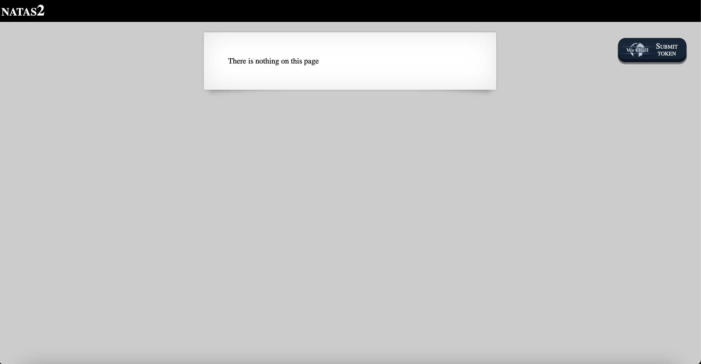
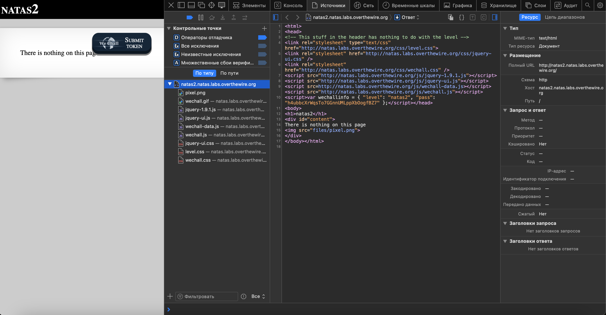
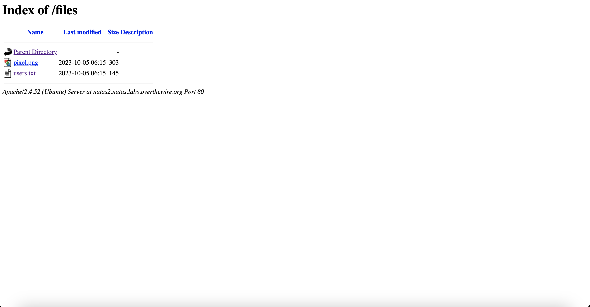

# Level 2

## Challenge Details 

- **CTF:** OverTheWire
- **Category:** Web

## Provided Materials

- [http://natas2.natas.labs.overthewire.org](http://natas2.natas.labs.overthewire.org)
- username: `natas2`
- password: `h4ubbcXrWqsTo7GGnnUMLppXbOogfBZ7`

## Solution

Let's open `Developer Tools`:

We can see, that there is `pixel.png` file in some `files` directory, so let's open this `files` directory:

The password is in `users.txt`.

## Password

`natas3`:`G6ctbMJ5Nb4cbFwhpMPSvxGHhQ7I6W8Q `

*Created by [bu19akov](https://github.com/bu19akov)*