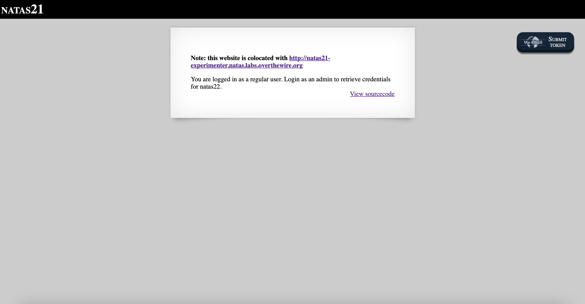
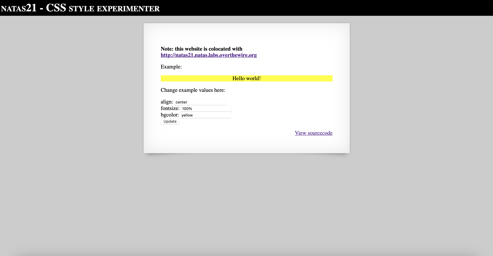

# Level 21

## Challenge Details 

- **CTF:** OverTheWire
- **Category:** Natas

## Provided Materials

- [http://natas21.natas.labs.overthewire.org](http://natas21.natas.labs.overthewire.org)
- username: `natas21`
- password: `89OWrTkGmiLZLv12JY4tLj2c4FW0xn56`

## Solution



Let's see the website from the link:



Let's see it's sourcecode:

```php
...
<?php

session_start();

// if update was submitted, store it
if(array_key_exists("submit", $_REQUEST)) {
    foreach($_REQUEST as $key => $val) {
    $_SESSION[$key] = $val;
    }
}

if(array_key_exists("debug", $_GET)) {
    print "[DEBUG] Session contents:<br>";
    print_r($_SESSION);
}

// only allow these keys
$validkeys = array("align" => "center", "fontsize" => "100%", "bgcolor" => "yellow");
$form = "";

$form .= '<form action="index.php" method="POST">';
foreach($validkeys as $key => $defval) {
    $val = $defval;
    if(array_key_exists($key, $_SESSION)) {
    $val = $_SESSION[$key];
    } else {
    $_SESSION[$key] = $val;
    }
    $form .= "$key: <input name='$key' value='$val' /><br>";
}
$form .= '<input type="submit" name="submit" value="Update" />';
$form .= '</form>';

$style = "background-color: ".$_SESSION["bgcolor"]."; text-align: ".$_SESSION["align"]."; font-size: ".$_SESSION["fontsize"].";";
$example = "<div style='$style'>Hello world!</div>";

?>
...
```

This part of code: 

```php
if(array_key_exists("submit", $_REQUEST)) {
    foreach($_REQUEST as $key => $val) {
    $_SESSION[$key] = $val;
    }
}
```

checks if the `submit` key exists and if it is, then it adds all keys from `$_REQUEST` to `$_SESSION`. So we can include any data in our request, and it will be stored in the session *(for example `example.com?submit=anything&debug=anything&admin=1`)*. So let's slightly modify python script from 

## Password

`natas22`:`91awVM9oDiUGm33JdzM7RVLBS8bz9n0s`

*Created by [bu19akov](https://github.com/bu19akov)*