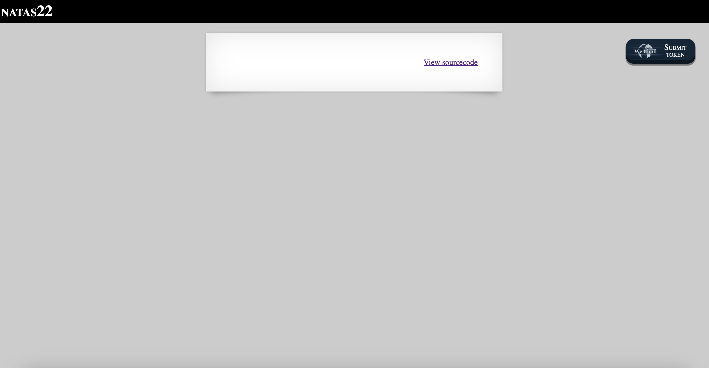
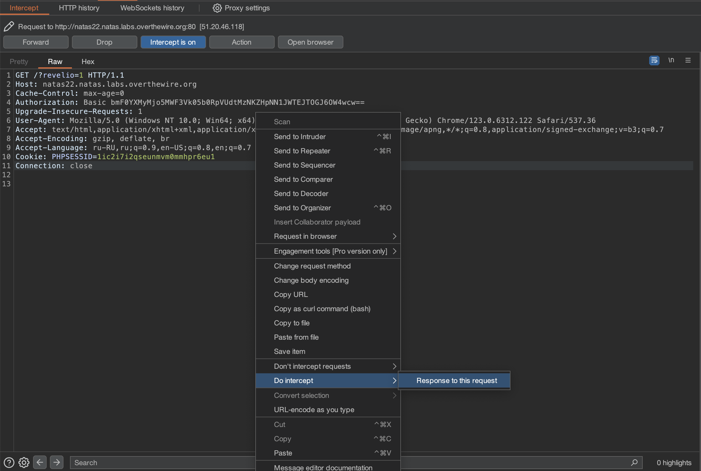
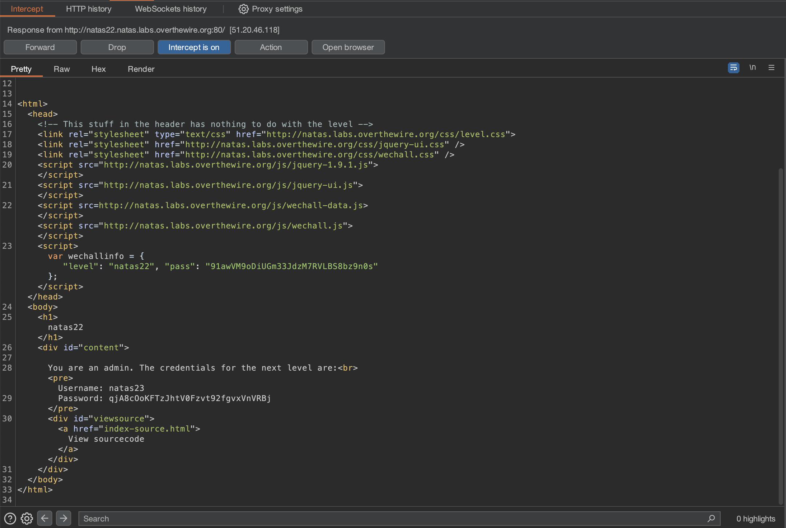

# Level 22

## Challenge Details 

- **CTF:** OverTheWire
- **Category:** Natas

## Provided Materials

- [http://natas22.natas.labs.overthewire.org](http://natas22.natas.labs.overthewire.org)
- username: `natas22`
- password: `91awVM9oDiUGm33JdzM7RVLBS8bz9n0s`

## Solution



Let's see the sourcecode:

```php
<?php
session_start();

if(array_key_exists("revelio", $_GET)) {
    // only admins can reveal the password
    if(!($_SESSION and array_key_exists("admin", $_SESSION) and $_SESSION["admin"] == 1)) {
    header("Location: /");
    }
}
?>
...
<?php
    if(array_key_exists("revelio", $_GET)) {
    print "You are an admin. The credentials for the next level are:<br>";
    print "<pre>Username: natas23\n";
    print "Password: <censored></pre>";
    }
?>
...
```

So if we set the parameter `?revelio=1`, we will be redirected to the start page. Actually this is wrong :) Firstly, we will see admin credentials and only then we will be redirected, but the browsers handles redirection automatically and didn't displays the middle pages. So we can use Burp to intercept the request:



And then we can intercept `Response to this request`:



## Password

`natas23`:`qjA8cOoKFTzJhtV0Fzvt92fgvxVnVRBj`

*Created by [bu19akov](https://github.com/bu19akov)*