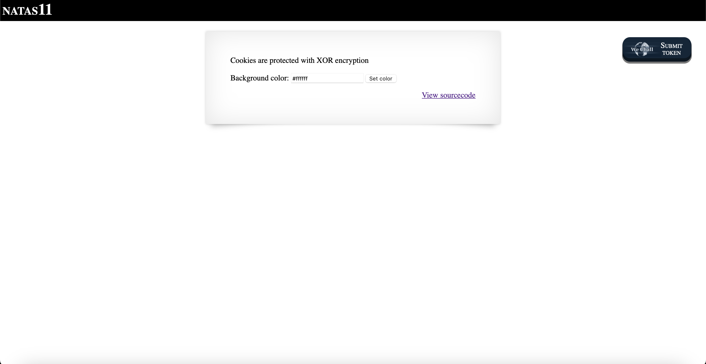
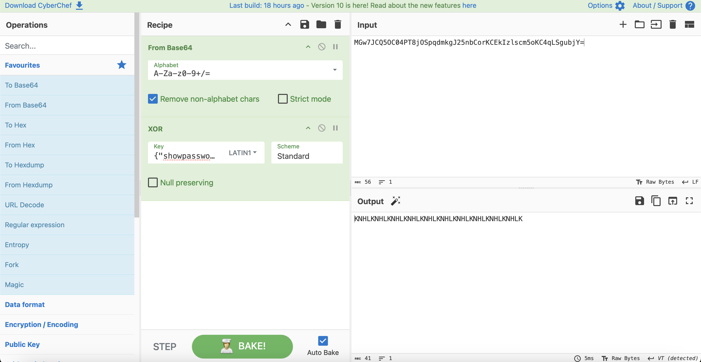
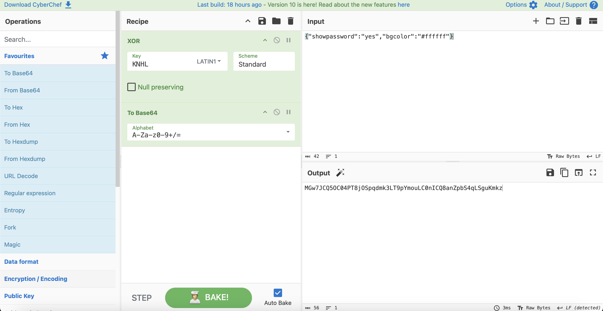
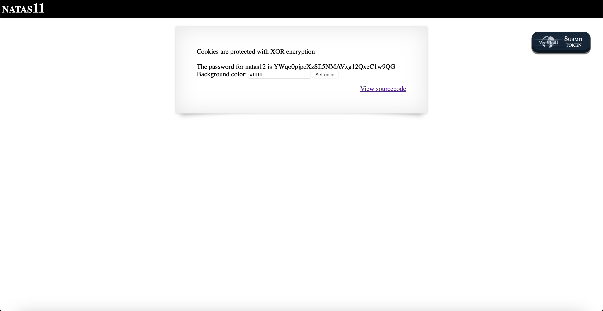

# Level 11

## Challenge Details 

- **CTF:** OverTheWire
- **Category:** Natas

## Provided Materials

- [http://natas11.natas.labs.overthewire.org](http://natas11.natas.labs.overthewire.org)
- username: `natas11`
- password: `1KFqoJXi6hRaPluAmk8ESDW4fSysRoIg`

## Solution



Let's see the sourcecode:

```php
...
<?

$defaultdata = array( "showpassword"=>"no", "bgcolor"=>"#ffffff");

function xor_encrypt($in) {
    $key = '<censored>';
    $text = $in;
    $outText = '';

    // Iterate through each character
    for($i=0;$i<strlen($text);$i++) {
    $outText .= $text[$i] ^ $key[$i % strlen($key)];
    }

    return $outText;
}

function loadData($def) {
    global $_COOKIE;
    $mydata = $def;
    if(array_key_exists("data", $_COOKIE)) {
    $tempdata = json_decode(xor_encrypt(base64_decode($_COOKIE["data"])), true);
    if(is_array($tempdata) && array_key_exists("showpassword", $tempdata) && array_key_exists("bgcolor", $tempdata)) {
        if (preg_match('/^#(?:[a-f\d]{6})$/i', $tempdata['bgcolor'])) {
        $mydata['showpassword'] = $tempdata['showpassword'];
        $mydata['bgcolor'] = $tempdata['bgcolor'];
        }
    }
    }
    return $mydata;
}

function saveData($d) {
    setcookie("data", base64_encode(xor_encrypt(json_encode($d))));
}

$data = loadData($defaultdata);

if(array_key_exists("bgcolor",$_REQUEST)) {
    if (preg_match('/^#(?:[a-f\d]{6})$/i', $_REQUEST['bgcolor'])) {
        $data['bgcolor'] = $_REQUEST['bgcolor'];
    }
}

saveData($data);


?>
...
<?
if($data["showpassword"] == "yes") {
    print "The password for natas12 is <censored><br>";
}

?>
...
```

Also we have our cookie `data`:`MGw7JCQ5OC04PT8jOSpqdmkgJ25nbCorKCEkIzlscm5oKC4qLSgubjY=`.Let's analyze the code now:

```php
$tempdata = json_decode(xor_encrypt(base64_decode($_COOKIE["data"])), true);
```

this line will base64 decode our cookie, then encrypt it with xor and then convert it to json. And also we will be able to see the password if `$data["showpassword"] == "yes"`. So now we need to understand how the `xor` operation works:

```
data xor key = cookie
this means
cookie xor data = key
```

So we know cookie and know data `{"showpassword":"no","bgcolor":"#ffffff"}` *(note that it must be in json format!)*, so we can get the key with [CyberChef](https://gchq.github.io/CyberChef/):



Thus we have repeated *(weak*) key *KNHL*, we can now encrypt our payload `{"showpassword":"yes","bgcolor":"#ffffff"}` with that key:



Let's set now our cookie to `MGw7JCQ5OC04PT8jOSpqdmk3LT9pYmouLC0nICQ8anZpbS4qLSguKmkz`:



## Password

`natas12`:`YWqo0pjpcXzSIl5NMAVxg12QxeC1w9QG `

*Created by [bu19akov](https://github.com/bu19akov)*