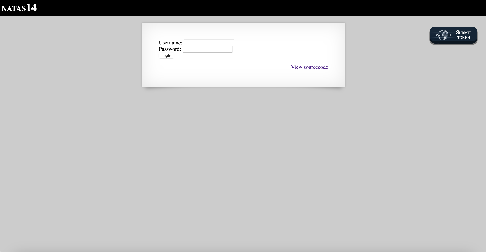
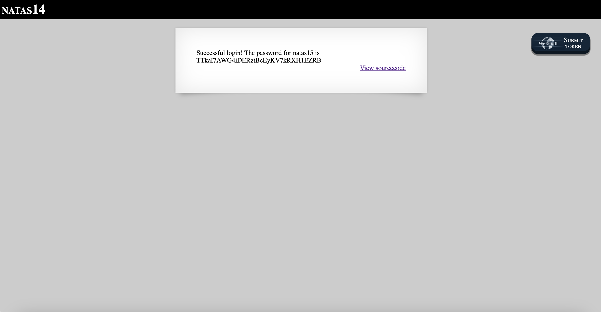

# Level 14

## Challenge Details 

- **CTF:** OverTheWire
- **Category:** Natas

## Provided Materials

- [http://natas14.natas.labs.overthewire.org](http://natas14.natas.labs.overthewire.org)
- username: `natas14`
- password: `qPazSJBmrmU7UQJv17MHk1PGC4DxZMEP`

## Solution



Let's see the source code:

```php
...
<?php
if(array_key_exists("username", $_REQUEST)) {
    $link = mysqli_connect('localhost', 'natas14', '<censored>');
    mysqli_select_db($link, 'natas14');

    $query = "SELECT * from users where username=\"".$_REQUEST["username"]."\" and password=\"".$_REQUEST["password"]."\"";
    if(array_key_exists("debug", $_GET)) {
        echo "Executing query: $query<br>";
    }

    if(mysqli_num_rows(mysqli_query($link, $query)) > 0) {
            echo "Successful login! The password for natas15 is <censored><br>";
    } else {
            echo "Access denied!<br>";
    }
    mysqli_close($link);
} else {
?>
...
```

It will be `SQL Injection`. The query is `SELECT * from users where username="..." and password="..."`. We can just send `" or 1#` for username, so the query on the server will be `SELECT * from users where username="" or 1# and password="..."`, that will return all users, because `username="" or 1` always evaluate to true and `#` is the comment character in `MySQL`, so anyhting after it will be ignored:



## Password

`natas15`:`TTkaI7AWG4iDERztBcEyKV7kRXH1EZRB `

*Created by [bu19akov](https://github.com/bu19akov)*