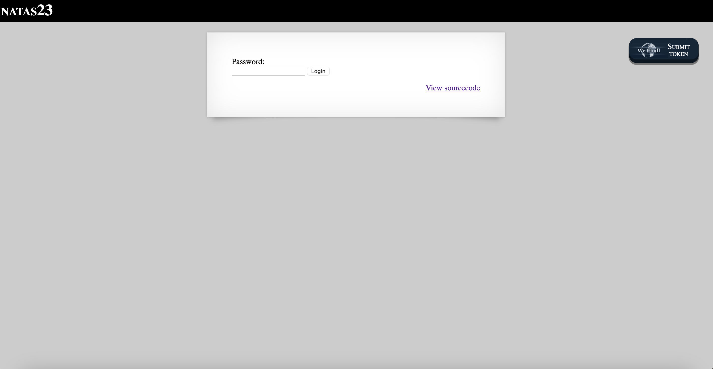
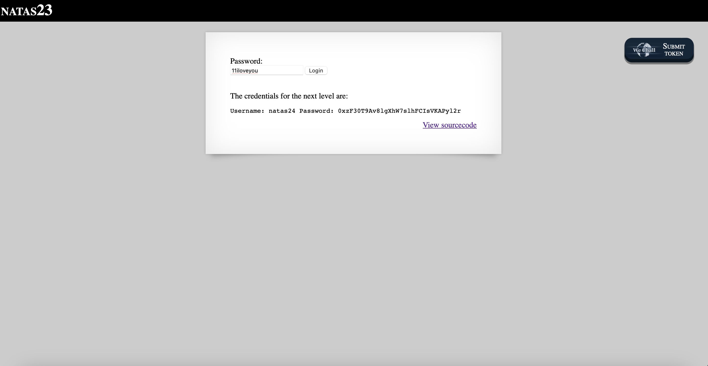

# Level 23

## Challenge Details 

- **CTF:** OverTheWire
- **Category:** Natas

## Provided Materials

- [http://natas23.natas.labs.overthewire.org](http://natas23.natas.labs.overthewire.org)
- username: `natas23`
- password: `qjA8cOoKFTzJhtV0Fzvt92fgvxVnVRBj`

## Solution



Let's see the sourcecode:

```php
...
<?php
    if(array_key_exists("passwd",$_REQUEST)){
        if(strstr($_REQUEST["passwd"],"iloveyou") && ($_REQUEST["passwd"] > 10 )){
            echo "<br>The credentials for the next level are:<br>";
            echo "<pre>Username: natas24 Password: <censored></pre>";
        }
        else{
            echo "<br>Wrong!<br>";
        }
    }
    // morla / 10111
?> 
...
```
So we need to submit string, that contains `iloveyou` and after it nothing *([strstr](https://www.w3schools.com/php/func_string_strstr.asp))* and that is also greater then 10. So we can submit `11iloveyou`, because `PHP` will interpret it as 11:



## Password

`natas24`:`0xzF30T9Av8lgXhW7slhFCIsVKAPyl2r`

*Created by [bu19akov](https://github.com/bu19akov)*