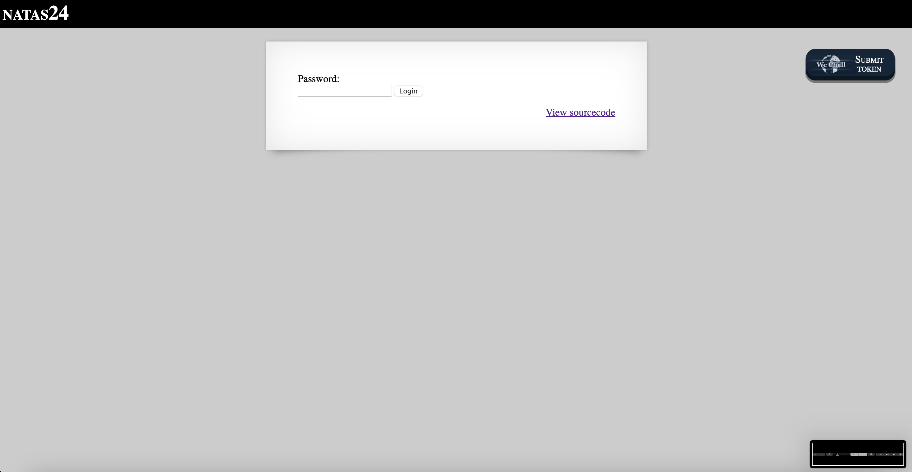
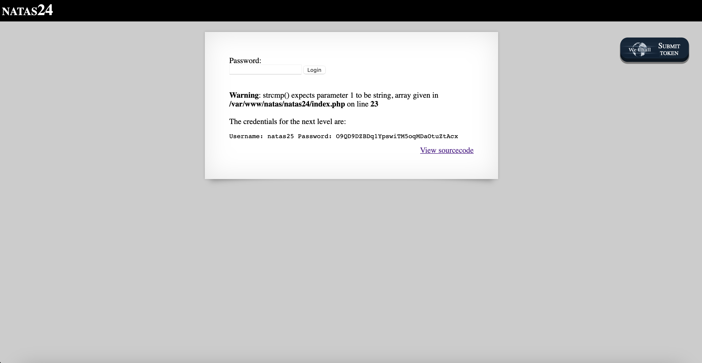

# Level 24

## Challenge Details 

- **CTF:** OverTheWire
- **Category:** Natas

## Provided Materials

- [http://natas24.natas.labs.overthewire.org](http://natas24.natas.labs.overthewire.org)
- username: `natas24`
- password: `0xzF30T9Av8lgXhW7slhFCIsVKAPyl2r`

## Solution



Let's analyze the sourcecode:

```php
...
<?php
    if(array_key_exists("passwd",$_REQUEST)){
        if(!strcmp($_REQUEST["passwd"],"<censored>")){
            echo "<br>The credentials for the next level are:<br>";
            echo "<pre>Username: natas25 Password: <censored></pre>";
        }
        else{
            echo "<br>Wrong!<br>";
        }
    }
    // morla / 10111
?>
...
```

If we set `$_REQUEST["passwd"]` equal to an empty array, then `strcmp` would return a `NULL`. Due to some inherent weaknesses in `PHP’s` comparisons, `NULL == 0` will return true *([source](https://www.doyler.net/security-not-included/bypassing-php-strcmp-abctf2016))*. So we need to send request like [http://natas24.natas.labs.overthewire.org/?passwd[]=](http://natas24.natas.labs.overthewire.org/?passwd[]=):



## Password

`natas25`:`O9QD9DZBDq1YpswiTM5oqMDaOtuZtAcx`

*Created by [bu19akov](https://github.com/bu19akov)*