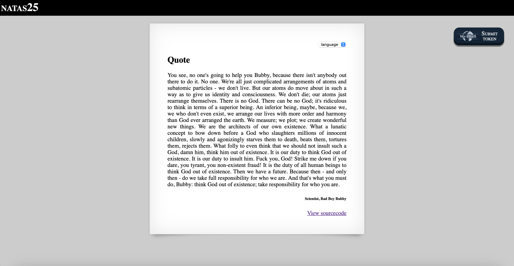
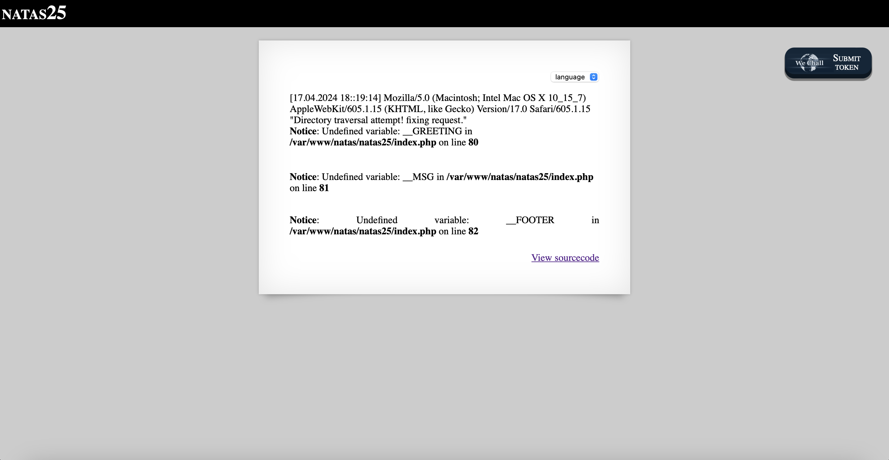
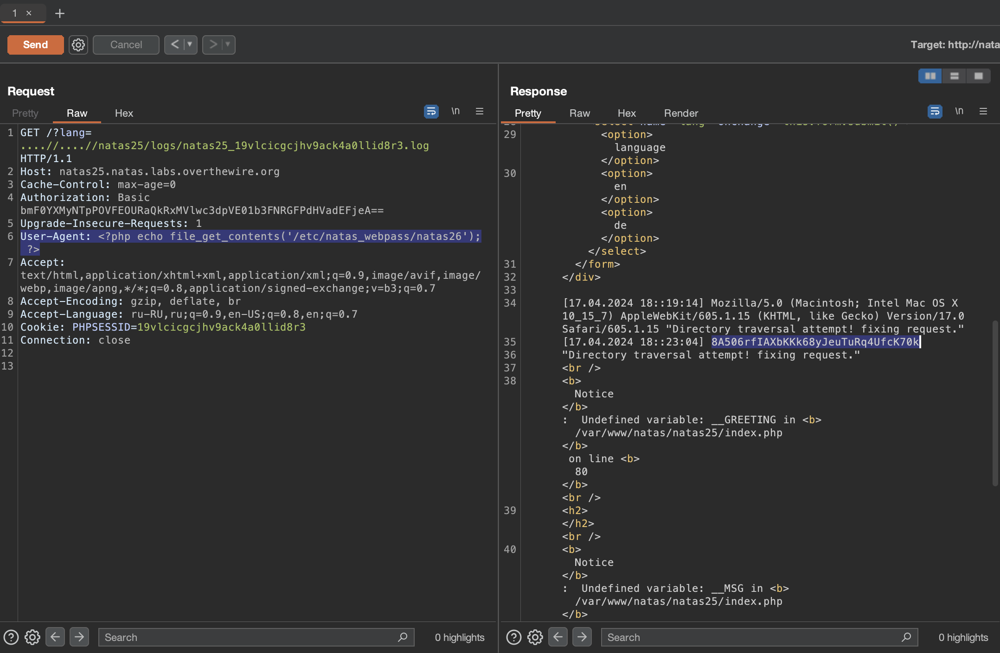

# Level 25

## Challenge Details 

- **CTF:** OverTheWire
- **Category:** Natas

## Provided Materials

- [http://natas25.natas.labs.overthewire.org](http://natas25.natas.labs.overthewire.org)
- username: `natas25`
- password: `O9QD9DZBDq1YpswiTM5oqMDaOtuZtAcx`

## Solution



Let's view the sourcecode:

```php
...
<?php
    // cheers and <3 to malvina
    // - morla

    function setLanguage(){
        /* language setup */
        if(array_key_exists("lang",$_REQUEST))
            if(safeinclude("language/" . $_REQUEST["lang"] ))
                return 1;
        safeinclude("language/en"); 
    }
    
    function safeinclude($filename){
        // check for directory traversal
        if(strstr($filename,"../")){
            logRequest("Directory traversal attempt! fixing request.");
            $filename=str_replace("../","",$filename);
        }
        // dont let ppl steal our passwords
        if(strstr($filename,"natas_webpass")){
            logRequest("Illegal file access detected! Aborting!");
            exit(-1);
        }
        // add more checks...

        if (file_exists($filename)) { 
            include($filename);
            return 1;
        }
        return 0;
    }
    
    function listFiles($path){
        $listoffiles=array();
        if ($handle = opendir($path))
            while (false !== ($file = readdir($handle)))
                if ($file != "." && $file != "..")
                    $listoffiles[]=$file;
        
        closedir($handle);
        return $listoffiles;
    } 
    
    function logRequest($message){
        $log="[". date("d.m.Y H::i:s",time()) ."]";
        $log=$log . " " . $_SERVER['HTTP_USER_AGENT'];
        $log=$log . " \"" . $message ."\"\n"; 
        $fd=fopen("/var/www/natas/natas25/logs/natas25_" . session_id() .".log","a");
        fwrite($fd,$log);
        fclose($fd);
    }
?>
...
```

So, here is some [Path Traversal](https://portswigger.net/web-security/file-path-traversal) prevention mechanism, that will remove `../`. But we can use `....//`, so the `../` will be removed *(`..{../}/`)*, and the outer `../` will be left, let's check it by sending the request to [http://natas25.natas.labs.overthewire.org/?lang=....//....//natas25/logs/natas25_19vlcicgcjhv9ack4a0llid8r3.log](http://natas25.natas.labs.overthewire.org/?lang=....//....//natas25/logs/natas25_19vlcicgcjhv9ack4a0llid8r3.log), where `19vlcicgcjhv9ack4a0llid8r3` is our `PHPSESSID`:

 
 
Nice! We can't directly access `/etc/natas_webpass/natas26` in the same way because of the check `strstr($filename,"natas_webpass")` but what we can also see, that our `User-Agent` is stored in plain text and isn't sanitized... So we can inject malicious code *(reading of `/etc/natas_webpass/natas26`)* instead of our `User-Agent` using Burp:

```
User-Agent: <?php echo file_get_contents('/etc/natas_webpass/natas26'); ?>
```



## Password

`natas26`:`8A506rfIAXbKKk68yJeuTuRq4UfcK70k`

*Created by [bu19akov](https://github.com/bu19akov)*