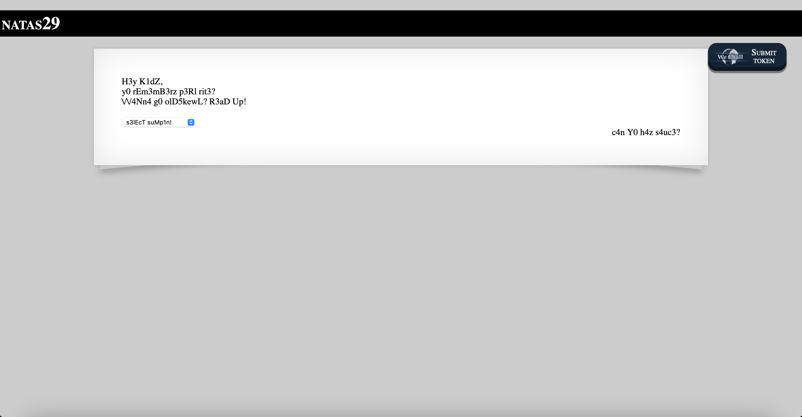
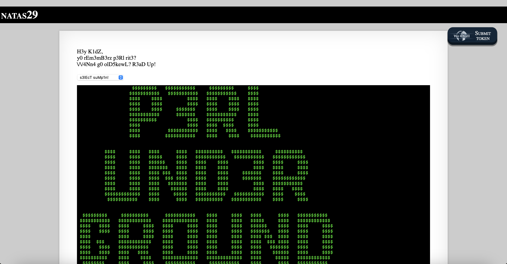
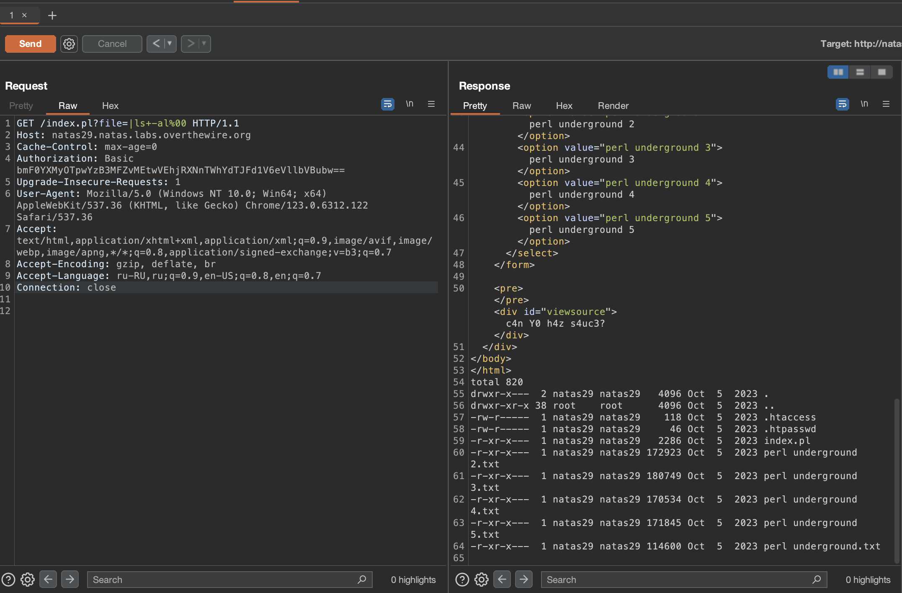
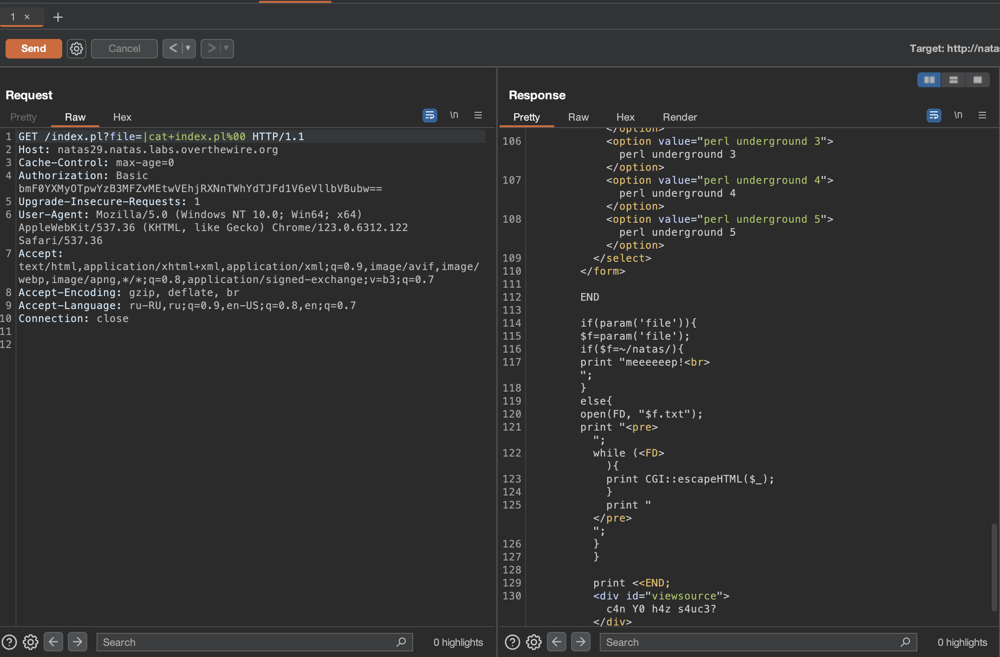
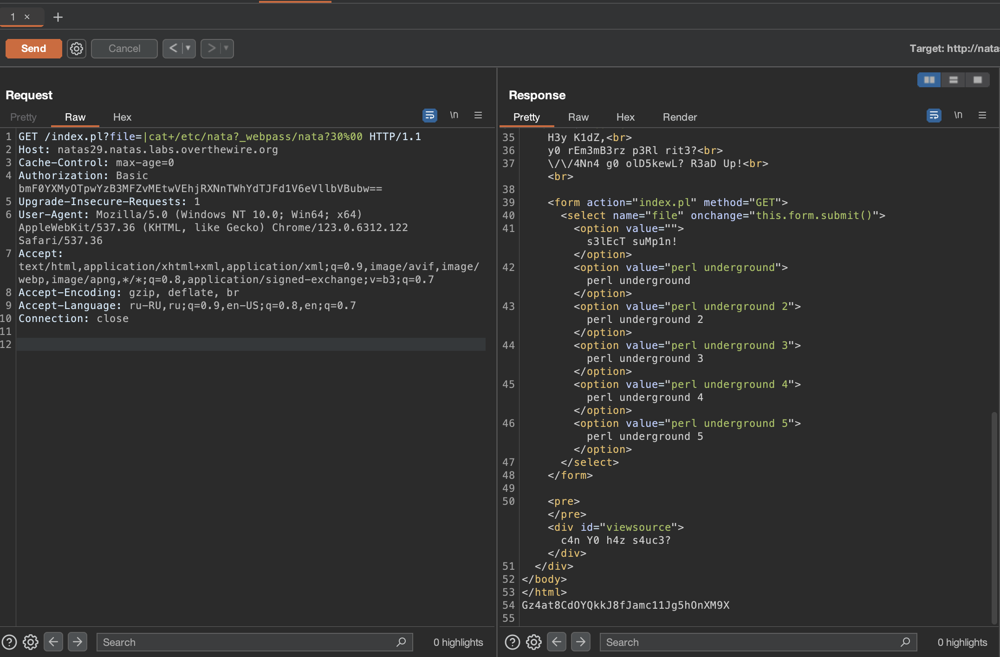

# Level 29

## Challenge Details 

- **CTF:** OverTheWire
- **Category:** Natas

## Provided Materials

- [http://natas29.natas.labs.overthewire.org](http://natas29.natas.labs.overthewire.org)
- username: `natas29`
- password: `pc0w0Vo0KpTHcEsgMhXu2EwUzyYemPno`

## Solution



By interacting with the page we can see, that we can open some files:

[http://natas29.natas.labs.overthewire.org/index.pl?file=perl+underground](http://natas29.natas.labs.overthewire.org/index.pl?file=perl+underground)



There is a lot of information but nothing really useful. But what we can directly see is `/index.pl?file=`. Command injection? We can find [this](https://www.cgisecurity.com/lib/sips.html) source in Google which tells, that theoretically *(if there is `open()` function)* we can execute commands by injecting `|` before the command. Let's try to intercept request with Burp and modify it:



*(See, that we also needed `null byte (%00)` for the request to be successful.)*

Let's see `index.pl` file:



```perl
if(param('file')){
	$f=param('file');
	if($f=~/natas/){
	    print "meeeeeep!<br>";
	}
	...
```

So to open `/etc/natas_webpass/natas30` we need to bypass the check *(so our filename don't contain word `natas`)*. [Command Substitution](https://www.ibm.com/docs/en/aix/7.2?topic=shell-file-name-substitution-in-bourne) comes here into play! So our command will be `cat /etc/nata?_webpass/nata?30`:



## Password

`natas30`:`Gz4at8CdOYQkkJ8fJamc11Jg5hOnXM9X `

*Created by [bu19akov](https://github.com/bu19akov)*