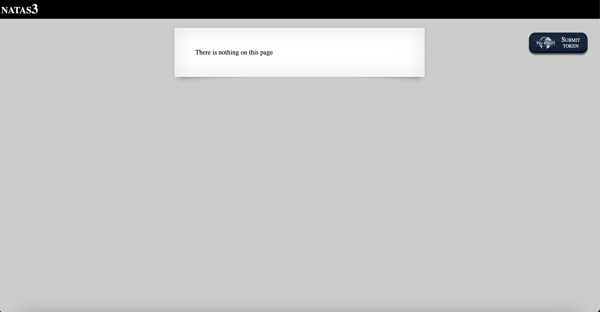
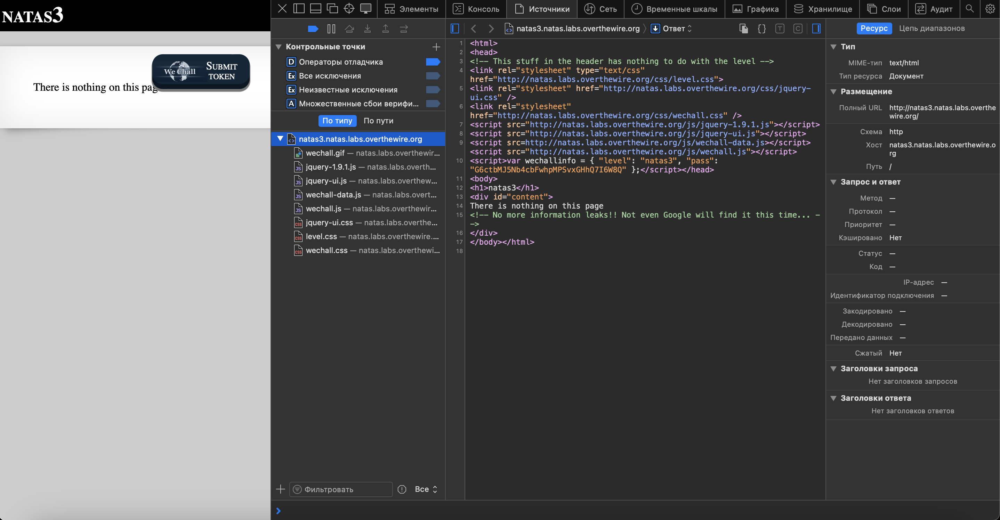
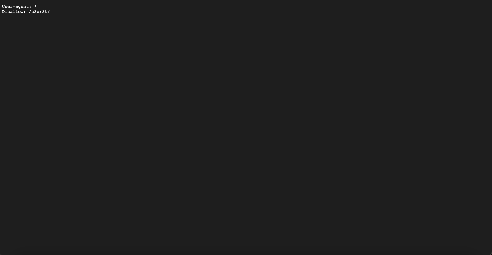

# Level 3

## Challenge Details 

- **CTF:** OverTheWire
- **Category:** Natas

## Provided Materials

- [http://natas3.natas.labs.overthewire.org](http://natas3.natas.labs.overthewire.org)
- username: `natas3`
- password: `G6ctbMJ5Nb4cbFwhpMPSvxGHhQ7I6W8Q`

## Solution

Let's open `Developer Tools`:

`<!-- No more information leaks!! Not even Google will find it this time... -->`

Hmmm...Each website has `robots.txt` file that tells search engine crawlers which URLs the crawler can access on the site and which not, so let's see it *([http://natas3.natas.labs.overthewire.org/robots.txt](http://natas3.natas.labs.overthewire.org/robots.txt))*:

So our password will be at [http://natas3.natas.labs.overthewire.org/s3cr3t/users.txt](http://natas3.natas.labs.overthewire.org/s3cr3t/users.txt).

## Password

`natas4`:`tKOcJIbzM4lTs8hbCmzn5Zr4434fGZQm`

*Created by [bu19akov](https://github.com/bu19akov)*