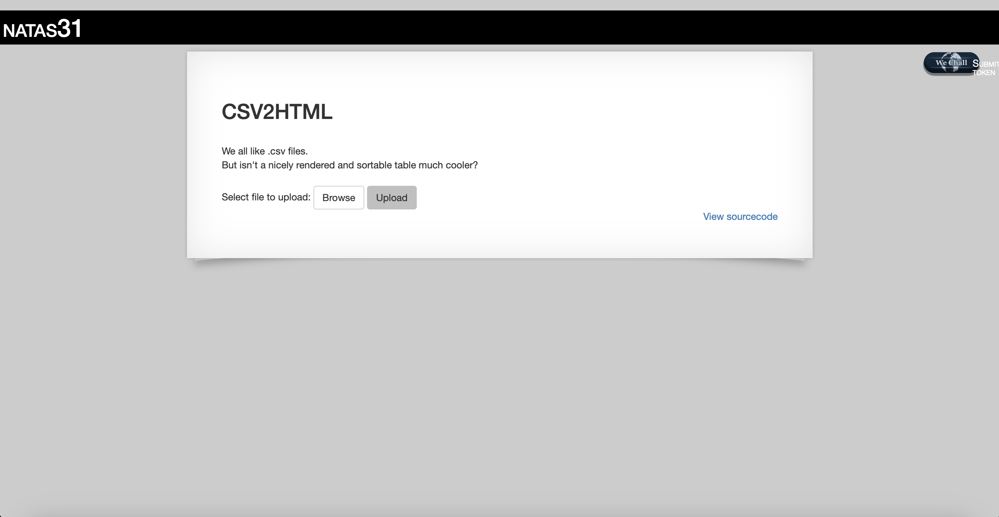
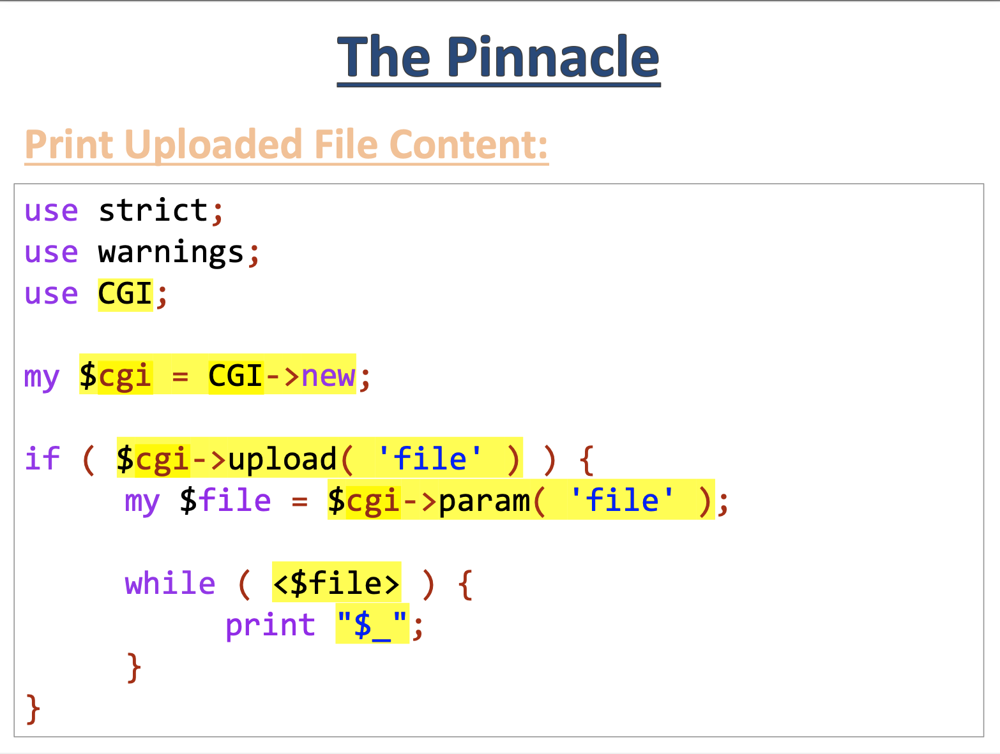
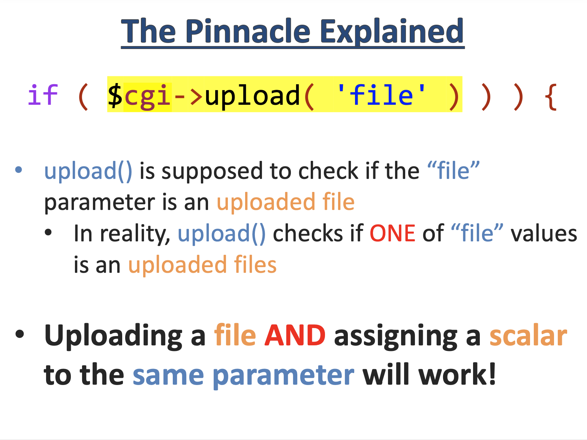
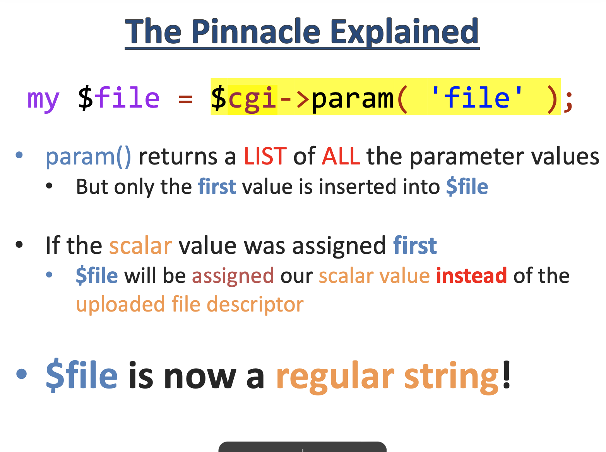
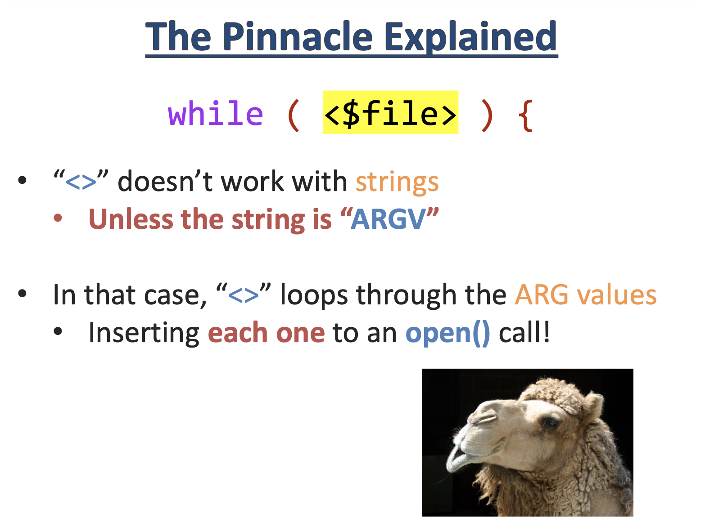
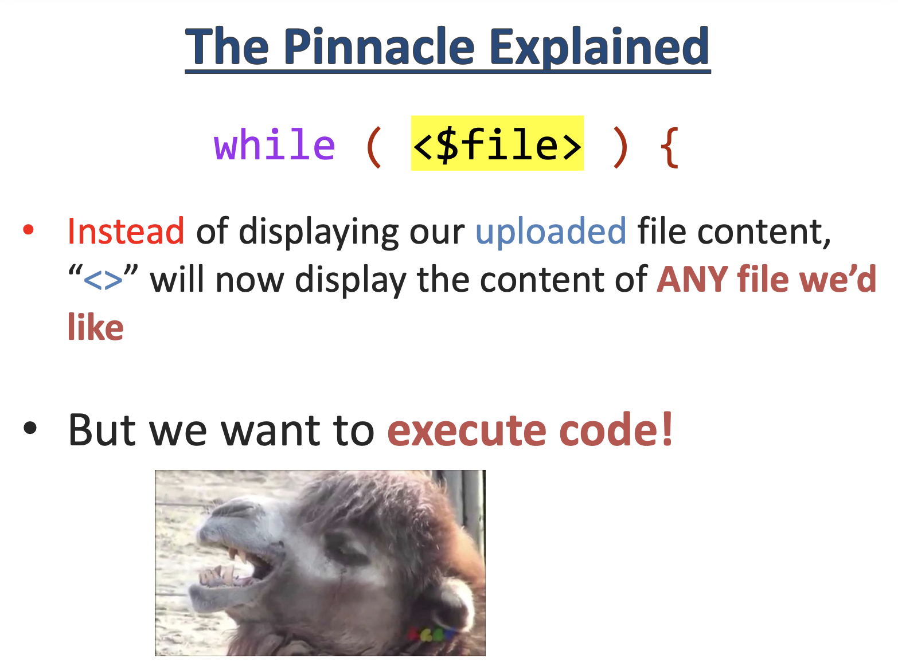
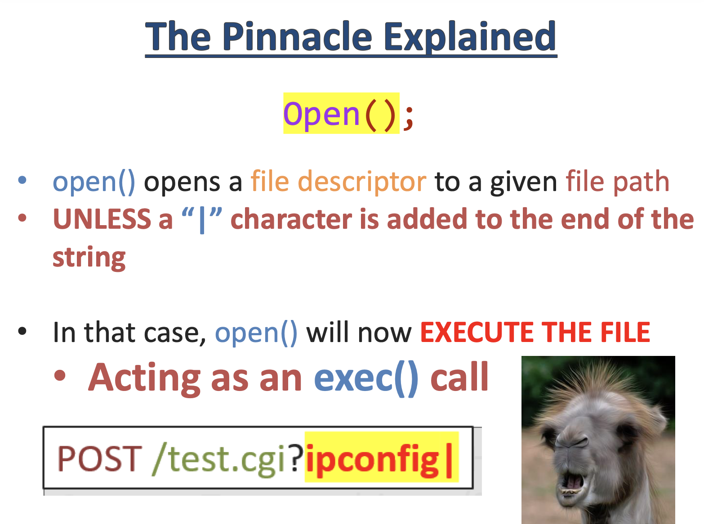
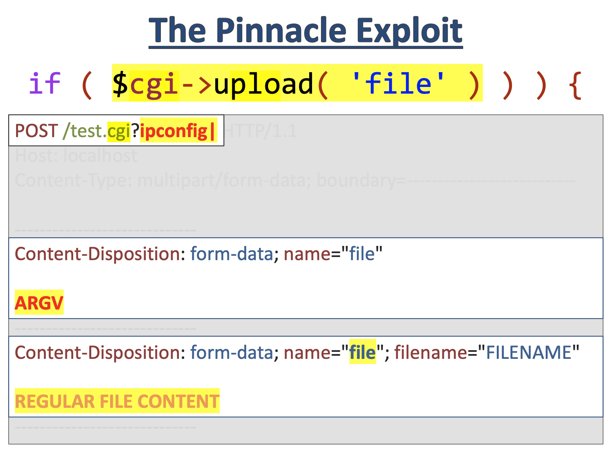
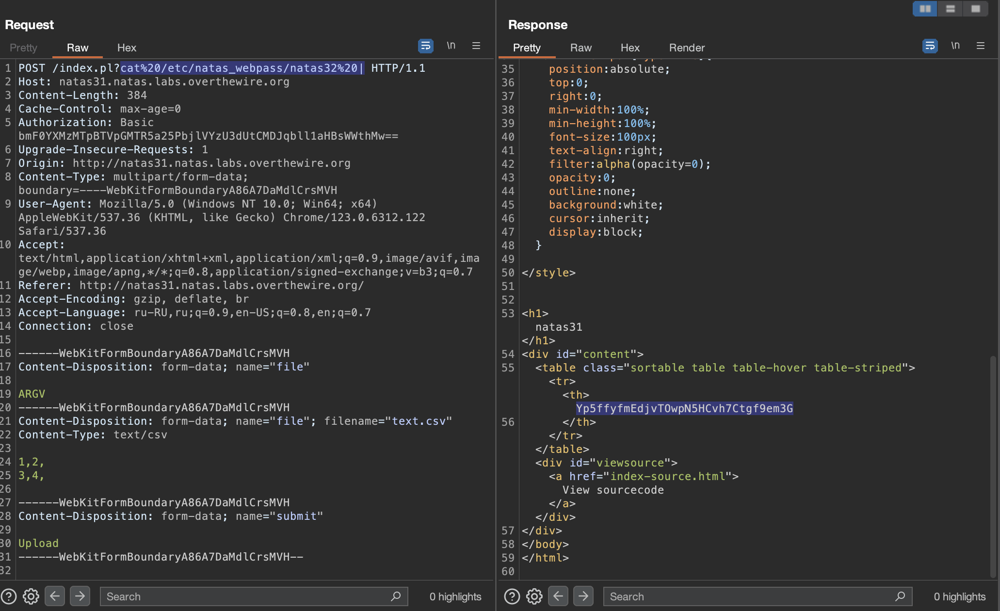

# Level 31

## Challenge Details 

- **CTF:** OverTheWire
- **Category:** Natas

## Provided Materials

- [http://natas31.natas.labs.overthewire.org](http://natas31.natas.labs.overthewire.org)
- username: `natas31`
- password: `AMZF14yknOn9Uc57uKB02jnYuhplYka3`

## Solution



Let's see the sourcecode:

```perl
my $cgi = CGI->new;
if ($cgi->upload('file')) {
    my $file = $cgi->param('file');
    print '<table class="sortable table table-hover table-striped">';
    $i=0;
    while (<$file>) {
        my @elements=split /,/, $_;

        if($i==0){ # header
            print "<tr>";
            foreach(@elements){
                print "<th>".$cgi->escapeHTML($_)."</th>";   
            }
            print "</tr>";
        }
        else{ # table content
            print "<tr>";
            foreach(@elements){
                print "<td>".$cgi->escapeHTML($_)."</td>";   
            }
            print "</tr>";
        }
        $i+=1;
    }
    print '</table>';
}
```

The same vulnerability is explained [here](https://www.blackhat.com/docs/asia-16/materials/asia-16-Rubin-The-Perl-Jam-2-The-Camel-Strikes-Back.pdf?ref=learnhacking.io):



Pretty much the same, yes? :) I won't explain it better as it is explained in this presentation:













So what we need to do:

- Intercept request with Burp
- Add `?cat%20/etc/natas_webpass/natas32%20|` to `/index.pl`
- Insert malicious form-data blocks above the actual CSV data

Here is the visual representation:



## Password

`natas32`:`Yp5ffyfmEdjvTOwpN5HCvh7Ctgf9em3G`

*Created by [bu19akov](https://github.com/bu19akov)*