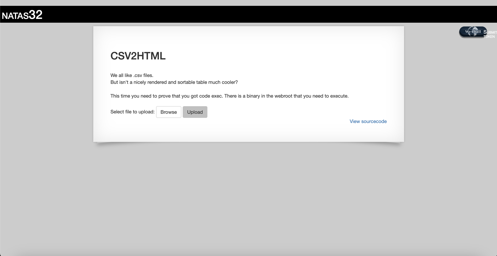
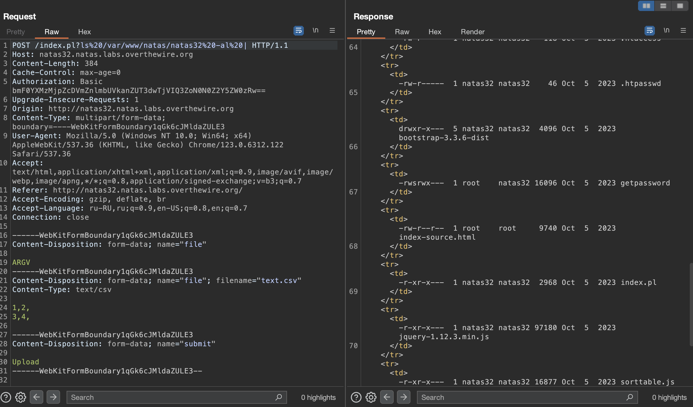
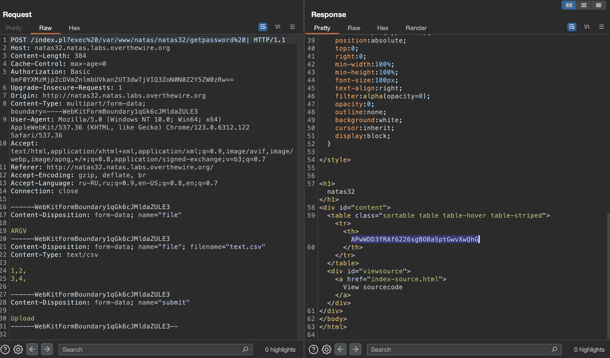

# Level 32

## Challenge Details 

- **CTF:** OverTheWire
- **Category:** Natas

## Provided Materials

- [http://natas32.natas.labs.overthewire.org](http://natas32.natas.labs.overthewire.org)
- username: `natas32`
- password: `Yp5ffyfmEdjvTOwpN5HCvh7Ctgf9em3G`

## Solution

`This time you need to prove that you got code exec. There is a binary in the webroot that you need to execute.`

The solution is already explained in [natas31](https://github.com/bu19akov/CTF-Challenge-Solutions/blob/main/OverTheWire/Natas/natas31/solution.md), so if you haven't, read it first.

So what we need to do:

- Intercept the request with Burp
- Find this executable
- Execute it

Let's find it:

The executable is `getpassword`. Let's execute it with `exec` command:

## Password

`natas33`:`APwWDD3fRAf6226sgBOBaSptGwvXwQhG`

*Created by [bu19akov](https://github.com/bu19akov)*